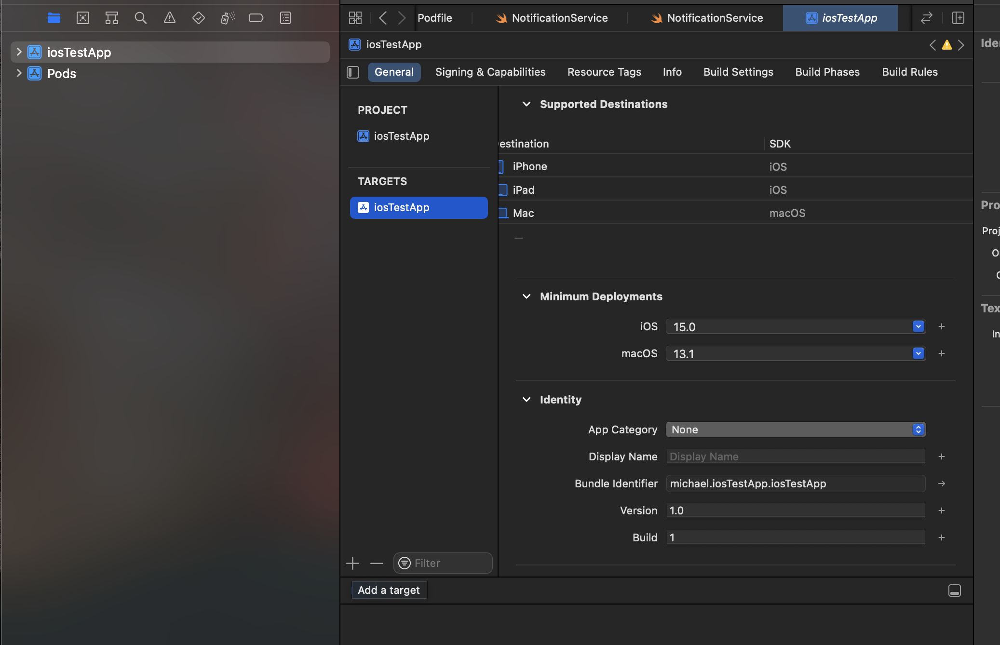
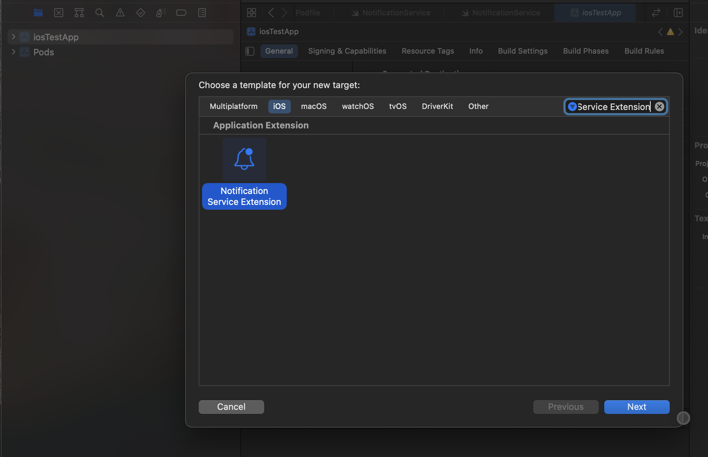
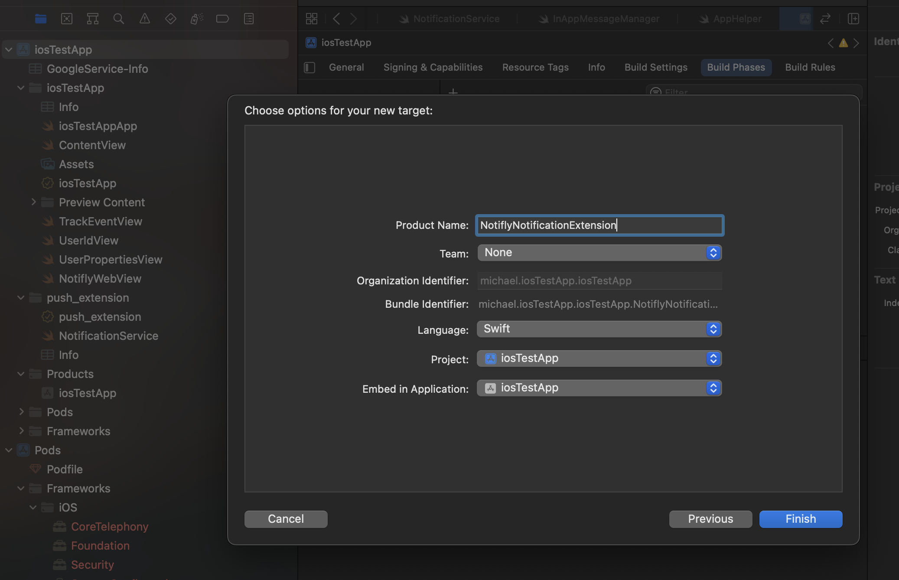
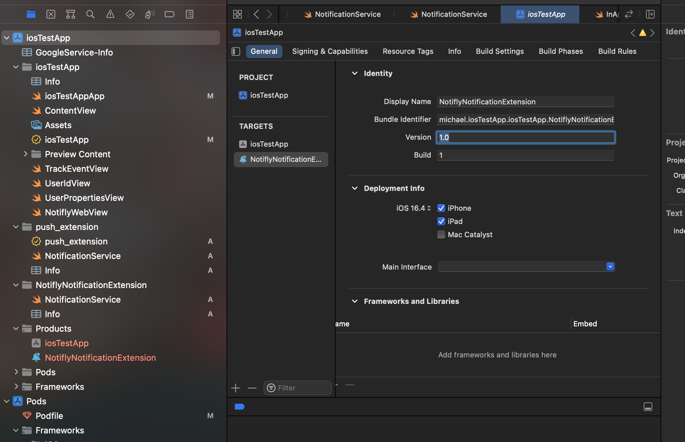
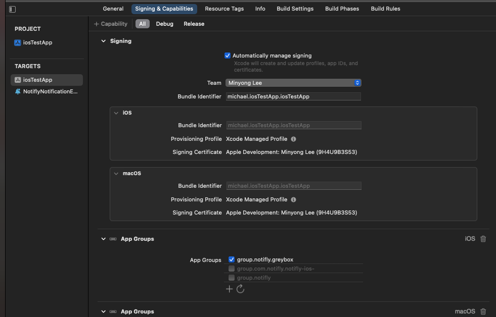
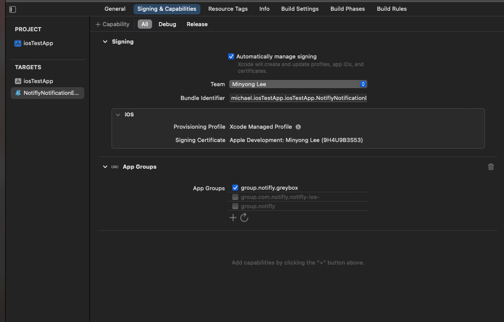
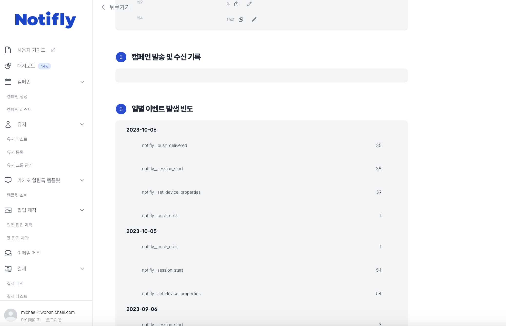

# (Advanced) Rich Push Notification (iOS)

```mdx-code-block
import Tabs from '@theme/Tabs';
import TabItem from '@theme/TabItem';
```

:::caution SDK spec for Rich Push Notification

- `iOS Native`: Version 1.3.0 or higher
- `react-native`: Version 3.0.4 or higher
- `flutter`: Version 1.2.3 or higher
  :::

:::note By setting up a Notification Extension in your project, you can use the following features:

1. Attach images and videos to push notifications sent by Notifly.<br/>
2. Collect push reception metrics, allowing for a more detailed analysis of campaign performance.
   :::

## 1. Adding a Notification Service Extension

1. Open your project in Xcode (for react_native or flutter projects, select the .xcworkspace file in the ios folder), and select your project in the project navigator.



2. Select the project target and click the `+` button to add a `Notification Service Extension`.



3. Enter `NotiflyNotificationExtension` as the Product Name and click the Finish button to add it.



4. Ensure that the created Extension uses the same version as the main app.



## 2. Setting up App Groups

1. The group id is formatted as group.notifly.{username}. (Ex: group.notifly.greybox)

- The username can be found on the Notifly settings page, in the API, SDK authentication section. (This is the same value used in the initialize method.)

2. In TARGETS, select the main app, then add App Groups in the Signing & Capabilities tab, setting the group name as `group.notifly.{username}`.



3. In TARGETS, select the created Extension, then add App Groups in the Signing & Capabilities tab, setting the group name as `group.notifly.{username}`.



## 3. Linking the Notification Service Extension with Notifly SDK

### 3-1. Cocoapods

1. In the Podfile, add the Notifly SDK to the Extension target.

:::caution Note on installing the SDK
For the Extension target, install notifly_sdk as a static library following the example code below.
:::

<Tabs>
<TabItem value="PodFile" label="Podfile">

```swift title="Podfile (root)"
platform :ios, '13.0'

// highlight-start
target 'NotiflyNotificationExtension' do
  use_frameworks! :linkage => :static
  pod 'notifly_sdk', '1.5.0', :subspecs => ['Extension']
end
// highlight-end
```

</TabItem>
</Tabs>

2. Run the `pod install` command in the directory where the Podfile is located.

### 3-2. Swift Package Manager

1. Open your project in Xcode and select your project in the project navigator.
2. In TARGETS, select the created Extension and, in the General tab, click the `+` button in the Frameworks, Libraries, and Embedded Content section to add Notifly SDK (notifly_sdk).

## 4. Writing Integration Code

1. Depending on whether an existing extension exists, refer to sections 4-1/4-2 to open the `NotiflyNotificationExtension/NotificationService.swift` file and add the following code.
2. `PROJECT_ID`, `USERNAME` can be found on the Notifly webpage, in the settings page's API, SDK authentication information section. (This is the same value used in the initialize method.)

### 4-1. If No Existing Extension Exists (When Creating an Extension for the First Time)

<Tabs>
<TabItem value="NotiflyNotificationExtension/NotificationService.swift" label="NotificationService.swift">

```swift title="NotiflyNotificationExtension/NotificationService.swift"
import notifly_sdk

class NotificationService: NotiflyNotificationServiceExtension {
    override init() {
        super.init()
        self.setup()
    }

    func setup() {
        self.register(projectId: "{YOUR_PROJECT_ID}", username: "{YOUR_USERNAME}")
    }
}

```

</TabItem>
</Tabs>

### 4-2. If an Existing Extension Exists

- Add the code written in your existing extension in the YOUR CODE section.
- If you are sending your own image push notifications, please make sure to complete the test for your own push notification delivery. If there are any issues, please contact us.

<Tabs>
<TabItem value="NotiflyNotificationExtension/NotificationService.swift" label="NotificationService.swift">

```swift title="NotiflyNotificationExtension/NotificationService.swift"
import notifly_sdk

class NotificationService: NotiflyNotificationServiceExtension {
    override init() {
        super.init()
        self.setup()
    }

    func setup() {
        self.register(projectId: "{YOUR_PROJECT_ID}", username: "{YOUR_USERNAME}")
    }

    override open func didReceive(_ request: UNNotificationRequest, withContentHandler contentHandler: @escaping (UNNotificationContent) -> Void) {
        super.didReceive(request, withContentHandler: contentHandler)
        /* YOUR CODE */
    }

    override open func serviceExtensionTimeWillExpire() {
        super.serviceExtensionTimeWillExpire()
        /* YOUR CODE */
    }
}

```

</TabItem>
</Tabs>

## 4. Test

### 1. Image Attachment Test

1. Refer to the [Notifly SDK Integration Test Guide](/developer-guide/client-sdk/sdk_test) to proceed with push notification tests after attaching images.<br/>
2. Upon receiving the push, check if the image is displayed correctly.

### 2. Push Reception Metrics Collection Test

1. Refer to the [Notifly SDK Integration Test Guide](/developer-guide/client-sdk/sdk_test) to proceed with push notification tests.<br/>
2. Move to the user list page and then to the detailed page of the user you tested.<br/>
3. Check if the push reception metrics have been collected correctly.


