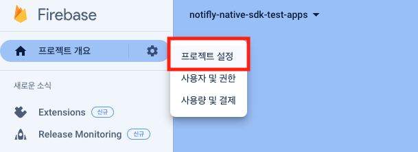
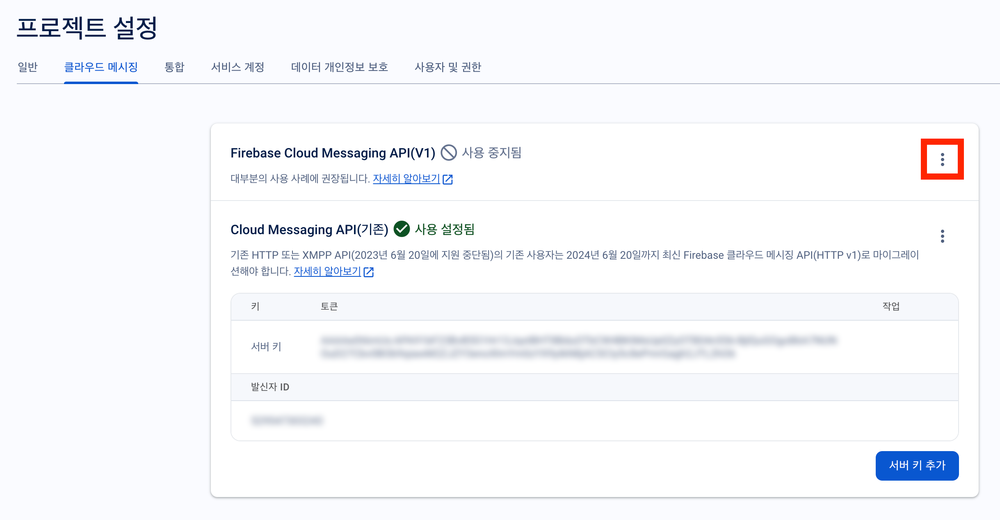
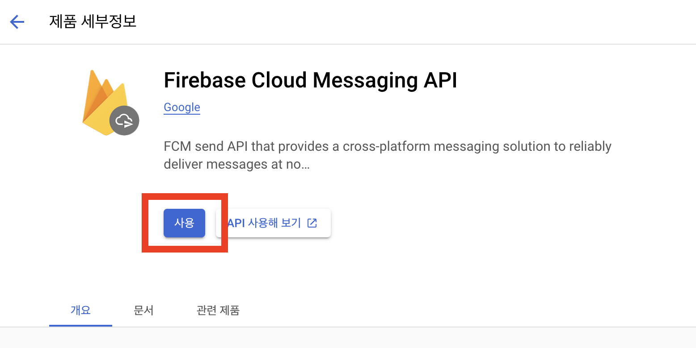
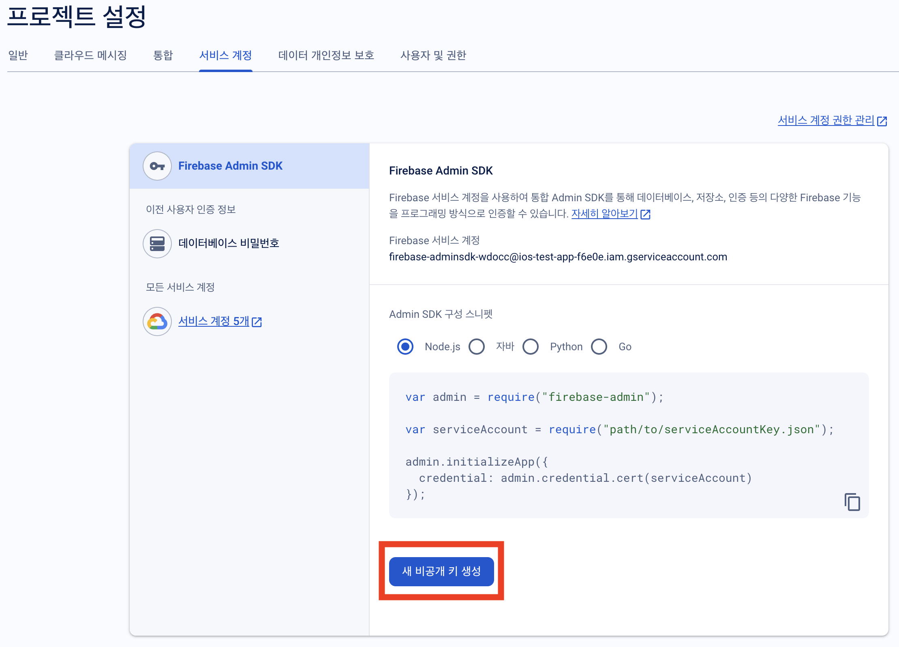
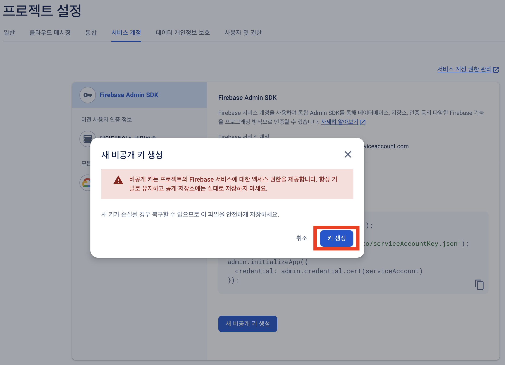
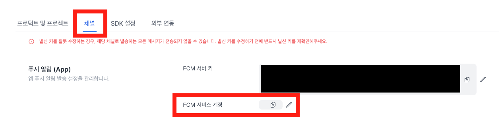

# Firebase Project Setup

Notifly utilizes [Firebase Cloud Messaging](https://firebase.google.com/docs/cloud-messaging) to send push notifications and in-app popups.

- A Firebase project is required to use Firebase Cloud Messaging.
- This guide will instruct you on how to create a Firebase project and integrate it with Notifly.

## 1. Prerequisite

### 1-1. Firebase Project Setup

You must have a Firebase project created and your app registered with this project.

- Refer [here](https://firebase.google.com/docs/projects/learn-more?hl=en) for how to create a Firebase project.
- Refer [here](https://firebase.google.com/docs/projects/learn-more?hl=en#add-app) for how to register your app with a Firebase project.

### 1-2. Firebase Setup for Each Platform

#### Flutter

Flutter offers two ways to set up Firebase:

1. Install and initialize Firebase using FlutterFire CLI (Recommended) - [Refer to the FlutterFire Guide](https://firebase.flutter.dev/docs/overview#installation).
2. Install and initialize Firebase for each platform (iOS, Android) separately - [Refer to the FlutterFire Guide](https://firebase.flutter.dev/docs/manual-installation/).

Both methods are viable. After installation, for Android, ensure the `google-services.json` file is added, and for iOS, the `GoogleService-Info.plist` file must be included.

#### React Native

Firebase setup must be completed separately for Android and iOS. Please refer to the Android and iOS sections below for setup instructions.

#### Android

Your project must include the `google-services.json` file from the Firebase project's registered app. For how to add the file, refer to the [Firebase Official Documentation (Android)](https://firebase.google.com/docs/android/setup?hl=en#add-config-file).

#### iOS

Your project must include the `GoogleService-Info.plist` file from the Firebase project's registered app. For how to add the file, refer to the [Firebase Official Documentation (iOS)](https://firebase.google.com/docs/ios/setup?hl=en#add-config-file).

### 1-3. Registering APNs Certificate

For iOS apps (including React Native and Flutter), an APNs certificate must be registered with your Firebase project.

- Refer to the APN Authentication Key Upload section on the [Firebase Official Documentation](https://firebase.google.com/docs/cloud-messaging/ios/client?hl=en#upload_your_apns_authentication_key) page for how to register an APNs certificate.

## 2. Enabling Firebase Cloud Messaging API(V1) for Your Firebase Project

To send push notifications and in-app popups through Notifly, the Firebase Cloud Messaging API(V1) must be activated. Here's how to enable it:

1. Log in to the [Firebase Console](https://console.firebase.google.com/).
2. Select `Project settings` from the top left tab.

3. Go to the Cloud Messaging tab.
4. Check if the Firebase Cloud Messaging API(V1) is enabled.
   - If the Cloud Messaging API is enabled, this step is complete.
   - Move to step 3 to register the FCM Service Account with Notifly.
5. If the Cloud Messaging API is disabled, click on the icon in the top right to go to the management page.

6. Activate the Firebase Cloud Messaging API in the Google Cloud Console.

## 3. Registering FCM Service Account with Notifly

For integration between Notifly and Firebase Cloud Messaging (FCM), the FCM Service Account key is required. This key is generated and managed in your Firebase project.

### Creating an FCM Service Account Key

1. Access your project in the Firebase Console and go to the 'Service accounts' tab.
2. Click the 'Generate new private key' button to create a new service account key.

   

3. In the dialog that pops up, click the 'Generate key' button to create the key.

   

4. The generated JSON key file will be downloaded. Keep this file in a safe place as it will be needed when registering with Notifly.

### Registering the Key in the Notifly Console

1. Log in to the Notifly console and go to the settings page.
2. In the 'Channels' tab, copy the contents of the downloaded JSON file and paste it into the FCM Service Account Key input field.

   
