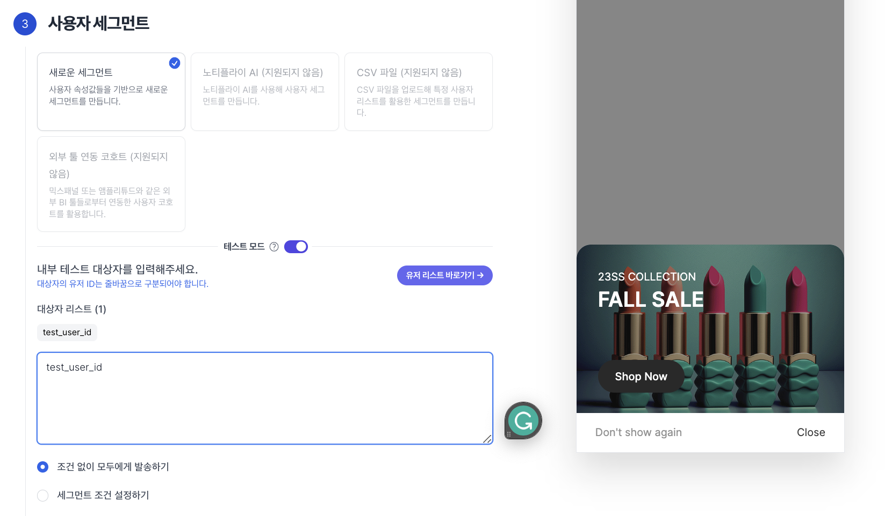
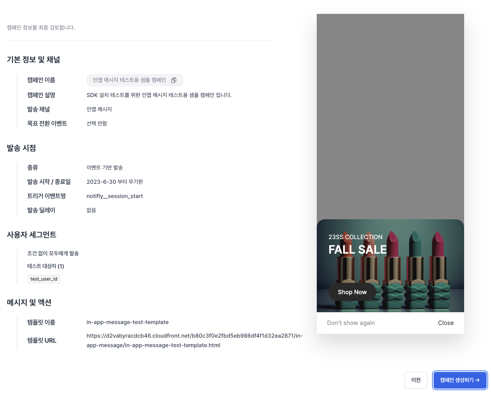

# Client SDK - SDK Integration Test

This section guides you through testing to ensure the Notifly Client SDK is properly set up.

## 1. User Registration and Event Sending

### 1-1. User ID Registration

- Users are created even without registering a user ID, but registering a user ID allows for distinguishing users.
- Register users using Notifly SDK's `setUserId`.

### 1-2. User Properties Registration

- Register user properties using Notifly SDK's `setUserProperties`.

### 1-3. Event Sending

- Send events using Notifly SDK's `trackEvent`.

## 2. Verifying User Registration and Event Sending

- Log in to the Notifly website and select the project that the test user belongs to.
  - Select the project in which the test user is registered from the top right of the homepage.
- Select the user menu, click on the test user in the user list page to go to the user profile page.
- Verify if the user ID, user properties, and events registered in steps 1-1, 1-2, and 1-3 have been correctly transmitted.

**User List Page**

**User Profile Page**

- Check if the user ID and user properties have been correctly registered.

- Verify if the events have been correctly sent.

## 3. App Push Notification Test

** Push notification tests are not possible on iOS simulators. **

- Go to the campaign creation page.
- Select the project in which the test user is registered from the top right tab.
- In the 1st section of basic information and channel, select `App Push`.
- Move to the 4th section of message and action, enter the message to be tested.
  - `Message Title`: Enter the title of the push notification to be sent.
  - `Message Content`: Enter the content of the push notification to be sent.
  - `Action`: Specify the action when the push notification is clicked.
    - ** Be sure to conduct tests for both URL and deep link testing. **
    - Test whether the action works correctly when clicked in Foreground, Background, and Terminated states.

- Click the "Send Test" button in the bottom right, enter the test user ID, and click to send the test.

- If the push notification arrives successfully, the test is complete.

## 4. In-App Popup Test

- Notifly automatically logs several events with the notifly\_\_ prefix in front of the event name.
  - ex: notifly\_\_session_start when the app is started for the first time
- This section tests the in-app popup feature by creating a test campaign that sends an in-app popup when notifly\_\_session_start occurs.

### 4-1. Creating an In-App Popup Template

1. Go to the in-app popup creation page.
2. Select a template and set the Image, Text, Button, and Aesthetics appropriately.
   - It's mandatory to enter the link to move to when the main_button is clicked in the Button section.

3. Click the save in-app popup button, enter the template name, and press save.

### 4-2. Creating a Test Campaign

1. Go to the campaign creation page.
2. Select the project in which the test user is registered from the top right tab.
3. In the 1st section of basic information and channel, enter the campaign name and select the distribution channel: `In-App Popup`.
4. In the 2nd section of sending time, fill in the necessary information as shown below.
   - Choose event-based sending.
   - Check indefinite sending.
   - Enable direct input toggle in event selection and enter `notifly__session_start`.
   - Choose immediate sending upon event occurrence for sending time.

5. In the 3rd section of sending targets, activate test mode and enter the test user ID.

6. In the 4th section of message and action, select the in-app popup template to be tested. (The template created in 4-1)

7. Click the final confirmation button on the bottom right, review if the necessary information is correctly filled, and click the button to create the campaign.
   

### 4-3. Testing In-App Popup on Test Device

- Proceed with the test on the device where the test user ID is registered.
- Make the test device in a terminated state.
- Upon launching the app, the notifly\_\_session_start event is automatically logged, and an in-app popup is sent, displaying the screen as shown below.
  - If the in-app popup does not appear, there might be a delay in fetching the new campaign information, so please close and restart the app.

- If the in-app popup arrives successfully, the test is complete.

## 5. Web Push Notification Test

### 5-1. Sending Web Push Test

- Go to the campaign creation page.
- Select the project in which the test user is registered from the top right tab.
- In the 1st section of basic information and channel, select `Web Push`.
- Move to the 4th section of message and action, enter the message to be tested.
  - `Message Title`: Enter the title of the push notification to be sent.
  - `Message Content`: Enter the content of the push notification to be sent.
  - `Action`: Specify the action when the push notification is clicked.
    - Test whether the action works correctly when received and clicked in both Focus (foreground) and Background states.

- Click the "Send Test" button in the bottom right, enter the test user ID, and click to send the test.

- If the push notification arrives successfully, the test is complete.

### 5-2. Web Push FAQ

If the web push notification does not arrive as expected, check the most common causes.

#### 5-2-1. Device Permissions

The user must allow notification permissions for the browser on the device (macOS, Windows, etc.).

Example (macOS):

#### 5-2-2. Browser Permissions

The user must allow notification permissions in the browser. The default setting and request method for push notification permissions vary by browser.

Example (Chrome)

Example (Edge)

Depending on the setup method of the Notifly JS SDK, the default permission request popup may or may not appear. For more details, please refer to [Notifly JS SDK - Registering a Service Worker](http://docs.notifly.tech/ko/developer-guide/client-sdk/javascript-sdk#2-3-service-worker-%EB%93%B1%EB%A1%9D%ED%95%98%EA%B8%B0).

#### 5-2-3. Supported Browser Versions

Notifly sends web pushes through the Web Push Protocol. Please check [Push API - Browser compatibility](https://developer.mozilla.org/en-US/docs/Web/API/Push_API) for currently supported browsers and versions.

- For example, web pushes are not supported in Safari versions 15 and below on desktop.

#### 5-2-4. Others

If you encounter any issues, please contact the Notifly team.
