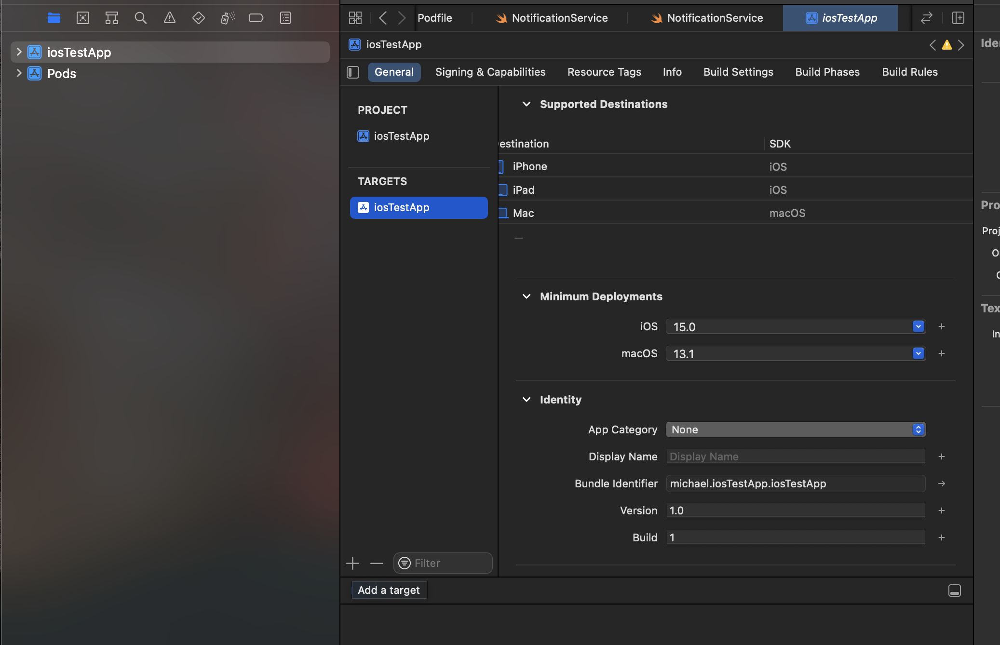
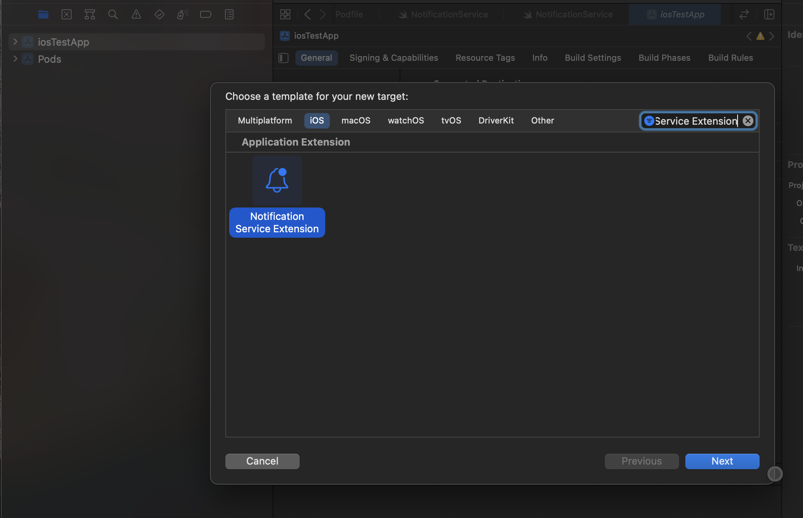
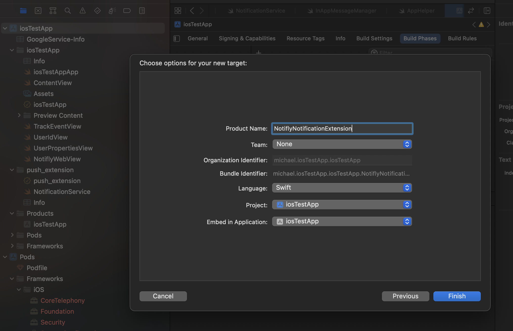
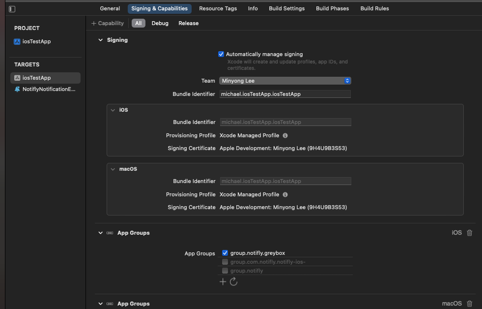
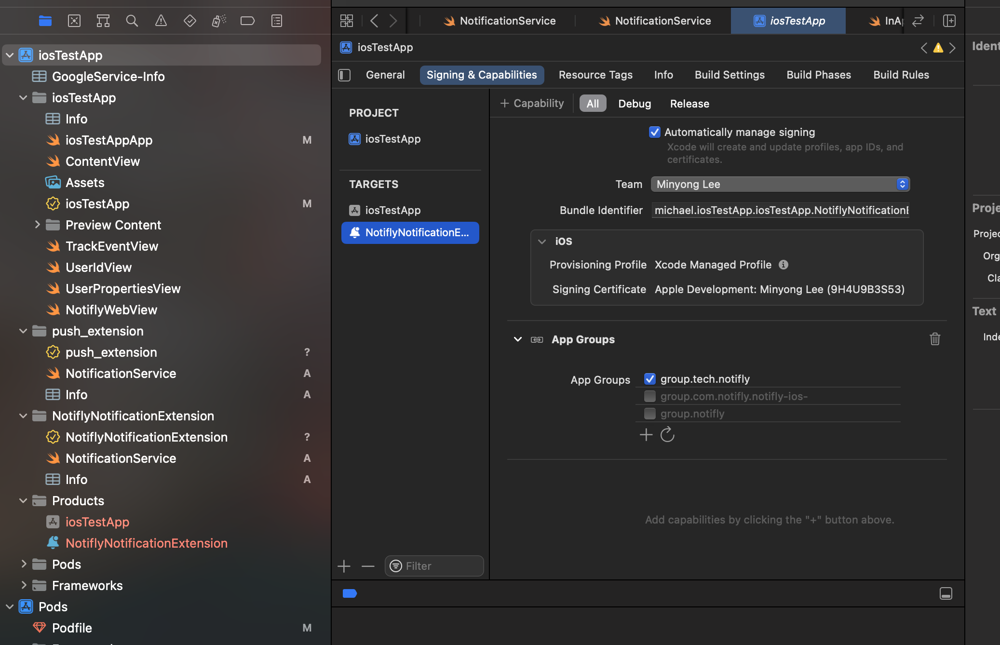
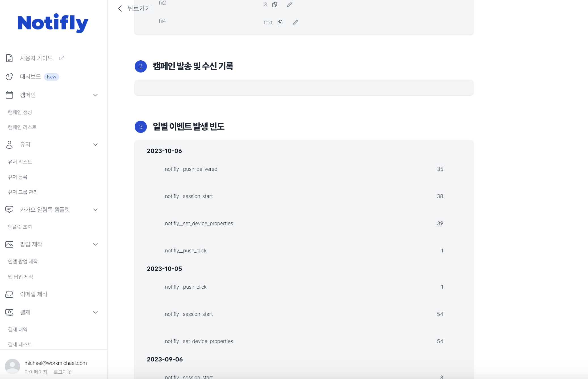

# (Advanced) Rich Push Notification (iOS)

```mdx-code-block
import Tabs from '@theme/Tabs';
import TabItem from '@theme/TabItem';
```

:::caution SDK spec for Rich Push Notification
`iOS Native`: 1.3.0 버전 이상<br/>
`react-native` : 3.0.4 버전 이상<br/>
`flutter`: 1.2.3 버전 이상
:::

<br />

:::note 프로젝트에 Notification Extension을 설정함으로써 다음 기능들을 사용하실 수 있습니다.

1. 노티플라이에서 전송하는 푸시 알림에 이미지 및 비디오를 첨부할 수 있습니다.<br/>
2. 푸시 수신 지표를 수집할 수 있어, 캠페인 성과를 보다 자세하게 확인하실 수 있습니다.
   :::

## 1. Notification Service Extension을 추가

1. Xcode에서 프로젝트를 열고(react_native나 flutter 프로젝트의 경우, ios 폴더 내의 .xcworkspace 파일을 선택), 프로젝트 네비게이터에서 프로젝트를 선택합니다.



2. 프로젝트 타겟을 선택하고, `+` 버튼을 눌러 `Notification Service Extension`을 추가합니다.



3. Product Name을 `NotiflyNotificationExtension`으로 입력하고, Finish 버튼을 눌러 추가합니다.



4. 생성된 Extension은 메인 앱과 동일한 버전을 사용하도록 설정합니다.


## 2. App Groups 설정

1. 그룹 id는 group.notifly.{username}과 같습니다. (Ex: group.notifly.greybox)

- username은 노티플라이의 설정 페이지의 API, SDK 인증 정보 섹션에서 확인하실 수 있습니다. (initialize method에서 사용하는 값과 동일합니다.)

2. TARGETS에서 메인 앱을 선택한 후, Signing & Capabilities 탭에서 App Groups을 추가하고, 그룹 이름을 `group.notifly.{username}`로 설정합니다.



3. TARGETS에서 생성된 Extension을 선택하고, Signing & Capabilities 탭에서 App Groups을 추가하고, 그룹 이름을 `group.notifly.{username}`로 설정합니다.



## 3. Notification Service Extension을 Notifly SDK와 연동

### 3-1. Cocoapods

1. Podfile에서 Extension 타겟에 Notifly SDK를 추가합니다.

:::caution SDK 설치시 주의사항
Extension target에는 아래 예시 코드를 참고하시어 static library로 notifly_sdk를 설치해주세요.
:::

<Tabs>
<TabItem value="PodFile" label="Podfile">

```swift title="Podfile (root)"
platform :ios, '13.0'

// highlight-start
target 'NotiflyNotificationExtension' do
  use_frameworks! :linkage => :static
  pod 'notifly_sdk', '1.5.0', :subspecs => ['Extension']
end
// highlight-end
```

</TabItem>
</Tabs>

2. Podfile이 있는 디렉토리에서 `pod install` 명령어를 실행합니다.

### 3-2. Swift Package Manager

1. Xcode에서 프로젝트를 열고 프로젝트 네비게이터에서 프로젝트를 선택합니다.
2. TARGETS에서 생성된 Extension을 선택하고, General 탭에서 Frameworks, Libraries, and Embedded Content 섹션에서 `+` 버튼을 눌러 Notifly SDK(notifly_sdk)를 추가합니다.

## 4. 연동 코드 작성

1. 기존 Extension 존재 여부에따라 4-1/4-2 중 하나의 섹션을 참고하시어 `NotiflyNotificationExtension/NotificationService.swift` 파일을 열고, 다음 코드를 추가합니다.
2. `PROJECT_ID`, `USERNAME`은 노티플라이 웹페이지의 설정 페이지의 API, SDK 인증 정보 섹션에서 확인하실 수 있습니다. (initialize method에서 사용하는 값과 동일합니다.)

### 4-1. 기존 Extension이 존재하지 않는 경우 (처음 Extension을 생성한 경우)

<Tabs>
<TabItem value="NotiflyNotificationExtension/NotificationService.swift" label="NotificationService.swift">

```swift title="NotiflyNotificationExtension/NotificationService.swift"
import notifly_sdk

class NotificationService: NotiflyNotificationServiceExtension {
    override init() {
        super.init()
        self.setup()
    }

    func setup() {
        self.register(projectId: "{YOUR_PROJECT_ID}", username: "{YOUR_USERNAME}")
    }
}

```

</TabItem>
</Tabs>

### 4-2. 기존 Extension이 존재하는 경우

- YOUR CODE 부분에 기존 Extension에 작성된 코드를 추가합니다.
- 자체 이미지 푸시를 발송하고 계시다면, 꼭 기존의 자체 푸시 알림 발송 테스트를 완료해주세요. 문제가 있을 경우, 노티플라이 슬랙 채널로 문의 부탁드립니다.

<Tabs>
<TabItem value="NotiflyNotificationExtension/NotificationService.swift" label="NotificationService.swift">

```swift title="NotiflyNotificationExtension/NotificationService.swift"
import notifly_sdk

class NotificationService: NotiflyNotificationServiceExtension {
    override init() {
        super.init()
        self.setup()
    }

    func setup() {
        self.register(projectId: "{YOUR_PROJECT_ID}", username: "{YOUR_USERNAME}")
    }

    override open func didReceive(_ request: UNNotificationRequest, withContentHandler contentHandler: @escaping (UNNotificationContent) -> Void) {
        super.didReceive(request, withContentHandler: contentHandler)
        /* YOUR CODE */
    }

    override open func serviceExtensionTimeWillExpire() {
        super.serviceExtensionTimeWillExpire()
        /* YOUR CODE */
    }
}

```

</TabItem>
</Tabs>

## 4. Test

### 1. 이미지 첨부 테스트

1. [노티플라이 SDK 연동 테스트 가이드](/developer-guide/client-sdk/sdk_test)를 참고하여, 이미지 첨부 후 푸시알림 테스트 발송을 진행합니다.<br/>
2. 푸시 수신 시, 이미지가 정상적으로 표시되는지 확인합니다.

### 2. 푸시 수신 지표 수집 테스트

1. [노티플라이 SDK 연동 테스트 가이드](/developer-guide/client-sdk/sdk_test)를 참고하여, 푸시알림 테스트 발송을 진행합니다.<br/>
2. 유저 리스트 페이지에서 테스트한 유저의 상세 페이지로 이동합니다.<br/>
3. 푸시 수신 지표가 정상적으로 수집되었는지 확인합니다.


