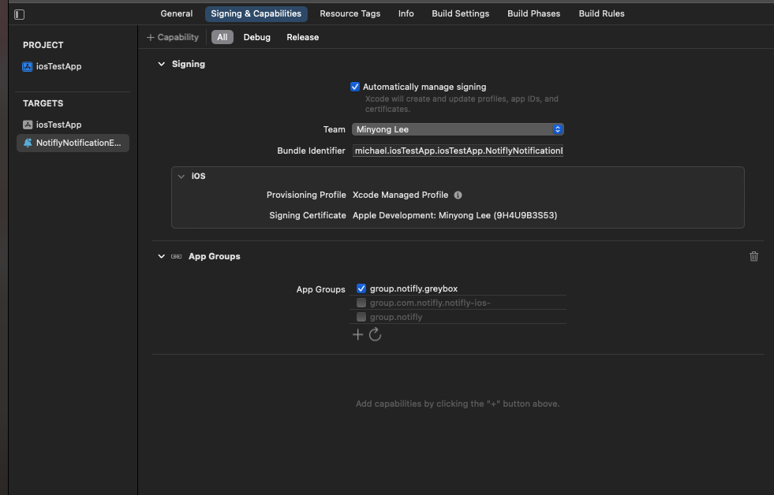

# (Advanced) Rich Push Notification (iOS)

```mdx-code-block
import Tabs from '@theme/Tabs';
import TabItem from '@theme/TabItem';
```


:::caution SDK spec for Rich Push Notification
`iOS Native`: 1.2.0 버전 이상<br/>
`react-native` : 3.0.4 버전 이상<br/>
`flutter`: 1.2.2 버전 이상
:::

<br/>

:::note 프로젝트에 Notification Extension을 설정함으로써 다음 기능들을 사용하실 수 있습니다.
1. 노티플라이에서 전송하는 푸시 알림에 이미지 및 비디오를 첨부할 수 있습니다.<br/>
2. 푸시 수신 지표를 수집할 수 있어, 캠페인 성과를 보다 자세하게 확인하실 수 있습니다.
:::

## 1. Notification Service Extension을 추가

1. Xcode에서 프로젝트를 열고(react_native나 flutter 프로젝트의 경우, ios 폴더 내의 .xcworkspace 파일을 선택), 프로젝트 네비게이터에서 프로젝트를 선택합니다. 


2. 프로젝트 타겟을 선택하고, `+` 버튼을 눌러 `Notification Service Extension`을 추가합니다.


3. Product Name을 `NotiflyNotificationExtension`으로 입력하고, Finish 버튼을 눌러 추가합니다.


4. 생성된 Extension은 메인 앱과 동일한 버전을 사용하도록 설정합니다.


## 2. App Groups 설정

1. TARGETS에서 메인 앱을 선택한 후, Signing & Capabilities 탭에서 App Groups을 추가하고, 그룹 이름을 `group.tech.notifly`로 설정합니다.
        


2. TARGETS에서 생성된 Extension을 선택하고, Signing & Capabilities 탭에서 App Groups을 추가하고, 그룹 이름을 `group.tech.notifly`로 설정합니다.



## 3. Notification Service Extension을 Notifly SDK와 연동

1. Podfile에서 Extension 타겟에 Notifly SDK를 추가합니다.

```ruby
platform :ios, '13.0'
  ...
target 'NotiflyNotificationExtension' do
  pod 'notifly_sdk', '~> 1.2.0'
end
```

2. Podfile이 있는 디렉토리에서 `pod install` 명령어를 실행합니다.

3. NotiflyNotificationExtension/NotificationService.swift 파일을 열고, 다음 코드를 추가합니다.

<Tabs>
<TabItem value="NotiflyNotificationExtension/NotificationService.swift" label="NotificationService.swift">

```swift title="NotiflyNotificationExtension/NotificationService.swift"
import notifly_sdk

class NotificationService: NotiflyNotificationServiceExtension {
}
```

</TabItem>
</Tabs>

## 4. Test 
### 1. 이미지 첨부 테스트
  1. [노티플라이 SDK 연동 테스트 가이드](/developer-guide/client-sdk/sdk_test)를 참고하여, 이미지 첨부 후 푸시알림 테스트 발송을 진행합니다.<br/>
  2. 푸시 수신 시, 이미지가 정상적으로 표시되는지 확인합니다.

### 2. 푸시 수신 지표 수집 테스트
  1. [노티플라이 SDK 연동 테스트 가이드](/developer-guide/client-sdk/sdk_test)를 참고하여, 푸시알림 테스트 발송을 진행합니다.<br/>
  2. [유저 리스트 페이지](https://www.notifly.tech/ko/console/users)에서 테스트한 유저의 상세 페이지로 이동합니다.<br/>
  3. 푸시 수신 지표가 정상적으로 수집되었는지 확인합니다.


