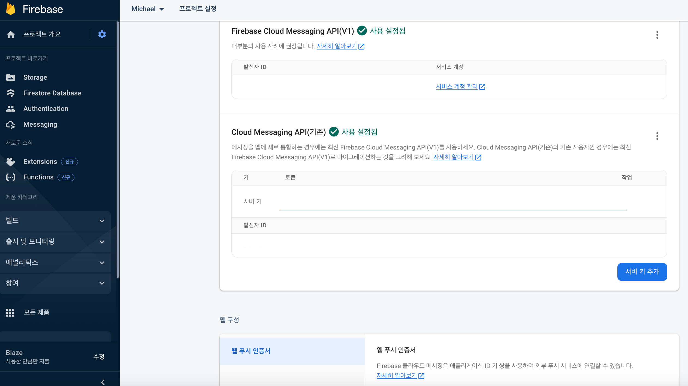
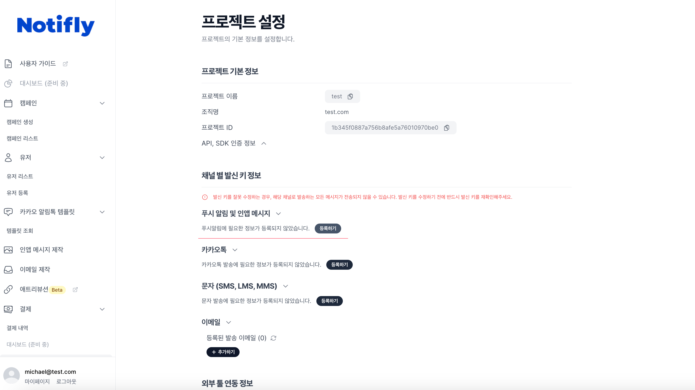

# Firebase Project 연동

Notifly에서는 푸시 알림과 인앱 메시지를 발송하기 위해 [Firebase Cloud Messaging](https://firebase.google.com/docs/cloud-messaging)을 활용하고 있습니다.

- Firebase Cloud Messaging을 활용하기 위해서는 Firebase 프로젝트가 필요합니다. 
- Firebase 프로젝트를 생성하고, Notifly에 Firebase 프로젝트를 연동하는 방법을 안내합니다.

## 1. Prerequisite

### 1-1. Firebase Project

- Firebase 프로젝트가 생성되어 있어야하며 앱이 이 프로젝트에 등록되어 있어야 합니다.
    - Firebase 프로젝트 생성 방법은 [여기](https://firebase.google.com/docs/projects/learn-more?hl=ko)를 참고하세요.
    - Firebase 프로젝트에 앱을 등록하는 방법은 [여기](https://firebase.google.com/docs/projects/learn-more?hl=ko#add-app)를 참고하세요.
    - Android 앱일 경우에 Firebase 프로젝트에 등록된 앱의 `google-services.json` 파일이 프로젝트에 추가되어 있어야 합니다.
        - Android 앱의 `google-services.json` 파일 추가 방법은 [여기](https://firebase.google.com/docs/android/setup?hl=ko#add-config-file)를 참고하세요.
    - iOS 앱일 경우에 Firebase 프로젝트에 등록된 앱의 `GoogleService-Info.plist` 파일이 프로젝트에 추가되어 있어야 합니다.
        - iOS 앱의 `GoogleService-Info.plist` 파일 추가 방법은 [여기](https://firebase.google.com/docs/ios/setup?hl=ko#add-config-file)를 참고하세요.

### 1-2. APNs 인증서 등록

- iOS 앱(React Native, Flutter 포함)일 경우, APNs 인증서가 Firebase 프로젝트에 등록되어 있어야 합니다.

    - APNs 인증서 등록 방법은 [Firebase 공식 문서](https://firebase.google.com/docs/cloud-messaging/ios/client?hl=ko#upload_your_apns_authentication_key)페이지의 APN 인증 키 업로드 섹션을 참고하세요.

## 2. Firebase 프로젝트 Cloud Messaging API 활성화

- Notifly를 통해 푸시 알림 및 인앱 메시지를 기기에 전송하기 위해서는 Cloud Messaging API가 활성화되어 있어야 합니다.
- Cloud Messaging API 활성화 방법은 다음과 같습니다. 
    1. [Firebase 콘솔](https://console.firebase.google.com/)에 로그인합니다.
    2. 좌측 상단 탭에서 `프로젝트 설정`을 선택합니다.
    3. 클라우드 메시징 탭으로 이동합니다.
    4. 클라우드 메시징 API가 활성화되었는지 확인합니다.
        - 클라우드 메시징 API가 활성화되었다면, 이 단계는 완료되었습니다.
        - 3으로 이동하여, FCM 서버 키를 Notifly에 등록해주세요.
    5. 클라우드 메시징 API가 비활성화되어 있다면, Cloud Messaging API 섹션의 우측 더보기 탭의 Google Cloud Console에서 API 관리 버튼을 클릭합니다.
    6. Google Cloud Console에서 Cloud Messaging API를 활성화합니다.

## 3. Notifly에 FCM 서버키 등록

- FCM 서버키는 Firebase 프로젝트의 Cloud Messaging 탭에서 확인할 수 있습니다.
    - Firebase 프로젝트의 Cloud Messaging 탭으로 이동합니다.
    - 서버 키를 확인합니다.

- [Notifly Setting 페이지](https://notifly.tech/ko/console/settings)에서 FCM 서버키를 등록합니다.

