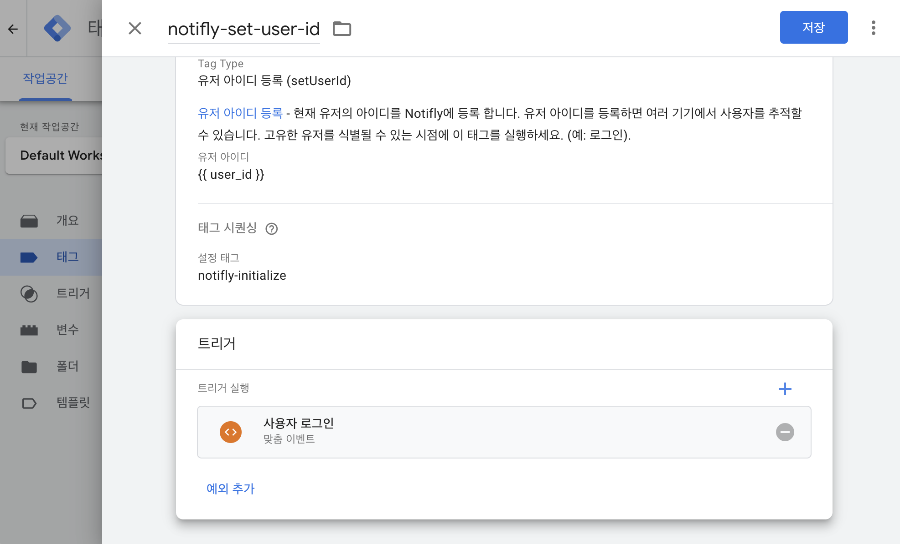

# Client SDK - Google Tag Manager

Google Tag Manager에서 Notifly 맞춤 템플릿을 추가하여 손쉽게 사용하실 수 있습니다.

## 1. Notifly 맞춤 템플릿 설치

1. [다운로드 페이지](https://github.com/team-michael/notifly-gtm-template/releases)에서 Notifly 맞춤 템플릿의 최신버전을 다운로드 합니다.
    * 한글: **template.ko.tpl**
    * 영문: **template.tpl**
2. 메뉴 왼쪽 하단 **템플릿** 메뉴를 선택하고 우측 상단에 있는 **태그 템플릿 > 새로 만들기** 버튼을 클릭하여 템플릿 편집기를 실행합니다.

 
3. 템플릿 편집기 우측 상단 저장 버튼 오른쪽에 있는 **⋮** 버튼을 클릭하고 **가져오기**를 선택하여 다운받은 맞춤 템플릿 파일을 가져옵니다.

4. 템플릿이 가져와 진 후 저장 버튼을 클릭하시면 왼쪽 하단에 **템플릿이 생성됨** 이라는 팝업이 뜨면서 템플릿 설치가 완료 됩니다.

## 2. Notifly SDK 초기화 태그

1. Google Tag Manager 좌측 메뉴에서 **태그** 섹션으로 들어가 **새로 만들기** 버튼을 클릭하여 태그 생성 메뉴를 실행합니다.
2. 태그의 이름을 지정하고 태그 구성을 클릭하여 태그 유형 선택 메뉴를 실행합니다.
3. 맞춤설정 섹션에서 위에서 추가한 **Notifly Javascript SDK** 를 선택합니다.

4. 태그 구성 화면에서 Tag Type은 SDK 초기화를 선택하고 Project ID, Username, Password 및 기타 설정을 입력합니다. ([Notifly SDK 초기화 옵션](http://localhost:3000/ko/developer-guide/client-sdk/javascript-sdk#initialize-options) 참고.)

5. 고급 설정에서 태그 실행 옵션은 페이지당 한번으로 설정 하시고 트리거는 **Initialization - All Pages**로 선택 합니다.

## 3. 유저 아이디 등록 (setUserId)

1. 초기화 태그 추가와 동일하게 태그 구성 메뉴를 실행하고 Tage Type을 **유저 아이디 등록(setUserId)**을 선택합니다. 유저 아이디 칸에는 [Google Tag Manager에서 설정한 변수](https://support.google.com/tagmanager/answer/7683362)를 지정해 줍니다.

 
2. 고급 설정의 **태그 시퀀싱** 메뉴에서 위에서 설정한 Notifly SDK 초기화 태그가 먼저 실행 되도록 설정 해줍니다. **(초기화 태그가 실행되지 않으면 다른 태그들이 동작하지 않습니다.)**

3. 트리거는 사용자가 로그인 하는 시점의 맞춤 이벤트로 설정 해주시면 됩니다.

## 3. 유저 속성 등록 (setUserProperties)

1. 유저 아이디 등록 태그 설정과 동일하게 진행 하시면 됩니다. Tag Type은 유저 속성 등록을 선택하고 유저 속성으로 등록할  [Google Tag Manager 변수](https://support.google.com/tagmanager/answer/7683362)를 입력해줍니다.

2. 태그 시퀀싱 으로 유저 속성 등록 태그 이전에 유저 아이디 등록 태그가 먼저 실행 될 수 있도록 설정 해줍니다. 

## 4. 유저 삭제 (deleteUser)

1. 유저 아이디, 유저 속성 등록 태그 생성과 동일하게 진행합니다. 유저 삭제는 현재 페이지에 접근한 사용자를 삭제하는 기능이기 때문에 별도의 아이디를 입력받지 않습니다. Notifly에서 해당 사용자의 정보를 완전 삭제합니다. 

2. 태그 시퀀싱으로 초기화 태그가 실행 된 이후에 실행 될 수 있도록 설정합니다.

## 5. 이벤트 로깅 (trackEvent)

1. 다른 태그들과 동일하게 추가하고 Tag Type은 이벤트 로깅으로 선택합니다. 전달할 이벤트의 이름을 설정합니다. 이벤트에 변수를 추가해서 보낼 수 있습니다.
2. 태그 시퀀싱으로 초기화 태그가 실행 된 이후에 실행 될 수 있도록 설정합니다.

