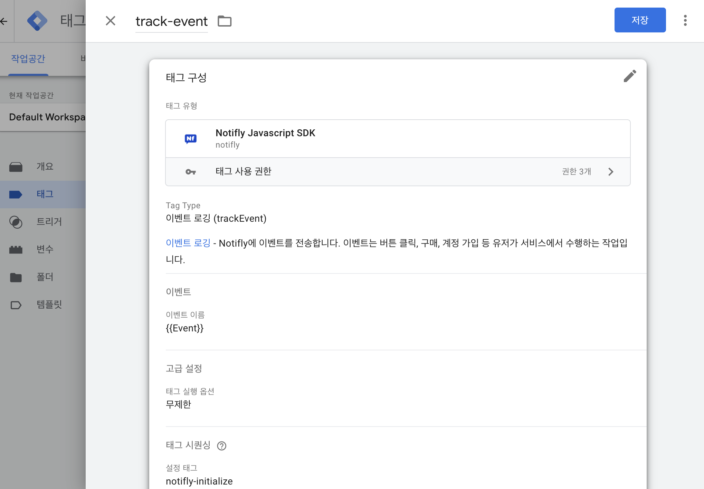

# Client SDK - Google Tag Manager

Google Tag Manager에서 Notifly 맞춤 템플릿을 추가하여 손쉽게 사용하실 수 있습니다.

## 1. Notifly 맞춤 템플릿 설치

1. [다운로드 페이지](https://github.com/team-michael/notifly-gtm-template/releases)에서 Notifly 맞춤 템플릿의 최신버전을 다운로드 합니다.
   - 한글: **template.ko.tpl**
   - 영문: **template.tpl**
2. 메뉴 왼쪽 하단 **템플릿** 메뉴를 선택하고 우측 상단에 있는 **태그 템플릿 > 새로 만들기** 버튼을 클릭하여 템플릿 편집기를 실행합니다.
   
3. 템플릿 편집기 우측 상단 저장 버튼 오른쪽에 있는 `⋮` 버튼을 클릭하고 **가져오기**를 선택하여 다운받은 맞춤 템플릿 파일을 가져옵니다.
   
4. 템플릿이 가져와 진 후 저장 버튼을 클릭하시면 왼쪽 하단에 **템플릿이 생성됨** 이라는 팝업이 뜨면서 템플릿 설치가 완료 됩니다.
   

## 2. Notifly SDK 초기화 태그

1. Google Tag Manager 좌측 메뉴에서 **태그** 섹션으로 들어가 **새로 만들기** 버튼을 클릭하여 태그 생성 메뉴를 실행합니다.
2. 태그의 이름을 지정하고 태그 구성을 클릭하여 태그 유형 선택 메뉴를 실행합니다.
3. 맞춤설정 섹션에서 위에서 추가한 **Notifly Javascript SDK** 를 선택합니다.
   
4. 태그 구성 화면에서 Tag Type은 SDK 초기화를 선택하고 Project ID, Username, Password를 입력합니다. ([Notifly SDK 초기화 옵션](/ko/developer-guide/client-sdk/javascript-sdk#initialize-options) 참고.)

 5. 고급 설정에서 태그 실행 옵션은 페이지당 한번으로 설정 하시고 트리거는 **Initialization - All Pages**로 선택 합니다.

## 3. 유저 관리

:::note 주의 사항

- 노티플라이에서는 유저의 아이디 (userId) 및 속성 (userProperties)을 설정하여 마케팅 캠페인 집행 시에 활용할 수 있습니다.
- 노티플라이에서는 채널 별 푸시 알림 수신 동의 여부를 유저 속성로 설정하여, 푸시 알림 전송 전에 필터링 할 수 있습니다.
- Notifly SDK 초기화 태그 추가를 마친 후 속성 등록을 시작해 주세요.

:::

### 3-1. 유저 아이디 등록 (setUserId)

1. 초기화 태그 추가와 동일하게 태그 구성 메뉴를 실행하고 Tage Type을 **유저 아이디 등록(setUserId)**을 선택합니다. 유저 아이디 칸에는 [Google Tag Manager에서 설정한 변수](https://support.google.com/tagmanager/answer/7683362)를 지정해 줍니다.
   

2. 고급 설정의 **태그 시퀀싱** 메뉴에서 위에서 설정한 Notifly SDK 초기화 태그가 먼저 실행 되도록 설정 해줍니다. **(초기화 태그가 실행되지 않으면 다른 태그들이 동작하지 않습니다.)**
   

3. 트리거는 사용자가 로그인 하는 시점의 맞춤 이벤트로 설정 해주시면 됩니다.
   

### 3-2. 유저 속성 등록 (setUserProperties)

1. 유저 아이디 등록 태그 설정과 동일하게 진행 하시면 됩니다. Tag Type은 유저 속성 등록을 선택하고 유저 속성으로 등록할 [Google Tag Manager 변수](https://support.google.com/tagmanager/answer/7683362)를 입력해줍니다.
   - 이메일 발송을 위해서는 **이메일 주소를 유저 속성으로 설정**해야 합니다.
   - 카카오 알림톡, 친구톡, 문자 발송을 위해서는 **전화번호를 유저 속성으로 설정**해야 합니다.
   - **전화번호와, 이메일의 속성 필드명은 꼭 각각 $phone_number, $email로 설정해 주세요.**
   - (권장사항) 로그아웃 시 userId를 null로 하여 setUserId 호출함으로써 유저의 userId 등록을 해지해 주세요.
   - 
       유저 아이디 등록해지를 호출할 경우, 유저 프로퍼티 및 캠페인 피로도 관리
       데이터 등 모든 유저 정보가 삭제됩니다.
     

2. 태그 시퀀싱 으로 유저 속성 등록 태그 이전에 유저 아이디 등록 태그가 먼저 실행 될 수 있도록 설정 해줍니다.
   

## 4. 이벤트 로깅 (trackEvent)

:::note 주의 사항

- 노티플라이에서는 유저의 행동 등 이벤트를 로깅하여 캠페인 집행 시 타겟팅에 활용할 수 있습니다. 로깅 된 이벤트는 푸시 알림 발송 타이밍, 발송 대상 설정 등에 활용할 수 있습니다.
  - Notifly SDK 초기화 태그 추가를 마친 후 이벤트 로깅을 시작해 주세요.
- **발송 대상 이벤트 변수 목록** 활용하여 이벤트 변수를 발송 대상 설정 등에 활용할 수 있습니다. 이를 위해서, 발송 대상 설정에 사용할 변수의 변수 명을 발송 대상 이벤트 변수 목록 지정해주세요. \* 현재는 하나의 **발송 대상 이벤트 변수**만 지원하고 있기 때문에, **발송 대상 이벤트 변수 목록**은 하나만 추가하셔야 합니다.
  :::

1. 다른 태그들과 동일하게 추가하고 Tag Type은 이벤트 로깅으로 선택합니다. 전달할 이벤트의 이름을 설정합니다. 이벤트에 변수를 추가해서 보낼 수 있습니다.
2. 태그 시퀀싱으로 초기화 태그가 실행 된 이후에 실행 될 수 있도록 설정합니다.
   

3. 다음은 Google Tag Manager가 제공하는 **[기본 변수](https://support.google.com/tagmanager/answer/7182738)인 `클릭 ID`와 [기본 트리거 이벤트](https://support.google.com/tagmanager/answer/7679320)인 `클릭 - 모든 요소`를 Notifly의 이벤트로 로깅**하는 태그 설정의 예시입니다. 클릭 된 HTML 요소의 id를 변수 **element_id**의 값으로 보내고 **발송 대상 이벤트 변수 목록**으로 **element_id**를 추가하였습니다.  
   
   

## 4. 연동 테스트

- 태그들이 잘 설정 되었다면 [Notifly 홈페이지](https://notifly.tech/)에서 등록된 사용자들과 사용자들이 발생 시킨 이벤트를 확인할 수 있습니다.
- [Client SDK - 연동 Test](/ko/developer-guide/client-sdk/sdk_test) 섹션을 참고하여 테스트를 진행합니다.
