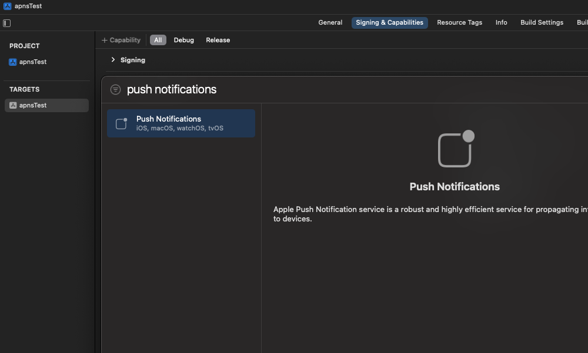

# Client SDK - iOS

Notifly iOS SDK는 노티플라이를 iOS 어플리케이션과 연동하기 위해 사용할 수 있습니다. 다음과 같은 기능들을 지원합니다:

- 기기 정보를 노티플라이에 등록하여 노티플라이를 통해 발송된 앱 푸시, 인앱 메시지를 iOS 앱에서 수신할 수 있습니다.
  - 노티플라이의 인앱 메시지는 앱이 Foreground 상태일 때만 수신됩니다. Background 및 Quit 상태일 때는 무시됩니다.
- 이벤트, 유저 정보를 노티플라이와 연동하여 모든 캠페인에서 활용할 수 있습니다.
- 캠페인의 성과를 측정할 수 있도록 이벤트를 로깅합니다.

```mdx-code-block
import Tabs from '@theme/Tabs';
import TabItem from '@theme/TabItem';
```

Notifly에서는 푸시를 발송하기 위해 [Firebase Cloud Messaging](https://firebase.google.com/docs/cloud-messaging)을 활용하고 있습니다.

1. [Firebase 프로젝트 연동](http://docs.notifly.tech/ko/developer-guide/client-sdk/firebase_project_setup)
2. [iOS APNs 인증 정보 설정](http://docs.notifly.tech/ko/developer-guide/client-sdk/firebase_project_setup#1-2-apns-%EC%9D%B8%EC%A6%9D%EC%84%9C-%EB%93%B1%EB%A1%9D)

을 마친 후, Notifly iOS SDK 연동을 시작해주세요.

## 1. Capability 설정

1. 대상 Project의 iOS Deployment Target과 Target의 Minimum Deployments iOS를 **13.0** 혹은 그 이상으로 설정합니다.
2. Push Notification Capability를 추가합니다.
   

3. Background Modes Capability를 추가합니다. - Remote notifications과 Background Fetch를 선택합니다.
   

## 2. CocoaPods에서 Notifly iOS SDK 설치

Notifly iOS SDK는 CocoaPods를 통해 설치할 수 있습니다.

1. Xcode 프로젝트에 CocoaPods 설치가 되어있는지 확인합니다.
   설치가 되어있지 않은 경우 [CocoaPods 설치 가이드](https://guides.cocoapods.org/using/getting-started.html)를 참고해 주세요.
2. Podfile 파일의 상단에 **platform :ios, '13.0'** 또는 그 이상의 버전으로 입력해 주세요.
3. Podfile 파일에 다음 코드를 추가해 주세요.

<Tabs>
<TabItem value="PodFile" label="Podfile">

```swift title="Podfile (root)"
target 'YOUR_PROJECT_NAME' do

// highlight-next-line
 pod 'notifly_sdk'

end
```

</TabItem>
</Tabs>

## 3. Notifly 연동 코드 작성

### 3-1. (SwiftUI) AppDelegate.swift 파일 수정

만약, **SwiftUI**프로젝트를 사용하고 계시다면, AppDelegate.swift 파일이 없을 수 있습니다. 이 경우, 다음과 같이 AppDelegate.swift 파일을 생성해 주세요.

이미 존재한다면 3-2로 넘어가 주세요.

<Tabs>
<TabItem value="SwiftUIAppDelegate" label="AppDelegate.swift">

```swift title="AppDelegate.swift (새로 추가할 파일)"
import UIKit

class AppDelegate: UIResponder, UIApplicationDelegate {
    func application(_ application: UIApplication, didFinishLaunchingWithOptions launchOptions: [UIApplication.LaunchOptionsKey: Any]?) -> Bool {
        return true
    }
}
```

</TabItem>
</Tabs>
<Tabs>
<TabItem value="SwiftUIAppFile" label="<YOUR_PROJECT_NAME>App.swift">

```swift title="<YOUR_PROJECT_NAME>App.swift (기존 파일)"
struct <YOUR_PROJECT_NAME>App: App {
    // highlight-next-line
    @UIApplicationDelegateAdaptor(AppDelegate.self) var appDelegate 
}
```

</TabItem>
</Tabs>

### 3-2. Notifly 연동 코드 작성

#### AppDelegate.swift 파일 에서 다음 코드들을 추가해 주세요.

- `notifly_sdk` 프래임워크를 import 합니다.

```swift
import notifly_sdk
```

- 다음 AppDelegate.swift의 `UIApplicationDelegate` 함수들 내에 각각 Notifly코드를 추가해 주세요.

    1. `application(_:didFinishLaunchingWithOptions:)`
        - Notifly SDK 초기화에 앞서 Firebase SDK를 초기화 합니다. *(Required)*
        - *PROJECT_ID, USERNAME, PASSWORD* 는 [노티플라이 홈페이지의 설정 페이지](https://notifly.tech/ko/console/settings)의 SDK, API 인증정보 섹션에서 확인하실 수 있습니다. 
            - 개발/프로덕션에 따라 PROJECT_ID가 다릅니다.
        - Notifly SDK를 초기화 합니다.
    2. `application(_:didRegisterForRemoteNotificationsWithDeviceToken:)`
        - APNs 토큰을 Notifly에 등록합니다.
    3. `application(_:didFailToRegisterForRemoteNotificationsWithError:)`
        - APNs 토큰 등록에 실패한 경우, Notifly에 알립니다.
    4. `application(_:didReceiveRemoteNotification:fetchCompletionHandler:)`
        - Notifly로부터 데이터를 수신합니다.
        
        <Tabs>
        <TabItem value="SwiftUIAppDelegate1" label="Swift">

        ```swift title="Example Code in AppDelegate.swift"
        import notifly_sdk 

        class AppDelegate: UIResponder, UIApplicationDelegate {
            func application(_: UIApplication,
                        didFinishLaunchingWithOptions _: [UIApplication.LaunchOptionsKey: Any]?) -> Bool {
                /* ...YOUR CODE */
                
                // highlight-start
                FirebaseApp.configure() // if you don't configure Firebase SDK yet.
                Notifly.initialize(projectID: "YOUR_PROJECT_NAME", username: "YOUR_USERNAME", password: "YOUR_PASSWORD")
                UNUserNotificationCenter.current().delegate = self
                // highlight-end
                return true
            }

            func application(_ application: UIApplication,
                didFailToRegisterForRemoteNotificationsWithError error: Error) {
                /* ...YOUR CODE */
                
                // highlight-start
                Notifly.application(application,
                                    didFailToRegisterForRemoteNotificationsWithError: error)
                // highlight-end
            }

            func application(_ application: UIApplication,
                didRegisterForRemoteNotificationsWithDeviceToken deviceToken: Data) {
                /* ...YOUR CODE */
                
                // highlight-start
                Notifly.application(application,
                    didRegisterForRemoteNotificationsWithDeviceToken: deviceToken)
                // highlight-end
            }

            func application(_ application: UIApplication,
                didReceiveRemoteNotification userInfo: [AnyHashable: Any],
                fetchCompletionHandler completionHandler: @escaping (UIBackgroundFetchResult) -> Void) {
                /* ...YOUR CODE */

                // highlight-start
                Notifly.application(application,
                                    didReceiveRemoteNotification: userInfo,
                                    fetchCompletionHandler: completionHandler)
                // highlight-end
            }
            /* ...YOUR CODE */
        }

        ```
        </TabItem>
        </Tabs>

- 앱 푸시 알림 트래픽을 Notifly에도 전달하도록 `UNUserNotificationCenterDelegate` 프로토콜에 다음 코드를 추가합니다.
    1. `userNotificationCenter(_:willPresent:withCompletionHandler:)`
        - 앱이 실행 중일 때, 앱 푸시 알림 트래픽을 Notifly로 전달합니다.
    2. `userNotificationCenter(_:didReceive:withCompletionHandler:)`
        - 앱 푸시 알림 클릭 이벤트를, Notifly로 전달합니다.

        <Tabs>
        <TabItem value="SwiftUIAppDelegate2" label="Swift">

        ```swift title="Example Code of UNUserNotificationCenterDelegate"
        import notifly_sdk 

        class AppDelegate: UIResponder, UIApplicationDelegate {
            /* ...YOUR CODE */
        }

        // Extension of AppDelegate conforming to the UNUserNotificationCenterDelegate protocol
        extension AppDelegate: UNUserNotificationCenterDelegate {
            func userNotificationCenter(_ notificationCenter: UNUserNotificationCenter,
                                        didReceive response: UNNotificationResponse,
                                        withCompletionHandler completion: () -> Void) {
                /* ...YOUR CODE */
                
                // highlight-start
                Notifly.userNotificationCenter(notificationCenter,
                                            didReceive: response,
                                            withCompletionHandler: completion)
                // highlight-end
            }

            func userNotificationCenter(_ notificationCenter: UNUserNotificationCenter,
                                        willPresent notification: UNNotification,
                                        withCompletionHandler completion: (UNNotificationPresentationOptions) -> Void) {
                /* ...YOUR CODE */
                
                // highlight-start
                Notifly.userNotificationCenter(notificationCenter,
                                            willPresent: notification,
                                            withCompletionHandler: completion)
                // highlight-end
            }
        }
        ```
        </TabItem>
        </Tabs>

## 4. 유저 프로퍼티 등록하기

- Notifly에서는 유저의 아이디 (userId) 및 프로퍼티 (userProperties)를 설정하여 마케팅 캠페인 집행 시에 활용할 수 있습니다.
    - Notifly에서는 채널 별 푸시 알림 수신 동의 여부를 유저 프로퍼티로 설정하여, 푸시 알림 전송 전에 필터링 할 수 있습니다.
    - Notifly SDK 초기화 코드 추가를 마친 후 프로퍼티 등록을 시작해 주세요.

### 4-1. userId 등록

| Parameter | Type     | Required |
| --------- | -------- | -------- |
|  userId   | `String` |   Yes    |


<Tabs>
<TabItem value="swift" label="Swift">

```kotlin title="Example Swift code for Notifly.setUserID"
import notifly_sdk

// highlight-next-line
Notifly.setUserId(userId: "exampleUserId")
```

</TabItem>
</Tabs>

### 4-2. userProperties 등록

| Parameter         | Type                | Required |
| ----------------- | ------------------- | -------- |
| userProperties    | `[String:Any]`     |   Yes    |

<Tabs>
<TabItem value="swift" label="Swift">

```swift title="Example Swift code for Notifly.setUserProperties"
import notifly_sdk

let sampleUserProperties = [
    "age": 15,
    "sex": "male",
    "push_allowed": true
] as [String : Any]

// highlight-next-line
Notifly.setUserProperties(userProperties: sampleUserProperties)
```

</TabItem>
</Tabs>


## 5. 이벤트 로깅

- Notifly에서는 유저의 행동 등 이벤트를 트래킹하여 캠페인 집행 시 타겟팅에 활용할 수 있습니다. 트래킹 된 이벤트는 푸시 알림 발송 타이밍, 유저 세그먼트 설정 등에 활용할 수 있습니다.
    - Notifly SDK 초기화 코드 추가를 마친 후 이벤트 로깅을 시작해 주세요.
- segmentation_event_param_keys를 활용하여 이벤트 변수 (event_params)를 유저 세그먼트 설정 등에 활용할 수 있습니다. 이를 위해서, 유저 세그멘트 설정에 사용할 event params의 특정 field의 key 값을 segmentation_event_param_keys에 지정해주세요.
    - **현재는 segmentation_event_param_key를 한 개까지 지원하고 있기 때문에, segmentation_event_param_keys는 길이는 1이하인 List이어야합니다.**

### 5-1. 이벤트 로깅

| Parameter                     | Type                | Required |
| ----------------------------- | ------------------- | -------- |
| eventName                     | `String`            |    Yes   |
| eventParams                   | `[String:Any]`      |    No    |
| segmentationEventParamKeys    | `[String]`          |    No    |

<Tabs>
<TabItem value="Swift_compose" label="Swift">

```swift title="Example Swift code for Notifly.trackEvent"
import notifly_sdk

...
    Button(action: {
        // highlight-next-line
        Notifly.trackEvent(eventName: "click_button_1")
    }) {
    Text("버튼1")
        .padding(5)
        .background(Color.red)
        .foregroundColor(.white)
        .cornerRadius(10)
    }

...

    Button(action: {
        // highlight-start
        Notifly.trackEvent(
            eventName: "ticket_purchase", 
            eventParams: [
                "ticket_name": "exampleTicket",
                "ticket_price": 10000,
                "ticket_purchase_date": "2021-01-01"
            ], 
            segmentationEventParamKeys: ["ticket_name"]
        )
        // highlight-end
    }) {
    Text("티켓 구매하기")
        .padding(5)
        .background(Color.black)
        .foregroundColor(.white)
        .cornerRadius(10)
    }
...
```

</TabItem>
</Tabs>

## 6. 연동 테스트
    
- [Client SDK - 연동 Test](https://docs.notifly.tech/ko/developer-guide/client-sdk/sdk_test) 섹션에서 테스트를 진행합니다.

## 7. (Advanced) 푸시 알림 동의 프롬프트

[(Advanced) Client SDK - iOS](/ko/developer-guide/client-sdk/advanced/ios-sdk-advanced) 를 참고해 주세요.

## FAQ

- Q. 이미 Firebase Cloud Messaging을 사용 중인데 어떻게 해야 할까요?
  - A. Notifly iOS SDK는 기존 앱에서 사용하고 있을 수 있는 Firebase Cloud Messaging과 함께 사용하실 수 있습니다.


- Q. SwiftUI를 사용하고 있습니다. 연동 후, 앱 푸시는 작동하는데 인앱 메시지가 작동하지 않는데 무엇이 문제일까요?
  - A. Info.plist에 **FirebaseAppDelegateProxyEnabled**를 **NO(BOOL)**로 설정해주세요.
  - A. [Firebase 공식 문서](https://firebase.google.com/docs/ios/learn-more?hl=ko#swiftui)에 따르면 특정 문제로 인해 SwiftUI를 사용할 때 FirebaseAppDelegateProxyEnabled를 NO로 설정해야만 정상적으로 작동한다고 합니다.
