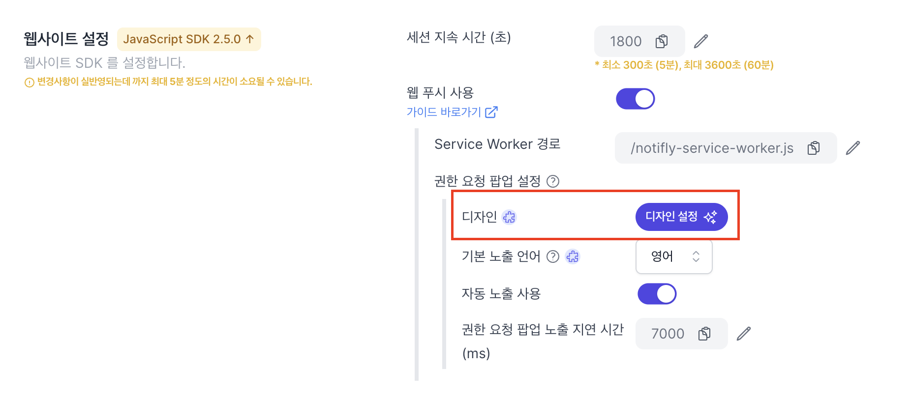
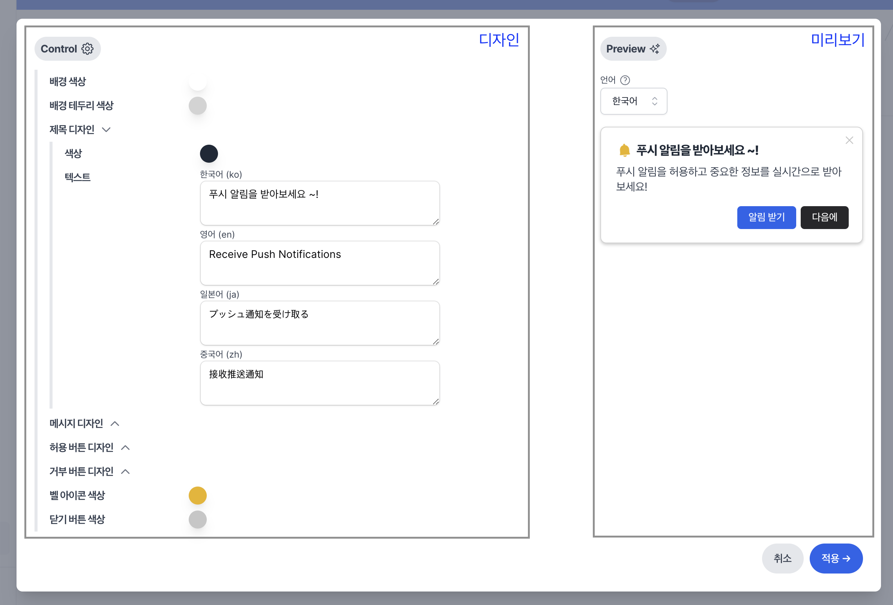

# Client SDK - Javascript

Notifly Javascript (JS) SDK는 노티플라이를 웹 어플리케이션과 연동하기 위해 사용할 수 있습니다.

```mdx-code-block
import Tabs from '@theme/Tabs';
import TabItem from '@theme/TabItem';
```

## 1. Notifly JS SDK 셋업

웹 어플리케이션의 환경에 따라 다음 방식 중 하나로 JS SDK를 설치 및 초기화 해주세요.

### 웹 푸시 설정 {#web-push}

웹 푸시 설정을 통하여 노티플라이에서 웹 푸시 캠페인을 집행할 수 있습니다. 만약 웹 푸시를 필요로 하지 않으시다면, 다음 단계로 이동해주세요.

#### 웹 푸시 인증서 생성하기

웹 푸시를 노티플라이를 통해 발송하고 웹 브라우저에서 수신하기 위해 인증서(VAPID Key)를 생성해야 합니다. 웹 푸시 인증서는 노티플라이 홈페이지의 설정 페이지에서 생성할 수 있습니다.


#### Service Worker 생성하기

Service Worker는 브라우저가 백그라운드에서 실행하는 스크립트입니다. 웹페이지가 열려있지 않은 상태에서도 푸시 알림을 수신할 수 있도록 해줍니다.
프로젝트의 루트 디렉토리에 Service Worker 파일을 생성해 주세요:

<Tabs>
<TabItem value="react" label="ReactJS project example">

```title="Example ReactJS project"
my-react-project/
├── src/
├── public/
│   ├── index.html
// highlight-next-line
|   ├── notifly-service-worker.js
│   └── ...
├── package.json
├── README.md
└── ...

```

</TabItem>
<TabItem value="vanillajs" label="JS project example">

```title="Example JS project"

my-project/
├── css/
├── js/
├── index.html
// highlight-next-line
├── notifly-service-worker.js
└── ...

```

</TabItem>
</Tabs>

`notifly-service-worker.js` 파일에 다음 코드를 추가해 주세요:

```js title="notifly-service-worker.js"
self.importScripts(
  "https://cdn.jsdelivr.net/npm/notifly-js-sdk@2/dist/NotiflyServiceWorker.js"
);
```

:::note 참고: Service Worker 파일 경로 및 이름

Service Worker 파일의 경로와 이름은 자유롭게 설정할 수 있습니다. 경로와 이름을 [초기화 옵션](#sdk-초기화-옵션)의 `serviceWorkerPath` 옵션에 잘 맞춰주었는지 반드시 확인해주세요.

:::

:::caution Bundler (Webpack, Rollup, Parcel 등) 사용 시

프로젝트에 Bundler를 사용하고 계신다면, `notifly-service-worker.js` 파일이 Bundler에 의해 번들링되거나, 삭제되지 않도록 Bundler configuration을 적절히 설정해주셔야 합니다.

:::

### SDK 초기화 옵션 {#initialize-options}

| Parameter                                          | Type                           | Required | Description                                                                                                                                                                                                                                                                                                                                  |
| -------------------------------------------------- | ------------------------------ | -------- | -------------------------------------------------------------------------------------------------------------------------------------------------------------------------------------------------------------------------------------------------------------------------------------------------------------------------------------------- |
| `projectId`                                        | string                         | Yes      | 노티플라이 프로젝트 ID입니다.                                                                                                                                                                                                                                                                                                                |
| `username`                                         | string                         | Yes      | 노티플라이 프로젝트 사용자 이름입니다.                                                                                                                                                                                                                                                                                                       |
| `password`                                         | string                         | Yes      | 노티플라이 프로젝트 사용자 비밀번호입니다.                                                                                                                                                                                                                                                                                                   |
| `sessionDuration` (Deprecated since 2.5.0)         | number                         | No       | 한 세션의 지속 시간을 설정합니다. 이 값은 최소 300 (5분) 이상이어야 합니다. default: `1800` (30분) **Website SDK v2.5.0 이상 버전 부터는, 설정 > SDK 설정 > 웹사이트 설정에서 직접 설정하셔야 합니다.**                                                                                                                                      |
| `pushSubscriptionOptions` (Deprecated since 2.5.0) | NotiflyPushSubscriptionOptions | No       | 웹 푸시 구독에 대한 옵션입니다. 자세한 설명은 위 [웹 푸시 설정](#웹-푸시-설정) 섹션을 참고해 주세요. 미입력 시 웹 푸시 서비스를 이용하실 수 없습니다. **Website SDK v2.5.0 이상 버전 부터는, 설정 > SDK 설정 > 웹사이트 설정에서 직접 설정하셔야 합니다.**                                                                                   |
| - `vapidPublicKey` (Deprecated since 2.5.0)        | string                         | Yes      | 위에서 생성한 웹 푸시 인증서 키입니다. [웹 푸시 설정](#웹-푸시-설정)에서 생성한 웹 푸시 인증서 키를 입력해 주세요. **Website SDK v2.5.0 이상 버전 부터는, 설정 > SDK 설정 > 웹사이트 설정에서 직접 설정하셔야 합니다.**                                                                                                                      |
| - `askPermission` (Deprecated since 2.5.0)         | boolean                        | No       | 사용자가 웹페이지에 방문했을 때 알림 권한을 요청할 지에 대한 값입니다. default: `true` **Website SDK v2.5.0 이상 버전 부터는, 설정 > SDK 설정 > 웹사이트 설정에서 직접 설정하셔야 합니다.**                                                                                                                                                  |
| - `serviceWorkerPath` (Deprecated since 2.5.0)     | string                         | No       | notifly-service-worker의 경로입니다. 만약 위 [Service Worker 생성](#service-worker-생성하기) 섹션에서의 예시와 다른 경로에 Service Worker 파일을 생성하셨다면, 꼭 알맞은 경로를 입력해 주세요. default: `'/notifly-service-worker.js'`. **Website SDK v2.5.0 이상 버전 부터는, 설정 > SDK 설정 > 웹사이트 설정에서 직접 설정하셔야 합니다.** |
| - `promptDelayMillis` (Deprecated since 2.5.0)     | number                         | No       | 사용자가 웹페이지에 방문했을 때 알림 권한 요청 팝업을 표시할때 까지의 지연 시간(ms) 입니다. `askPermission`이 `false`인 경우 해당 값은 초기화에서 영향을 미치지 않습니다. default: `5000` **Website SDK v2.5.0 이상 버전 부터는, 설정 > SDK 설정 > 웹사이트 설정에서 직접 설정하셔야 합니다.**                                               |

:::caution
v2.5.0 이상 버전 부터는, `projectId`, `username`, `password`를 제외한 모든 필드에 대하여 설정 > SDK 설정 > 웹사이트 설정에서 설정하신 값들이 SDK 초기화 옵션에 반영됩니다.


세션 지속 시간은 `sessionDuration`, 권한 요청 팝업 여부는 `askPermission`, Service Worker 경로는 `serviceWorkerPath`, 알림 권한 요청 팝업 지연 시간은 `promptDelayMillis`에 해당합니다.
웹 푸시 인증서 키는 설정된 키값을 자동으로 반영합니다. 만약 인증서 키가 설정되지 않았다면, 웹 푸시 서비스를 이용하실 수 없습니다.

:::

### 푸시 알림 권한 요청 {#web-push-permission-request}

`askPermission` (권한 요청 팝업 노출) 은 사용자가 웹페이지에 방문했을 때 알림 권한을 요청할 지에 대한 값입니다. on인 경우 노티플라이는 다음과 같은 팝업을 먼저 웹사이트의 우상단에 보여준 뒤에 실제 브라우저의 알림 권한을 요청합니다.

1. 사용자가 아직 브라우저에서 알림 권한을 설정하지 않은 경우 팝업을 보여줍니다.
2. 사용자가 이미 알림 권한을 부여한 경우에 노티플라이는 팝업을 보여주지 않고 알림 권한을 다시 요청하지 않습니다.
3. 사용자가 알림 권한을 거부한 경우에도 노티플라이는 팝업을 보여주지 않고 알림 권한을 다시 요청하지 않습니다.


- 더 커스텀한 타이밍으로 알림 권한을 요청하기 위해서는 아래 [매뉴얼하게 팝업 노출하기](#programmatically-request-web-push-permission) 섹션을 참고해 주세요.
- 알림 권한 요청 팝업을 현재 사이트의 스타일에 맞게 커스터마이즈하고 싶으신 경우, [팝업 커스터마이징](#customize-web-push-permission-popup) 섹션을 참고해 주세요.
- 더 자유롭게 팝업 스타일을 수정하고싶으신 경우, 노티플라이 콘솔에서 자동 노출 사용 을 off (SDK 버전 2.5.0 이상), 또는 `askPermission`을 false로 SDK를 초기화 (SDK 버전 2.5.0 미만) 시켜주시고 직접 팝업을 디자인해주세요.
  더 자세한 내용은 [MDN Web Docs - Notification: `requestPermission`](https://developer.mozilla.org/en-US/docs/Web/API/Notification/requestPermission_static) 을 참고해 주세요.

#### 지원 언어 {#supported-languages}

Javascript SDK 버전 2.8.0 부터는 아래 네 가지의 언어를 지원합니다.

> - `ko`: 한국어
> - `en`: 영어
> - `ja`: 일본어
> - `zh`: 중국어

Javascript SDK 버전 2.8.0 미만인 경우

> 한국어 또는 영어만 지원합니다.

#### 웹 푸시 권한 요청 팝업을 매뉴얼하게 노출 {#programmatically-request-web-push-permission}

:::caution 유의사항

- 이 기능은 Javascript SDK 버전 2.7.0 이상에서만 사용 가능합니다.

- 권한 팝업을 매뉴얼하게 노출시키는 기능은 팝업 자동 노출이 비활성화 되어있는 경우에만 사용 가능합니다. 팝업 자동 노출 설정은 노티플라이 웹 콘솔의 설정 > SDK 설정 > 웹사이트 설정에서 확인하실 수 있습니다.

:::

SDK 버전 2.7.0 이상부터는, `requestPermission` 함수를 통하여 알림 팝업을 노출하도록 할 수 있습니다.

```js
notifly.requestPermission();
```

SDK 버전 2.8.0 이상부터는, `requestPermission` 함수에 `language` argument를 넘겨주어 노출될 팝업의 언어를 강제할 수 있습니다. 지원되는 언어는 위 [지원 언어](#supported-languages)를 참고해 주세요.

만약 `language` 패러미터를 입력하지 않거나, 지원되지 않는 언어 코드를 입력한 경우에는

1. 브라우저의 언어 설정에 따라 팝업 노출을 시도합니다. 만약 브라우저의 언어 설정이 노티플라이에서 지원하는 언어 코드인 경우, 팝업을 노출합니다.
2. 브라우저의 언어 설정이 노티플라이에서 지원하지 않는 언어 코드인 경우, 기본 노출 언어로 팝업을 노출합니다. **기본 노출 언어**에 대한 내용은 아래를 참고해 주세요.

```js
notifly.requestPermission("en");
```

#### 기본 노출 언어 {#default-web-push-prompt-language}

:::caution 버전 호환성

이 기능은 Notifly Javascript SDK `v2.8.0` 버전부터 지원됩니다. 이전 SDK에서는 **한국어 (ko)** 가 기본 노출 언어입니다.

:::


기본 노출 언어는

1. 브라우저의 언어 설정이 명시되어있지 않거나
2. 브라우저의 언어 설정이 노티플라이에서 지원하는 언어 코드가 아닌 경우

에 노출되는 언어를 의미합니다. 기본 노출 언어는 노티플라이 웹 콘솔의 설정 > SDK 설정 > 웹사이트 설정에서 변경할 수 있습니다.

#### 커스터마이징 {#customize-web-push-permission-popup}

:::caution 주의

1. 이 기능은 Notifly Javascript SDK `v2.7.0` 버전부터 지원됩니다. 이전 SDK에서는 아래와 같은 기본 팝업이 노출됩니다.


2. 설정이 반영되는데 까지는 최대 5분이 소요될 수 있습니다.

:::

1. 웹 콘솔 > 설정 > SDK 설정 > 웹사이트 설정 > 권한 요청 팝업 설정에 디자인 설정 버튼을 눌러, 모달을 열어주세요.



2. 팝업의 디자인을 원하는 대로 수정하고 저장해주세요.



### SDK 셋업

#### npm / yarn / pnpm

패키지를 설치하기 위해, 다음을 실행해 주세요:


<Tabs>
<TabItem value="npm" label="npm">

```shell
npm install notifly-js-sdk@latest --save
```

</TabItem>
<TabItem value="yarn" label="yarn">

```shell
yarn add notifly-js-sdk@latest
```

</TabItem>
<TabItem value="pnpm" label="pnpm">

```shell
pnpm add notifly-js-sdk@latest
```

</TabItem>
</Tabs>

:::tip

Notifly SDK는 성능 개선, 버그 수정 및 새로운 기능 추가 등을 위해 지속적으로 업데이트되고 있습니다. 따라서, 최신 버전을 사용하시는 것을 권장드립니다.

:::

설치가 완료되면, `index.js` 또는 `App.js`에서 Notifly SDK 초기화 코드를 추가해 주세요.

`NOTIFLY_PROJECT_ID`, `NOTIFLY_USERNAME`, `NOTIFLY_PASSWORD` 값은 노티플라이 홈페이지의 설정 페이지에서 확인하실 수 있습니다.

<Tabs>
<TabItem value="v2.5.0 or above" label="v2.5.0 or above">

```js
useEffect(() => {
  if (typeof window !== "undefined") {
    notifly.initialize({
      projectId: process.env.NEXT_PUBLIC_NOTIFLY_PROJECT_ID,
      username: process.env.NEXT_PUBLIC_NOTIFLY_PROJECT_USERNAME,
      password: process.env.NEXT_PUBLIC_NOTIFLY_PROJECT_PASSWORD,
    });
  }
});
```

</TabItem>
<TabItem value="v2.4.0 or below" label="v2.4.0 or below">

```js
useEffect(() => {
  if (typeof window !== "undefined") {
    notifly.initialize({
      projectId: process.env.NEXT_PUBLIC_NOTIFLY_PROJECT_ID,
      username: process.env.NEXT_PUBLIC_NOTIFLY_PROJECT_USERNAME,
      password: process.env.NEXT_PUBLIC_NOTIFLY_PROJECT_PASSWORD,
      // Don't need to specify this if you don't need a web push service
      pushSubscriptionOptions: {
        vapidPublicKey: NOTIFLY_VAPID_PUBLIC_KEY,
        askPermission: true,
        promptDelayMillis: 5000,
      },
    });
  }
});
```

</TabItem>
</Tabs>

#### From CDN

아래 코드를 웹 어플리케이션의 `<body>` 태그 안에 추가해 주세요. 스크립트가 로드된 후에는, `window.notifly`를 통해 Notifly SDK에 전역적으로 접근할 수 있습니다.

`YOUR_NOTIFLY_PROJECT_ID`, `YOUR_NOTIFLY_USERNAME`, `YOUR_NOTIFLY_PASSWORD` 값은 노티플라이 홈페이지의 설정 페이지에서 확인하실 수 있습니다.
`YOUR_VAPID_PUBLIC_KEY` 값은 위 [웹 푸시 설정](#웹-푸시-설정) 섹션에서 생성한 웹 푸시 인증서 키를 입력해 주세요.

<Tabs>
<TabItem value="v2.7.4 or above" label="v2.7.4 or above (Highly Recommended)">

```html title="Example HTML code for install & initialization"
<script src="https://cdn.jsdelivr.net/npm/notifly-js-sdk@<SDK_VERSION>/dist/index.global.min.js"></script>
<script>
  window.notifly.initialize({
    // highlight-next-line
    projectId: "<YOUR_NOTIFLY_PROJECT_ID>",
    // highlight-next-line
    username: "<YOUR_NOTIFLY_USERNAME>",
    // highlight-next-line
    password: "<YOUR_NOTIFLY_PASSWORD>",
  });
</script>
```

</TabItem>
<TabItem value="2.5.0 or above" label="2.5.0 or above">

```html title="Example HTML code for install & initialization"
<script src="https://cdn.jsdelivr.net/npm/notifly-js-sdk@<SDK_VERSION>/dist/index.min.js"></script>
<script>
  window.notifly.initialize({
    // highlight-next-line
    projectId: "<YOUR_NOTIFLY_PROJECT_ID>",
    // highlight-next-line
    username: "<YOUR_NOTIFLY_USERNAME>",
    // highlight-next-line
    password: "<YOUR_NOTIFLY_PASSWORD>",
  });
</script>
```

</TabItem>
<TabItem value="2.4.0 or below" label="2.4.0 or below">

```html title="Example HTML code for install & initialization"
<script src="https://cdn.jsdelivr.net/npm/notifly-js-sdk@<SDK_VERSION>/dist/index.min.js"></script>
<script>
  window.notifly.initialize({
    // highlight-next-line
    projectId: "<YOUR_NOTIFLY_PROJECT_ID>",
    // highlight-next-line
    username: "<YOUR_NOTIFLY_USERNAME>",
    // highlight-next-line
    password: "<YOUR_NOTIFLY_PASSWORD>",
    // You don't need below options if you don't need a web push service
    pushSubscriptionOptions: {
      vapidPublicKey: "<YOUR_VAPID_PUBLIC_KEY>",
      askPermission: true,
    },
  });
</script>
```

</TabItem>
</Tabs>

:::warning CDN 사용 시 주의 사항
AMD(Asynchronous Module Definition) 형태의 모듈 로더를 사용하고 계신다면, 스크립트 태그가 제대로 동작하지 않을 수 있습니다. 이 경우, 버전 `2.7.4`부터 지원하는 IIFE(Immediately Invoked Function Expression) 형태의 스크립트 태그 (`index.global.min.js` 또는 `index.global.js`) 를 사용해 주세요.
:::

:::caution window 객체가 존재하는지 확인하기

Notifly Website SDK는 Browser DOM의 최상단 `window` 객체가 존재할 때만 동작합니다. 따라서, 꼭 `typeof window !== 'undefined'` 를 통해 `window` 객체가 존재하는지 확인해 주세요.

:::

## 2. 유저 프로퍼티 등록하기

- 노티플라이에서는 유저의 아이디 (userId) 및 프로퍼티 (userProperties)를 설정하여 마케팅 캠페인 집행 시에 활용할 수 있습니다.
  - 노티플라이에서는 채널 별 푸시 알림 수신 동의 여부를 유저 프로퍼티로 설정하여, 푸시 알림 전송 전에 필터링 할 수 있습니다.
  - 카카오 알림톡, 친구톡, 문자 발송을 위해서는 전화번호를 유저 프로퍼티로 설정해야 합니다.
  - 이메일 발송을 위해서는 이메일 주소를 유저 프로퍼티로 설정해야 합니다.
  - 전화번호와, 이메일의 프로퍼티 필드명은 꼭 각각 $phone_number, $email로 설정해 주세요.
  - Notifly SDK 초기화 코드 추가를 마친 후 프로퍼티 등록을 시작해 주세요.
  - (권장사항) 로그아웃 시 userId를 null로 하여 setUserId 호출함으로써 유저의 userId 등록을 해지해 주세요.

:::caution 유저 아이디 등록 해지 시 주의사항

유저 아이디 등록해지를 호출할 경우, 유저 프로퍼티 및 캠페인 피로도 관리 데이터 등 모든 유저 정보가 삭제됩니다.

:::

### 2-1. 유저 아이디 등록 {#set-user-id}

| Parameter | Type   | Required |
| --------- | ------ | -------- |
| userId    | String | No       |

```js
notifly.setUserId(userId);
```

<Tabs>
<TabItem value="react" label="ReactJS">

```js title="Example ReactJS code for setUserId"
const handleLogin = () => {
    ...
    notifly.setUserId('example_user_id');
    ...
}

const handleLogout = () => {
    ...
    notifly.setUserId(null); // unregister user id (notifly.setUserId(); works too!)
    ...
}
```

</TabItem>
<TabItem value="vanillajs" label="JS">

```js title="Example JS code for setUserId"
userIdSaveButton.addEventListener("click", function () {
  window.notifly.setUserId(userIdInput.value);
});
```

</TabItem>
</Tabs>

### 2-2. 유저 프로퍼티 등록 {#set-user-properties}

| Parameter      | Type                | Required |
| -------------- | ------------------- | -------- |
| userProperties | Record<string, any> | Yes      |

```js
notifly.setUserProperties(userProperties);
```

<Tabs>
<TabItem value="react" label="ReactJS">

```js title="Example ReactJS code for setUserProperties"
const handleRejectPushNotification = () => {
    ...
    notifly.setUserProperties({
        "paid_membership": true,
        "subscriptions": ["astro_boy", "x-men"],
    });
    ...
}
```

</TabItem>
<TabItem value="vanillajs" label="JS">

```js title="Example JS code for setUserProperties"
subscribeButton.addEventListener('click', function () {
    ...
    window.notifly.setUserProperties({
        "subscribed": true,
    });
});
```

</TabItem>
</Tabs>

## 3. 이벤트 로깅 {#track-event}

- 노티플라이에서는 유저의 행동 등 이벤트를 트래킹하여 캠페인 집행 시 타겟팅에 활용할 수 있습니다. 트래킹 된 이벤트는 푸시 알림 발송 타이밍, 발송 대상 설정 등에 활용할 수 있습니다.
  - Notifly SDK 초기화 코드 추가를 마친 후 이벤트 로깅을 시작해 주세요.
- `segmentationEventParamKeys` 활용하여 이벤트 변수 (eventParams의)를 발송 대상 설정 등에 활용할 수 있습니다. 이를 위해서, 발송 대상 설정에 사용할 eventParams의 특정 field의 key 값을 segmentationEventParamKeys 지정해주세요.
  - 현재는 `segmentationEventParamKeys` 한 개까지 지원하고 있기 때문에, `segmentationEventParamKeys` 길이는 1이하인 List이어야합니다.

### 3-1. 이벤트 로깅

| Parameter                  | Type                | Required |
| -------------------------- | ------------------- | -------- |
| eventName                  | string              | Yes      |
| eventParams                | Record<string, any> | No       |
| segmentationEventParamKeys | string[]            | No       |

```js
notifly.trackEvent(eventName, eventParams, segmentationEventParamKeys);
```

<Tabs>
<TabItem value="react" label="ReactJS">

```js title="Example ReactJS code for trackEvent"
const handleContentView = () => {
    ...
    notifly.trackEvent("view_content", {
        "content_name": "mickey_mouse",
    });
    ...
}

// Example code with segmentationEventParamKeys
const handlePurchaseTicket = () => {
    ...
    notifly.trackEvent("ticket_purchase", {
        "show_id": "sample_show_id",
        "performance_start_time": 1674104659
    }, ["show_id"]);
    ...
}
```

</TabItem>

<TabItem value="vanillajs" label="JS">

```js title="Example JS code for trackEvent"
event1Button.addEventListener('click', function () {
    ...
    window.notifly.trackEvent('event1');
});
```

</TabItem>

</Tabs>

:::caution 유의 사항

Notifly가 이벤트를 로깅할 때에, 로깅할 유저의 정보는 `setUserId`를 기점으로 변경되게 됩니다. 유저 아이디가 변할 때 (로그인 혹은 로그아웃 등), 정확한 로깅을 위하여 꼭 호출 순서를 지켜주세요. `setUserId`가 호출된 이후로부터 모든 이벤트는, 변경된 유저를 기준으로 기록됩니다. 예를 들자면, 로그인 시 기본적으로 `setUserId` -> `setUserProperties` -> `trackEvent`의 Flow가 가장 바람직합니다.

```js title="Example code when user ID is changed"
const handleLogin = (userId) => {
    ...
    notifly.setUserId(userId);
    // From here, Notifly SDK will log events with the new userId
    notifly.setUserProperties({
        '$phone_number': '01012345678',
        'paid_membership': true,
    });
    notifly.trackEvent("login");
    ...
}
```

:::

## 4. 웹 팝업 커스텀 이벤트

:::info 버전 확인

웹 팝업에서 커스텀 이벤트 로깅을 팝업 html 에서 javascript로 구현하기 위해서는 js-sdk 2.17.2 버전 이상을 사용해야 합니다.

:::

노티플라이 js sdk를 초기화 시 `allowUserSuppliedLogEvent` 옵션을 활성화해주세요.

```js
notifly.initialize({
  projectId: projectId,
  password: password,
  username: userName,
  allowUserSuppliedLogEvent: true, // TO ENABLE CUSTOM JAVASCRIPT
});
```

이후, 작성하는 웹 팝업 템플릿에서 커스텀 이벤트를 로깅할 수 있습니다. (자세한 내용은 노티플라이팀에 문의해주세요)

## 5. 연동 테스트

[Client SDK - 연동 Test](https://docs.notifly.tech/ko/developer-guide/client-sdk/sdk_test) 섹션에서 테스트를 진행합니다.
