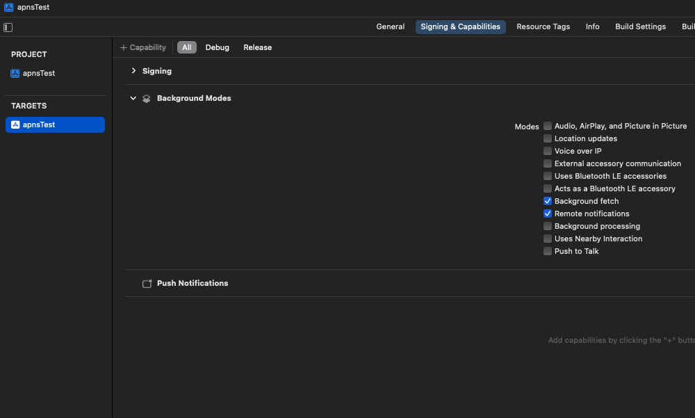

# Client SDK - React Native ( 3.0.0 이상 버전 )

Notifly React Native SDK는 노티플라이를 React Native 어플리케이션과 연동하기 위해 사용할 수 있습니다. 다음과 같은 기능들을 지원합니다:

- 기기 정보를 노티플라이에 등록하여 노티플라이를 통해 발송된 앱 푸시, 인앱 메시지를 React Native 앱에서 수신할 수 있습니다.
  - 노티플라이의 인앱 메시지는 앱이 Foreground 상태일 때만 수신됩니다. Background 및 Quit 상태일 때는 무시됩니다.
- 이벤트, 유저 정보를 노티플라이와 연동하여 모든 캠페인에서 활용할 수 있습니다.
- 캠페인의 성과를 측정할 수 있도록 이벤트를 로깅합니다.

```mdx-code-block
import Tabs from '@theme/Tabs';
import TabItem from '@theme/TabItem';
```

Notifly에서는 푸시를 발송하기 위해 [Firebase Cloud Messaging](https://firebase.google.com/docs/cloud-messaging)을 활용하고 있습니다. 다음 과정을 먼저 진행해주세요:

1. [Firebase 프로젝트 연동](http://docs.notifly.tech/ko/developer-guide/client-sdk/firebase_project_setup)
2. [iOS APNs 인증 정보 설정](http://docs.notifly.tech/ko/developer-guide/client-sdk/firebase_project_setup#1-3-apns-%EC%9D%B8%EC%A6%9D%EC%84%9C-%EB%93%B1%EB%A1%9D)

## 1. Notifly SDK 셋업

### 1-1. Notifly SDK 설치

- [notifly-sdk npm](https://www.npmjs.com/package/notifly-sdk)

패키지를 설치하기 위해, 다음을 실행해 주세요:

```shell
npm install notifly-sdk@latest --save
cd ios && pod install
```

yarn을 사용하시는 경우:

```shell
yarn add notifly-sdk@latest
cd ios && pod install
```

앱 패키지의 package.json 파일에 notifly-sdk가 추가됩니다. (현재 최신 버전: [](https://www.npmjs.com/package/notifly-sdk))


### 1.2. iOS 설정

#### 1) Capability 설정

1. Xcode에서 {Your_Project_Name}.xcworkspace를 열어주세요.
  - Xcode에서 {Your_Project_Name}.xcworkspace를 열지 않고 {Your_Project_Name}.xcodeproj를 열어서 빌드하면, Notifly SDK를 사용할 수 없습니다.
  - {Your_Project_Name}.xcworspace는 Root 디렉토리의 ios 디렉토리에 있습니다.
2. 대상 Project의 iOS Deployment Target과 Target의 Minimum Deployments iOS를 **13.0** 혹은 그 이상으로 설정합니다. 
  - Podfile에서도 최소 버전을 13.0으로 설정해주세요.
3. Push Notification Capability를 추가합니다.
  

4. Background Modes Capability를 추가합니다. - Remote notifications과 Background Fetch를 선택합니다.
  

5. AppDelegate.mm 파일을 열어서 다음 코드를 추가합니다.

- AppDelegate.mm ios 디렉토리의 {ProjectName} 폴더에 있습니다.

- `notifly_sdk` 프래임워크를 import 합니다.

```objc
#import "notifly_sdk-Swift.h"
```

- AppDelegate.h에서 AppDelegate 클래스에 `UNUserNotificationCenterDelegate` 프로토콜을 추가합니다.
  - 아래 예시코드를 참고해주세요.
- AppDelegate.mm의 `AppDelegate method`들에 Notifly코드를 추가해 주세요.
    1. `(BOOL)application:(UIApplication *)application didFinishLaunchingWithOptions:(NSDictionary *)launchOptions`
        - UNNotificationCenter의 delegate를 self로 설정합니다.
    2. `(void)application:(UIApplication *)application didRegisterForRemoteNotificationsWithDeviceToken:(NSData *)deviceToken`
        - APNs 토큰을 Notifly에 등록합니다.
    3. `(void)application:(UIApplication *)application didFailToRegisterForRemoteNotificationsWithError:(NSError *)error`
        - APNs 토큰 등록에 실패한 경우, Notifly에 알립니다.
    4. `(void)userNotificationCenter:(UNUserNotificationCenter *)center didReceiveNotificationResponse:(UNNotificationResponse *)response withCompletionHandler:(void (^)(void))completionHandler`
        - 앱 푸시 알림 클릭 이벤트를, Notifly로 전달합니다.
    5. `(void)userNotificationCenter:(UNUserNotificationCenter *)center willPresentNotification:(UNNotification *)notification withCompletionHandler:(void (^)(UNNotificationPresentationOptions))completionHandler`
        - 앱이 Foreground 상태일 때, Notifly로부터 수신한 데이터를 SDK로 전달합니다.

<Tabs>
<TabItem value="header" label="AppDelegate.h">

```objc title="Example Code of AppDelegate.h"
#import <RCTAppDelegate.h>
#import <UIKit/UIKit.h>
#import <UserNotifications/UNUserNotificationCenter.h>

@interface AppDelegate : RCTAppDelegate <UNUserNotificationCenterDelegate>

@end
```

</TabItem>
<TabItem value="delegate" label="AppDelegate.mm">

```objc title="Example Code of AppDelegate.mm"
#import <Firebase.h>
#import <React/RCTBundleURLProvider.h>
#import "AppDelegate.h"
// highlight-next-line
#import "notifly_sdk-Swift.h"

@implementation AppDelegate

- (BOOL)application:(UIApplication *)application didFinishLaunchingWithOptions:(NSDictionary *)launchOptions {
    /* Your Code */
    // highlight-start
    [FIRApp configure];
    UNUserNotificationCenter *center = [UNUserNotificationCenter currentNotificationCenter];
    center.delegate = self;
    [[UIApplication sharedApplication] registerForRemoteNotifications];
    // highlight-end
    /* Your Code */
}

- (void)application:(UIApplication *)application didRegisterForRemoteNotificationsWithDeviceToken:(NSData *)deviceToken {
    /* Your Code */
    // highlight-next-line
    [Notifly application:application didRegisterForRemoteNotificationsWithDeviceToken:deviceToken];
    /* Your Code */
}

- (void)application:(UIApplication *)application didFailToRegisterForRemoteNotificationsWithError:(NSError *)error {
    /* Your Code */
    // highlight-next-line
    [Notifly application:application didFailToRegisterForRemoteNotificationsWithError:error];
    /* Your Code */
}

- (void)userNotificationCenter:(UNUserNotificationCenter *)center didReceiveNotificationResponse:(UNNotificationResponse *)response withCompletionHandler:(void (^)(void))completionHandler {
    /* Your Code */
    // highlight-start
    [Notifly userNotificationCenter:center didReceive:response];
    completionHandler();
    // highlight-end
    /* Your Code */
}

- (void)userNotificationCenter:(UNUserNotificationCenter *)center willPresentNotification:(UNNotification *)notification withCompletionHandler:(void (^)(UNNotificationPresentationOptions options))completionHandler {
    /* Your Code */
    // highlight-next-line
   [Notifly userNotificationCenter:center willPresent:notification withCompletionHandler:completionHandler];
    /* Your Code */
}

/* Your Code */
@end

```

</TabItem>
</Tabs>

### 1-3. Notifly SDK 초기화 코드 추가

- index.js 또는 App.js에서 Notifly SDK 초기화 코드를 추가해 주세요.

<Tabs>
<TabItem value="initialize" label="javascript">

```js title="index.js"
...
import messaging from '@react-native-firebase/messaging';
// highlight-next-line
import notifly from 'notifly-sdk';

/* Your Code */

// highlight-next-line
notifly.initialize('myProjectId', 'myUserName', 'myPassword');

/* Your Code */

AppRegistry.registerComponent(...);
```

</TabItem>
</Tabs>

`NOTIFLY_PROJECT_ID`, `NOTIFLY_USERNAME`, `NOTIFLY_PASSWORD` 값은 노티플라이 홈페이지의 [설정 페이지](https://www.notifly.tech/ko/console/settings?environment=1)에서 확인하실 수 있습니다.

## 2. 유저 프로퍼티 등록하기

- Notifly에서는 유저의 아이디 (userId) 및 프로퍼티 (params)를 설정하여 마케팅 캠페인 집행 시에 활용할 수 있습니다.
  - Notifly에서는 채널 별 푸시 알림 수신 동의 여부를 유저 프로퍼티로 설정하여, 푸시 알림 전송 전에 필터링 할 수 있습니다.
  - 카카오 알림톡, 친구톡, 문자 발송을 위해서는 전화번호를 유저 프로퍼티로 설정해야 합니다.
  - 이메일 발송을 위해서는 이메일 주소를 유저 프로퍼티로 설정해야 합니다.
  - 전화번호와, 이메일의 프로퍼티 필드명은 꼭 각각 $phone_number, $email로 설정해 주세요.
  - Notifly SDK 초기화 코드 추가를 마친 후 프로퍼티 등록을 시작해 주세요.

### 2-1. 유저 아이디 등록

| Parameter | Type     | Required |
| --------- | -------- | -------- |
| userId    | `String` | Yes      |

```js
notifly.setUserId(userId);
```

<Tabs>
<TabItem value="setUserId" label="javascript">

```js title="Example Code of setUserId"
const handleLogin = () => {
    ...
    notifly.setUserId('example_user_id'); // Set User Id
    ...
}

const handleLogout = () => {
    ...
    notifly.setUserId(); // Remove User Id
    ...
}
```

</TabItem>
</Tabs>

### 2-2. 유저 프로퍼티 등록

| Parameter | Type     | Required |
| --------- | -------- | -------- |
| params    | `Object` | Yes      |

```js
notifly.setUserProperties(params);
```

<Tabs>
<TabItem value="setUserProperties" label="javascript">

```js title="Example Code of setUserProperties"
const handleRejectPushNotification = () => {
    ...
    notifly.setUserProperties({
        "push_subscription_channel1": false,
        "push_subscription_channel2": false,
        "push_subscription_channel3": false,
    });
    ...
}
```

</TabItem>
</Tabs>

## 3. 이벤트 로깅

- Notifly에서는 유저의 행동 등 이벤트를 트래킹하여 캠페인 집행 시 타겟팅에 활용할 수 있습니다. 트래킹 된 이벤트는 푸시 알림 발송 타이밍, 유저 세그먼트 설정 등에 활용할 수 있습니다.
  - Notifly SDK 초기화 코드 추가를 마친 후 이벤트 로깅을 시작해 주세요.
- segmentationEventParamKeys 활용하여 이벤트 변수 (eventParams)를 유저 세그먼트 설정 등에 활용할 수 있습니다. 이를 위해서, 유저 세그멘트 설정에 사용할 eventParams의 특정 field의 key 값을 segmentationEventParamKeys에 지정해주세요.
  - **현재는 segmentationEventParamKeys 한 개까지 지원하고 있기 때문에, segmentationEventParamKeys 길이는 1이하인 List이어야합니다.**

### 3-1. 이벤트 로깅

| Parameter                  | Type           | Required |
| -------------------------- | -------------- | -------- |
| eventName                  | `String`       | Yes      |
| eventParams                | `Object`       | No       |
| segmentationEventParamKeys | `List<String>` | No       |

```js
notifly.trackEvent(eventName, eventParams, segmentationEventParamKeys);
```

<Tabs>
<TabItem value="trackEvent" label="javascript">

```js title="Example Code of trackEvent"
const handlePurchaseTicket = () => {
    ...
    notifly.trackEvent("ticket_purchase", {
        "show_id": "sample_show_id",
        "performance_start_time": 1674104659
    }, ["show_id"]);
    ...
}

const handleLogin = () => {
    ...
    notifly.trackEvent("login");
    ...
}
```

</TabItem>
</Tabs>

## 4. 연동 테스트

[Client SDK - 연동 Test](https://docs.notifly.tech/ko/developer-guide/client-sdk/sdk_test) 섹션에서 테스트를 진행합니다.

## 5. (Advanced) 푸시 알림 아이콘 등록 (Android) & 푸시 알림 동의 프롬프트
[(Advanced) Client SDK - React Native](/ko/developer-guide/client-sdk/advanced/react-native-sdk-advanced) 를 참고해 주세요.

## FAQ

- Q. 이미 Firebase Cloud Messaging을 사용 중인데 어떻게 해야 할까요?
  - A. Notifly Flutter Plugin은 기존 앱에서 사용하고 있을 수 있는 Firebase Cloud Messaging과의 충돌을 방지하기 위한 처리를 이미 자체적으로 구현해 두었기 때문에 안전하게 사용하실 수 있습니다.
- Q. Build시 AppDelegate.mm 파일에서 Notifly 클래스 관련 에러가 발생합니다.
  - A. Podfile에 `use_frameworks! :linkage => :static` 라인을 추가하여 Static Linking을 시도해주세요. (기존에 `use_frameworks!` 라인이 존재한다면, `:linkage => :static` 옵션만 추가해주세요.)
- Q. iOS기기에서 Foreground 상태에서 푸시 알림이 오지 않습니다.
  - A. Firebase Messaging을 이미 사용하시고 계시다면, firebase.json 파일에 아래 안내에 따라 설정해주세요.
    - [React Native Firebase의 Foreground Presentation Options](https://rnfirebase.io/messaging/usage#foreground-presentation-options-ios)의 가이드에 따라 firebase.json 파일에 다음 코드를 추가해주세요.
    ```json
    {
      "react-native": {
        "messaging_ios_foreground_presentation_options": [
          "badge",
          "sound",
          "list",
          "banner"
        ]
      }
    }
    ```