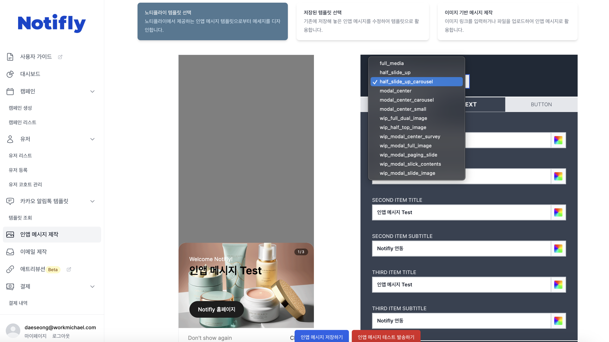
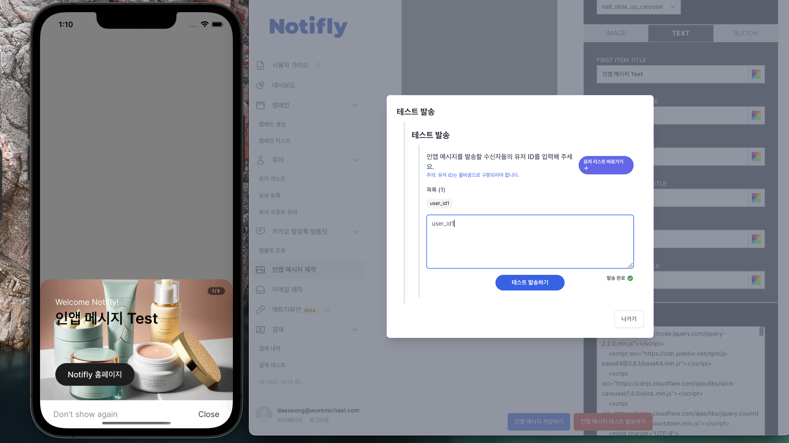

# Client SDK - 연동 Test

본 섹션에서는, Notifly Client SDK가 정상적으로 연동되었는지 테스트를 진행합니다.

## 1. 유저 등록 및 이벤트 전송

### 1-1. 유저 아이디 등록
- 유저 아이디를 등록하지 않아도 유저는 생성되지만, 유저 아이디를 등록하여야 유저를 구분할 수 있습니다.
- Notifly SDK의 setUserId를 이용해 유저를 등록합니다.

### 1-2. 유저 프로퍼티 등록 
- Notifly SDK의 setUserProperties를 이용해 유저 프로퍼티를 등록합니다.

### 1-3. 이벤트 전송 
- Notifly SDK의 trackEvent를 이용해 이벤트를 전송합니다.

## 2. 유저 페이지에서 유저 등록 및 이벤트 전송 확인
- [Notifly 홈페이지](https://notifly.tech/ko/console)에 로그인 하시고, 1에서 등록한 테스트 유저가 속한 프로젝트를 선택합니다. 
    - 홈페이지 오른쪽 상단에서, `개발/프로덕션` 중 테스트 유저가 등록된 프로젝트를 선택하셔야 합니다.
- `유저` 메뉴를 선택하시고, [유저 리스트 페이지](https://notifly.tech/ko/console/users)에서 등록한 테스트 유저를 클릭하여 해당 `유저 프로필 페이지`로 이동합니다.
- `유저 프로필 페이지`에서, 1-1, 1-2, 1-3에서 등록한 유저 아이디, 유저 프로퍼티, 이벤트가 정상적으로 전송되었는지 확인합니다.
    
**`유저 리스트 페이지`**

**`유저 프로필 페이지`**

- 유저 아이디와 유저 프로퍼티가 정상적으로 등록되었는지 확인합니다.

- 이벤트가 정상적으로 전송되었는지 확인합니다.

## 3. 앱 푸시알림 테스트 발송

** iOS simulator에서는 푸시알림 테스트가 불가능합니다. **

- [Notifly 캠페인 생성 페이지](https://www.notifly.tech/console/campaign/create)에 접속합니다.
- 우측 상단 탭에서 `개발/프로젝션` 중 테스트 유저가 등록된 프로젝트를 선택합니다.
- `1번 기본 정보 및 채널` 섹션에서 `앱 푸시`을 선택합니다.
- `4번 메시지 및 액션` 섹션으로 이동하여 테스트할 메시지를 입력합니다.
    - `메시지 제목` : 전송할 푸시알림 제목을 입력합니다.
    - `메시지 내용` : 전송할 푸시알림 내용을 입력합니다.
    - `액션` : 푸시알림 클릭 시 액션을 지정합니다.

- 우측 하단의 `테스트 발송하기` 버튼을 클릭하고, 테스트 유저 아이디를 입력하고 테스트 발송하기를 클릭합니다.

- 정상적으로 푸시 알림이 도착했다면 테스트가 완료된 것입니다.

## 4. 인앱 메시지 테스트 발송

** iOS simulator에서는 푸시알림 테스트가 불가능합니다. **

- 앱을 실행하여 포어그라운드 상태로 유지합니다.
- [Notifly 인앱 메시지 제작 페이지](https://www.notifly.tech/console/in-app-message)에 접속합니다.
- 우측 상단 탭에서 `개발/프로젝션` 중 테스트 유저가 등록된 프로젝트를 선택합니다.
- 테스트할 인앱 메시지 템플릿을 선택합니다.
- 인앱 메시지 콘텐츠(IMAGE, TEXT, BUTTON)를 입력하여 테스트할 인앱메시지를 제작합니다.

- 중앙 하단의 `인앱 메시지 테스트 발송하기` 버튼을 클릭합니다.
- 테스트할 유저 아이디를 입력하고, 테스트 발송하기를 클릭합니다.

- 정상적으로 인앱 메시지가 도착했다면 테스트가 완료된 것입니다.
