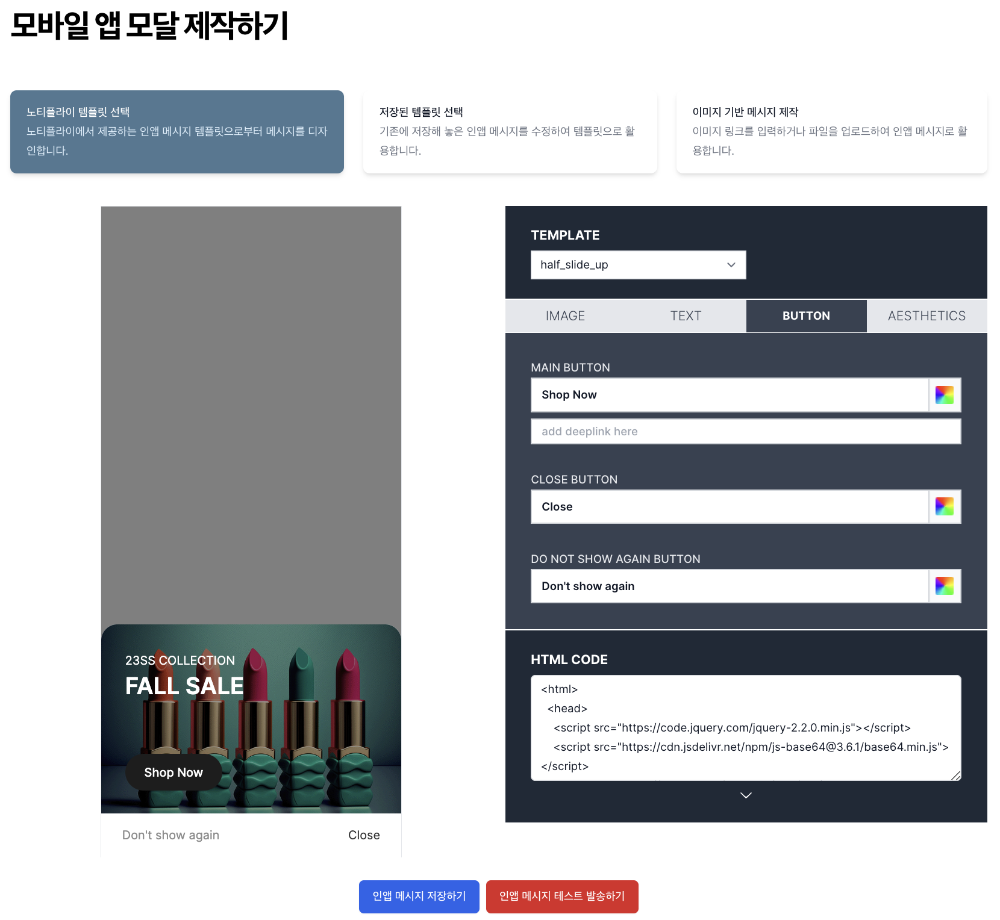
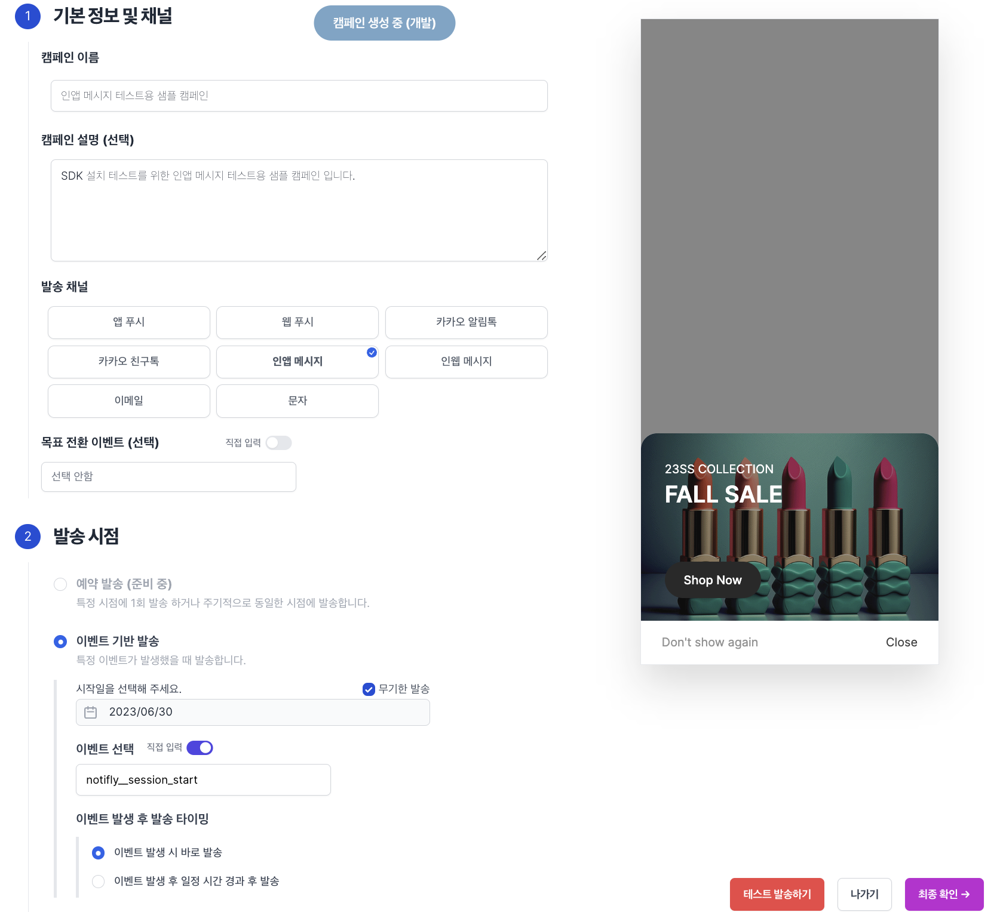
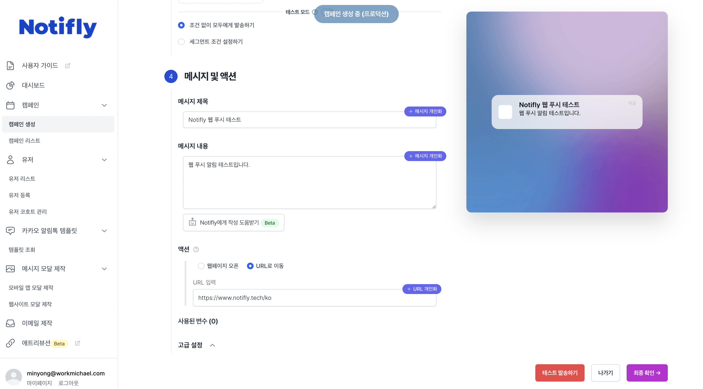

# Client SDK - 연동 Test

본 섹션에서는, Notifly Client SDK가 정상적으로 연동되었는지 테스트를 진행합니다.

## 1. 유저 등록 및 이벤트 전송 {#user-registration-and-event-tracking}

### 1-1. 유저 아이디 등록

- 유저 아이디를 등록하지 않아도 유저는 생성되지만, 유저 아이디를 등록하여야 유저를 구분할 수 있습니다.
- Notifly SDK의 setUserId를 이용해 유저를 등록합니다.

### 1-2. 유저 프로퍼티 등록

- Notifly SDK의 setUserProperties를 이용해 유저 프로퍼티를 등록합니다.

### 1-3. 이벤트 전송

- Notifly SDK의 trackEvent를 이용해 이벤트를 전송합니다.

## 2. 유저 등록 및 이벤트 전송 확인 {#user-registration-and-event-tracking-confirmation}

- 노티플라이 홈페이지에 로그인 하시고, 1에서 등록한 테스트 유저가 속한 프로젝트를 선택합니다.
  - 홈페이지 오른쪽 상단에서, 개발/프로덕션 중 테스트 유저가 등록된 프로젝트를 선택하셔야 합니다.
- 유저 메뉴를 선택하시고, 유저 리스트 페이지에서 등록한 테스트 유저를 클릭하여 해당 유저 프로필 페이지로 이동합니다.
- 유저 프로필 페이지에서, 1-1, 1-2, 1-3에서 등록한 유저 아이디, 유저 프로퍼티, 이벤트가 정상적으로 전송되었는지 확인합니다.

**유저 리스트 페이지**

**유저 프로필 페이지**

- 유저 아이디와 유저 프로퍼티가 정상적으로 등록되었는지 확인합니다.

- 이벤트가 정상적으로 전송되었는지 확인합니다.

## 3. 앱 푸시 알림 테스트 {#app-push-notification-test}

** iOS simulator에서는 푸시 알림 테스트가 불가능합니다. **

- 캠페인 생성 페이지로 이동합니다.
- 우측 상단 탭에서 개발/프로젝션 중 테스트 유저가 등록된 프로젝트를 선택합니다.
- 1번 기본 정보 및 채널 섹션에서 `앱 푸시`을 선택합니다.
- 4번 메시지 및 액션 섹션으로 이동하여 테스트할 메시지를 입력합니다.
  - `메시지 제목` : 전송할 푸시 알림 제목을 입력합니다.
  - `메시지 내용` : 전송할 푸시 알림 내용을 입력합니다.
  - `액션` : 푸시 알림 클릭 시 액션을 지정합니다.
    - ** 꼭 URL 및 딥링크 테스팅을 모두 진행해보세요. **
    - Foreground, Background, Terminated 상태에서 모두 클릭 시 액션이 정상적으로 작동하는지 테스트를 진행해보세요.

- 우측 하단의 "테스트 발송하기" 버튼을 클릭하고, 테스트 유저 아이디를 입력하고 테스트 발송하기를 클릭합니다.

- 정상적으로 푸시 알림이 도착했다면 테스트가 완료된 것입니다.

## 4. 인앱 팝업 테스트 {#in-app-message-test}

- 노티플라이에서는 자체적으로 몇 가지 이벤트를 로깅하고 있습니다. 이러한 이벤트들은 이벤트명 앞에 notifly\_\_ prefix가 붙어있습니다.
  - ex: 앱을 처음 시작했을 때, notifly\_\_session_start
- 본 섹션에서는, notifly\_\_session_start가 발생했을 경우, 인앱 팝업을 전송하는 테스트 캠페인을 생성해봄으로써 정상적으로 인앱 팝업 기능이 작동하는지를 테스트 합니다.

### 4-1. 인앱 팝업 템플릿을 제작

1. 인앱 팝업 제작 페이지로 이동합니다.
2. 템플릿을 선택하고, Image, Text, Button, Aesthetics를 알맞게 설정합니다.
   - Button 섹션에서 main_button 클릭 시 이동한 링크 입력을 필수입니다.

3. 인앱 팝업 저장하기 버튼을 누르고 템플릿 이름을 입력한 후, 저장하기 버튼을 누릅니다.

### 4-2. 테스트 캠페인 생성

1. 캠페인 생성 페이지로 이동합니다.
2. 우측 상단 탭에서 개발/프로젝션 중 테스트 유저가 등록된 프로젝트를 선택합니다.
3. 1번 기본 정보 및 채널 섹션에서 캠페인 이름을 입력하고, 발송 채널: `인앱 팝업`을 선택합니다.
4. 2번 발송 시점 세션에서 아래 사진을 참고하여 다음과 같이 필요한 정보를 채워줍니다.
   - 이벤트 기반 발송을 선택합니다.
   - 무기한 발송을 체크합니다.
   - 이벤트 선택에서 직접 입력 토글을 활성화한 후, `notifly__session_start`를 입력합니다.
   - 발송 시점을 이벤트 발생 시 바로 발송을 선택합니다.

5. 3번 발송 대상 섹션에서, 테스트 모드를 활성화하고 테스트 유저 아이디를 입력합니다.

6. 4번 메시지 및 액션 섹션에서, 테스트할 인앱 팝업 템플릿을 선택합니다. (4-1에서 제작한 템플릿)

7. 오른쪽 하단의 최종 확인 버튼을 눌러 필요한 정보가 제대로 기입되었는지 검토한 후, 캠페인을 생성하기 버튼을 클릭합니다.
   

### 4-3. 테스트 기기에서 인앱 팝업 테스트

- 테스트 유저 아이디를 등록한 기기에서 테스트를 진행합니다.
- 테스트 기기에서 앱을 종료(terminated) 상태로 만듭니다.
- 앱을 실행하면, notifly\_\_session_start이벤트가 자동으로 로깅되면서 인앱 팝업이 전송되며 아래와 같은 화면이 나타납니다.
  - 인앱 팝업가 보이지 않는다면, 새로 생성된 캠페인 정보를 받아오는데 딜레이가 있을 수 있기에, 앱을 종료했다가 다시 실행해주세요.

- 정상적으로 인앱 팝업이 도착했다면 테스트가 완료된 것입니다.

## 5. 웹 푸시 알림 테스트 {#web-push-notification-test}

### 5-1. 웹 푸시 테스트 발송

- 캠페인 생성 페이지로 이동합니다.
- 우측 상단 탭에서 개발/프로젝션 중 테스트 유저가 등록된 프로젝트를 선택합니다.
- 1번 기본 정보 및 채널 섹션에서 `웹 푸시`을 선택합니다.
- 4번 메시지 및 액션 섹션으로 이동하여 테스트할 메시지를 입력합니다.
  - `메시지 제목` : 전송할 푸시 알림 제목을 입력합니다.
  - `메시지 내용` : 전송할 푸시 알림 내용을 입력합니다.
  - `액션` : 푸시 알림 클릭 시 액션을 지정합니다.
    - 웹페이지가 Focus (foreground)인 상태, Background인 상태에서 모두 푸시 수신 및 클릭 시 액션이 정상적으로 작동하는지 테스트를 진행해보세요.

- 우측 하단의 "테스트 발송하기" 버튼을 클릭하고, 테스트 유저 아이디를 입력하고 테스트 발송하기를 클릭합니다.

- 정상적으로 푸시 알림이 도착했다면 테스트가 완료된 것입니다.

### 5-2. 웹 푸시 FAQ

웹 푸시 알림이 정상적으로 도착하지 않을 경우 가장 흔한 원인들에 대해 확인해보세요.

#### 5-2-1. 기기 권한

사용자가 기기 (macOS, Windows 등)에서 브라우저의 알림 권한을 허용해야 합니다.

예시 (macOS):

#### 5-2-2. 브라우저 권한

사용자가 브라우저에서 알림 권한을 허용해야 합니다. 브라우저마다 푸시 알림 권한의 기본 설정값과 권한 요청 방식이 다소 다릅니다.

예시 (Chrome)

예시 (Edge)

노티플라이 JS SDK 의 셋업 방식에 따라 권한 요청 기본 팝업이 노출되거나 노출되지 않을 수 있습니다. 자세한 내용은 [Notifly JS SDK - Service Worker 등록하기](http://docs.notifly.tech/ko/developer-guide/client-sdk/javascript-sdk#2-3-service-worker-%EB%93%B1%EB%A1%9D%ED%95%98%EA%B8%B0)를 참고해 주세요.

#### 5-2-3. 지원 브라우저 버전

노티플라이는 Web Push Protocol을 통하여 웹 푸시를 발송하고 있습니다. 현재 지원되는 브라우저와 버전은 [Push API - Browser compatibility](https://developer.mozilla.org/en-US/docs/Web/API/Push_API)를 확인해 주세요.

- 예를 들어, 데스크탑에서 Safari 버전 15 이하에서는 웹 푸시가 지원되지 않습니다.

#### 5-2-4. 그 외

노티플라이 팀에 문의해 주시면 빠르게 확인해 드리겠습니다.
