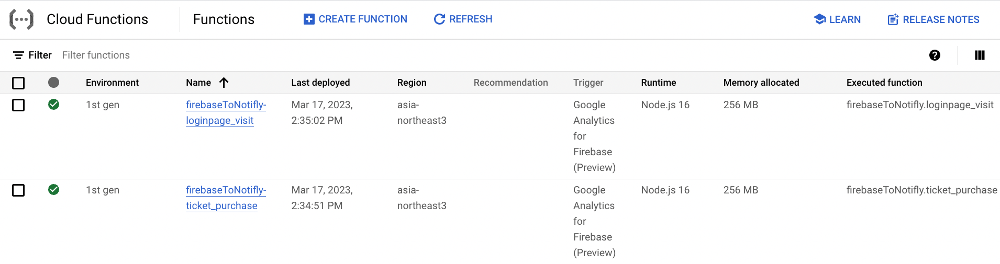

# Firebase - Notifly extension

Firebase - Notifly extension은 Firebase (Google Analytics)의 전환 이벤트를 Notifly에 전송하는 Google Cloud Functions들입니다. Firebase 프로젝트와 Notifly 간의 원활한 연동을 가능하게 하여 전환 이벤트를 추적하고 이러한 이벤트를 기반으로 Notifly의 기능들을 활용할 수 있습니다.

## 사전 준비 사항

Firebase - Notifly extension을 사용하려면 다음이 필요합니다:

- 앱이 포함된 Firebase 프로젝트
- Firebase 프로젝트에 대해 활성화된 Google Analytics
- [Firebase CLI](https://firebase.google.com/docs/cli) 설치
- Google Cloud 결제 수단 등록 및 [Firebase Blaze 요금제](https://firebase.google.com/pricing?hl=ko)
- Notifly에 전송할 전환 이벤트 이름들


## Google Cloud Functions

Firebase - Notifly extension은 각각의 전환 이벤트 별로 하나의 Cloud Function을 생성합니다. 이러한 Cloud Functions는 Firebase 프로젝트에서 해당 전환 이벤트를 수신 대기하고, 이벤트가 발생했을 때 이벤트 데이터를 Notifly에 전송합니다.

## 설치

Firebase - Notifly extension의 Cloud Functions를 배포하려면 다음 단계를 따라주세요:

1. Firebase - Notifly extension의 리포지토리를 복제합니다:

```
git clone https://github.com/team-michael/firebase-notifly-extension.git
```

2. 복제된 디렉토리로 이동하여 필요한 npm 패키지를 설치합니다:

```
cd firebase-notifly-extension
npm install
```

3. Firebase CLI를 활용하여 환경변수들을 설정합니다.

다음 다섯가지 환경변수들을 설정하셔야 합니다.

| Variable 이름               | 설명                                                  | 예시값                |
|-----------------------------|--------------------------------------------------------------|------------------------------|
| `notifly.location`            | Cloud Function을 배포할 Google Cloud region.       | 'asia-northeast3'           |
| `notifly.conversion_events`   | Notifly로 전송할 Google Analytics 전환 이벤트 목록 (쉼표로 구분)   | 'ticket_purchase,loginpage_visit' |
| `notifly.project_id`          | Notifly project ID                                       | 'michael'                    |
| `notifly.username`            | Notifly의 설정 페이지에서 확인하실 수 있습니다. 프로젝트 별로 하나의 사용자 이름이 생성됩니다. 문의 사항은 contact@workmichael.com 으로 이메일 부탁드립니다.               | 'jordan'                    |
| `notifly.password`            | Notifly의 설정 페이지에서 확인하실 수 있습니다. 프로젝트 별로 하나의 사용자 비밀번호가 생성됩니다. 문의 사항은 contact@workmichael.com 으로 이메일 부탁드립니다.                | '111111'                     |

예시:
```
firebase functions:config:set notifly.location='asia-northeast3' notifly.conversion_events='ticket_purchase,loginpage_visit' notifly.project_id='michael' notifly.username='jordan' notifly.password='111111'
```

Cloud function들의 환경설정을 확인하시기 위해서는 다음을 실행하세요:
```
firebase functions:config:get
```

4. Cloud Function들을 배포합니다.

```console
cd functions
firebase deploy --only functions:firebaseToNotifly
```

배포에 성공하면 [Cloud function 콘솔](https://console.cloud.google.com/functions) 에서 다음과 같이 셋업이 완료되었음을 확인할 수 있습니다.



## 요금

Cloud Function은 무료 티어를 초과하면 관련 요금이 발생하는 Google Cloud Platform 서비스를 사용합니다. Firebase - Notifly extension은 Node.js 16+의 런타임이 있는 Cloud Functions를 사용합니다. 청구 및 가격 정보에 대한 자세한 내용은 [Google Cloud Functions 가격](https://cloud.google.com/functions/pricing) 페이지를 참조해 주세요.

## 문의

Firebase - Notifly 확장기능에 대한 지원이 필요하거나 질문이 있으시면 contact@workmichael.com으로 문의해 주십시오.
