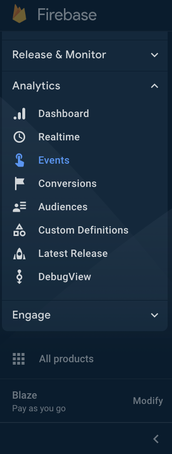
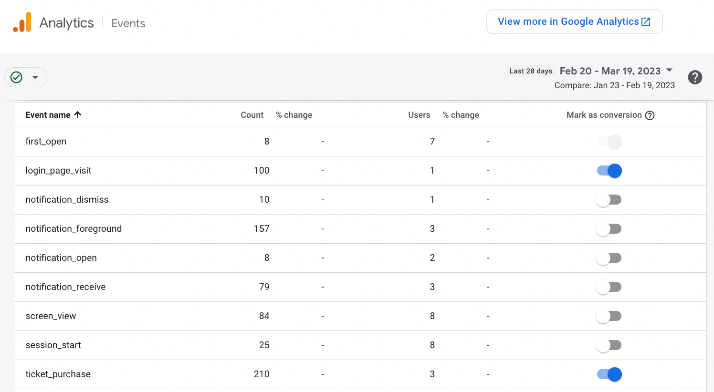
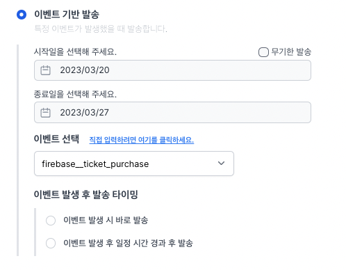

# Google Analytics 연동 시작하기

Notifly와 Google Analytics를 연동하면 코드 개발 없이 Google Analytics 이벤트들을 Notifly의 캠페인에서 활용할 수 있습니다.

## Notifly - Google Analytics 연동이란?

Notifly에서 사용자가 발생시킨 이벤트를 기반으로 캠페인을 설계하기 위해서는 이벤트 데이터를 Notifly에 전송해야 합니다. Notifly에 이벤트를 전송하기 위해서는 현재 두 가지 방법이 있습니다:

1. Notifly SDK 나 API를 활용하여 이벤트가 발생할 때 Notifly에 이벤트 데이터를 전송합니다.
2. Notifly와 Firebase (Google Analytics) 를 연동하여 Firebase 이벤트가 발생했을 때 Notifly에도 이벤트 데이터가 전송되도록 합니다.

Firebase (Google Analytics) 를 연동하면 추가적인 코드 개발 없이 Notifly에서 이벤트를 활용할 수 있습니다. 

다만, Google Analytics의 정책으로 인해 다음과 같은 경우에만 이벤트 데이터를 전송 가능합니다:

1. iOS, Android 기기에서 Firebase로 로깅되는 Google Analytics 이벤트에 대해서만 Notifly로 전송이 가능합니다.
2. Firebase에서 전환 이벤트로 설정한 이벤트에 대해서만 Notifly로 이벤트가 전송됩니다.
3. Firebase 프로젝트에서 Blaze 요금제를 사용하는 경우에만 로깅이 가능합니다.

## 지원되지 않는 기능

- 전환 이벤트로 설정하지 않은 이벤트들은 로깅이 불가능합니다.
    - 현재는 Google Analytics에서는 전환 이벤트가 아니면 준실시간으로 로깅되지 않고 최대 1시간의 딜레이가 발생할 수 있어서 지원하지 않고 있습니다. 이 이벤트들에 대해서도 준실시간성에 대한 보장 없이 사용자 세그먼트에서 활용할 수 있게 지원할 계획입니다. 더 자세한 내용은 노티플라이 팀에게 문의해 주세요.
- 웹사이트 Google Analytics 이벤트 (Google Tag Manager, Google tag API)들은 로깅이 불가능합니다.
    - Google Tag Manager, Google tag API를 사용한 Google Analytics 이벤트는 준실시간으로 로깅되지 않고 최대 1시간의 딜레이가 발생할 수 있어서 지원하지 않고 있습니다. 이 이벤트들에 대해서도 준실시간성에 대한 보장 없이 사용자 세그먼트에서 활용할 수 있게 지원할 계획입니다. 더 자세한 내용은 노티플라이 팀에게 문의해 주세요.

## Notifly - Google Analytics 연동 가이드

다음 세 가지 스텝을 따르면 연동이 완료됩니다

1. Firebase에서 이벤트 중에 Notifly로 보낼 이벤트를 전환 이벤트로 설정하기
2. Firebase - Notifly extension 설치
3. 실제 로깅된 Google Analytics 이벤트를 노티플라이에서 확인하기

### 1. Firebase에서 이벤트 중에 Notifly로 보낼 이벤트를 전환 이벤트로 설정하기

Firebase 프로젝트에서 Events를 찾아 선택해 주세요.

이벤트 목록에서 Notifly로 전송할 이벤트를 전환 이벤트로 설정해 주세요.

### 2. Firebase - Notifly extension 설치

[Firebase - Notifly extension](/ko/google-analytics/firebase-notifly-extension)가이드를 참고해 주세요.

### 3. 실제 로깅된 Google Analytics 이벤트를 노티플라이에서 확인하기

Notifly 캠페인 생성 페이지에서 이벤트 기반 발송 드롭다운에서 `firebase__` 로 시작하는 이벤트 이름이 보이시면 연동이 완료된 것입니다.

* Extenstion 설치 및 이벤트 발생 이후 약 15분 정도의 딜레이가 발생할 수 있습니다.
* 혹시 확인이 안 되시면 노티플라이 팀에게 문의 부탁드립니다.

## 예상 요금

Notifly - Google Analytics 연동 기능 자체는 무료로 제공되지만, 이벤트를 Notifly에 발송할 때 Google Cloud 비용을 직접 지불하셔야 합니다.

약 10,000개의 이벤트를 보낼 때 예상되는 비용은 다음과 같습니다.

- 컴퓨팅 비용 (256MB 메모리 기준)
    - 이벤트 한 개당 처리 시간 약 3.3초
    - 한 번 호출당 드는 컴퓨팅 비용: $0.00000648 / per 1s
    - 이벤트 10,000개당 컴퓨팅 비용: 약 $0.214
- 호출 비용
    - 200만 회까지 무료
    - 이후 $0.4 / 100만회
- 네트워킹 비용
    - 아웃바운드 데이터 $0.12 per 1GB

예를 들어, 한 달에 백만 개 이벤트를 Notifly에 발송한다면 월 비용은 약 $25입니다.

- 컴퓨팅 비용: $21
- 네트워킹 비용: $4
