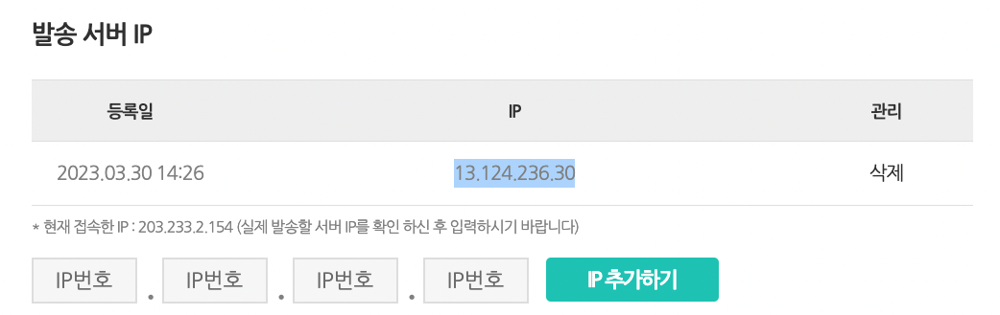

# 문자 발송 대행사 연결

노티플라이에서는 현재 사용중이신 문자 발송 대행사를 연결하여 캠페인에 활용하실 수 있습니다. 현재 연결 가능한 대행사 목록은 실시간으로 추가되고 있으니 제품 내에서 확인하시기 바랍니다. 

## 알리고 연결

[알리고](https://smartsms.aligo.in/admin/api/info.html)를 사용하시는 경우에는 반드시 노티플라이의 문자 발송 서버 IP 주소를 알리고에 직접 입력해 주셔야 합니다.

알리고 홈페이지에 로그인 하신 후에 [문자API] - [신청/인증] 탭에 들어가셔서, 발송 서버 IP에 `13.124.236.30`을 입력해 주시기 바랍니다.

노티플라이의 [설정] - [문자] 섹션에서는 aligo를 선택하신 후 다음 3가지 값을 입력하셔야 합니다:
1. sender_phone_number: 알리고에 등록하신 발신번호를 기입해 주세요.
2. api_id: 알리고에 기존 API Key 에 있는 Identifier(예: michael)를 입력해 주세요. 목록이 없다면 API Key 발급신청을 눌러주세요.
3. api_secret_key: 알리고에 기존 API Key 에 있는 발급키(그림의 ******** 에 있는 값)를 입력해 주세요. 목록이 없다면 API Key 발급신청을 눌러주세요.

설정을 완료하신 이후에는 [문자 발송 테스트하기](/ko/text-message/text-message-guide#문자-발송-테스트하기) 를 통해 실제로 잘 연결이 되었는지 확인해 주시길 바랍니다.
