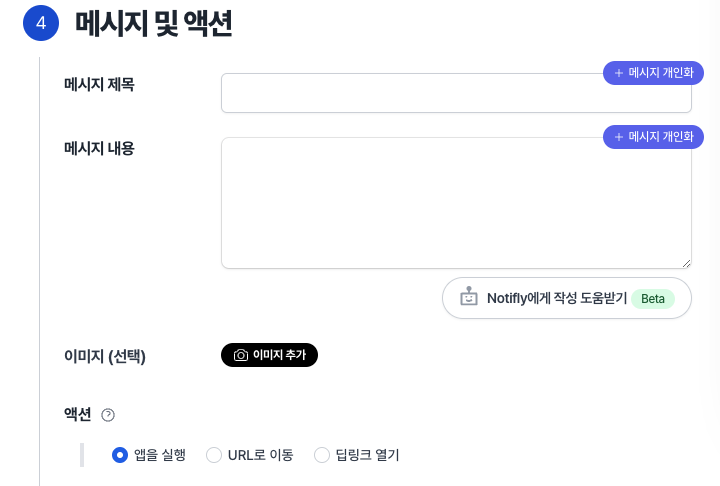
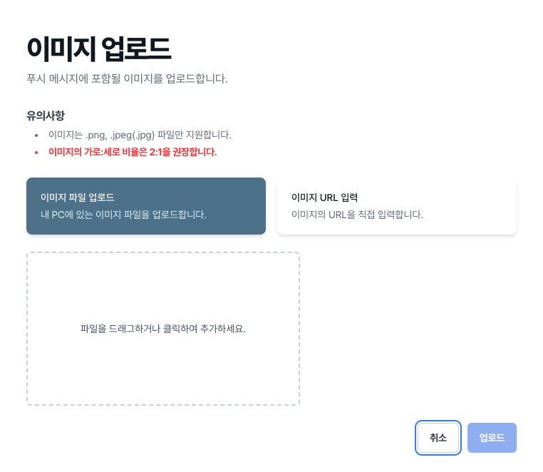
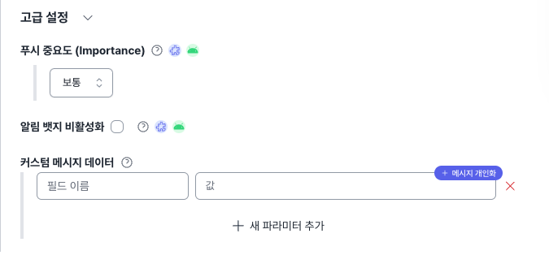
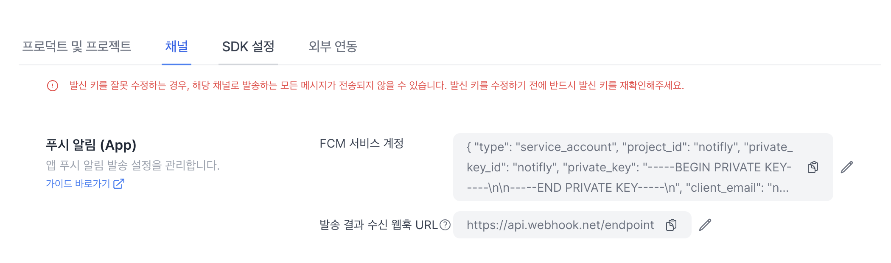
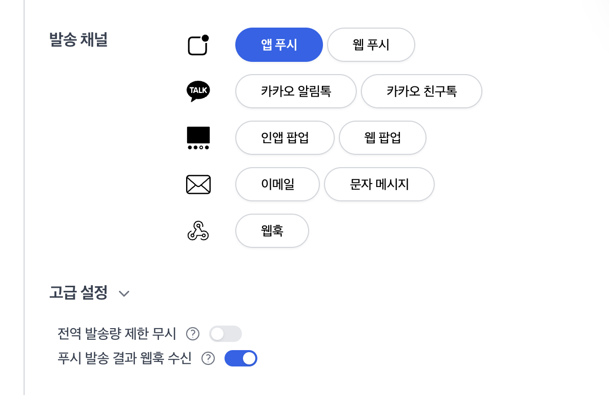

# 앱 푸시 알림 발송

노티플라이에서 앱 푸시 기능을 이용하기 위해서는 다음 두 가지를 먼저 확인해 주세요:

1. 앱에 [노티플라이 SDK](/ko/category/client-sdk)가 설치되었는지 확인해 주세요.
2. [연동 테스트 - 앱 푸시 알림 테스트](/ko/developer-guide/client-sdk/sdk_test#app-push-notification-test)를 진행해 주세요.

## 1. 발송 시점 설정 {#app-push-notification-send-time}

앱 푸시의 경우 예약 발송, 이벤트 기반 발송, API 기반 발송이 모두 지원됩니다.  
자세한 내용은 [노티플라이 캠페인 - 시작하기 - 발송 시점](/ko/user-guide/campaigns/basic#2-발송-시점) 섹션을 참고해주세요.

사용자가 여러 기기에서 앱을 사용하고 있는 경우, 앱 푸시 알림은 다음과 같이 발송됩니다:

- 예약 발송, API 기반 발송인 경우에는 사용자의 모든 기기로 앱 푸시 알림이 발송됩니다.
- 이벤트 기반 발송인 경우에는 사용자가 해당 이벤트를 발생시킨 기기로만 앱 푸시 알림이 발송됩니다.

## 2. 발송 대상 설정 {#app-push-notification-target}

앱 푸시의 경우 유저 그룹 설정 또는 CSV 업로드 방식으로 발송 대상을 설정할 수 있습니다.  
자세한 내용은 [유저 그룹 설정](/ko/user-guide/campaigns/campaign-segments/segment#user-group-setup) 섹션을 참고해주세요.

## 3. 메시지 내용 및 액션 설정 {#app-push-notification-content}

### 3-1. 푸시 알림 기본 내용 설정

앱 푸시에서는 제목, 내용, 이미지, 클릭 시 액션 등을 설정할 수 있습니다.



#### 3-1-1. 앱 푸시 제목 및 내용 설정

앱 푸시의 제목과 내용을 설정하시면 프리뷰를 확인할 수 있습니다.

- 기기별로 실제로 표시되는 글자 수가 다를 수 있습니다. 일반적으로 Android에서는 제목 65자, 내용 240자의 제한이 있고, iOS에서는 총 4줄/178자의 제한이 있습니다.
- 이모티콘 사용이 가능합니다.

#### 3-1-2. 앱 푸시 이미지 설정 (Optional)

- 이미지는 .png, .jpeg(.jpg) 파일만 지원합니다.
- 이미지의 가로:세로 비율은 2:1을 권장합니다.
- 이미 업로드된 이미지를 사용하고자 하는 경우 URL 입력 옵션을 선택하시면 됩니다.



#### 3-1-3. 앱 푸시 클릭 시 액션 설정 (Optional)

- 기본적으로 앱 푸시를 클릭하면 앱이 실행됩니다.
- 앱 푸시 클릭 시 웹 페이지로 이동하거나, 딥링크를 활용하여 특정 화면으로 이동하도록 설정할 수 있습니다. 이 때, 딥링크를 사용하려면 앱 내에 딥링크가 설정되어 있어야 합니다.

:::caution Universal Link 동작
Notifly 앱 푸시 클릭시 이동할 주소에는 Universal Link를 지원하지 않습니다. appName:// 형태의 앱 스킴 딥링크를 사용해주세요.
:::

### 3-2. 푸시 알림 고급 설정 (Optional)

푸시 알림에 대한 세부적인 형태를 고급 설정에서 변경할 수 있습니다.



#### 3-2-1. 앱 푸시 알림 중요도 설정 (Android Only)

Android에서는 알림의 중요도를 사용하여 알림이 사용자를 시각적으로 또는 청각적으로 방해하는 정도를 결정할 수 있습니다. 예를 들어, 헤드업 알림 등으로 표시되도록 하기 위해서는 '높음'을 선택하시면 됩니다.

#### 3-2-2. 알림 뱃지 비활성화 (Android Only)

뱃지는 앱 아이콘 위에 표시되는 작은 숫자 표시 기능입니다. Android에서 푸시 알림에 표시되는 뱃지를 비활성화할 수 있습니다.

#### 3-2-3. 커스텀 메시지 데이터

푸시 메시지의 데이터(data) 필드에 담고 싶은 추가적인 정보를 입력하고, 해당 커스텀 데이터를 활용하여 앱 내에서 따로 푸시 메시지에 대한 처리를 할 수 있습니다.
앱 내 푸시 수신 알림함을 구현하시거나, 앱 푸시에 대한 특정한 처리를 하고자 할 때 활용할 수 있습니다.

## 4. 발송 결과 수신 웹훅 {#notification-webhook}

노티플라이를 통한 앱 푸시 발송 결과를 실시간으로 추적할 수 있는 웹훅 기능을 제공합니다. 이 기능을 활성화하려면, 노티플라이 설정 페이지에서 채널 설정 탭의 푸시 알림 섹션의 발송 결과 수신 웹훅 URL에 웹훅 endpoint 정보를 입력해야 합니다.



설정이 완료되면, 모든 성공적인 푸시 알림 발송에 대해 아래의 형태로 데이터가 POST 요청을 통해 전송됩니다.

```json
{
  "userId": "사용자 아이디",
  "campaignId": "캠페인 아이디",
  "platform": "플랫폼", // "ios" or "android"
  "token": "FCM token",
  "title": "푸시 제목",
  "body": "푸시 내용",
  "url": "푸시 URL (딥링크 등)"
}
```

웹훅은 기본적으로 모든 푸시 캠페인에 대해 활성화되어 있지만, 특정 캠페인에서 웹훅 호출을 원하지 않는 경우 캠페인 설정 과정에서 비활성화할 수 있습니다.



발송 결과 수신 웹훅 기능을 활용하면 서비스 내 알림함 기능을 구현하는데 활용하실 수 있습니다.
웹훅은 노티플라이 [웹훅 채널](/ko/user-guide/webhook/guide)을 통해 발송되며, **동일한 요금 요율**이 적용됩니다.
