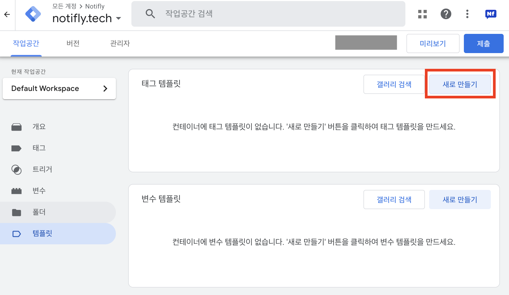
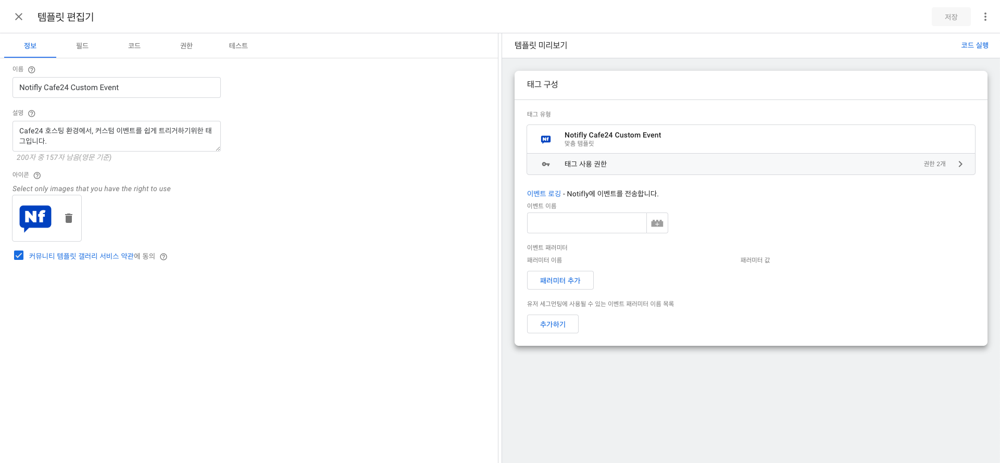
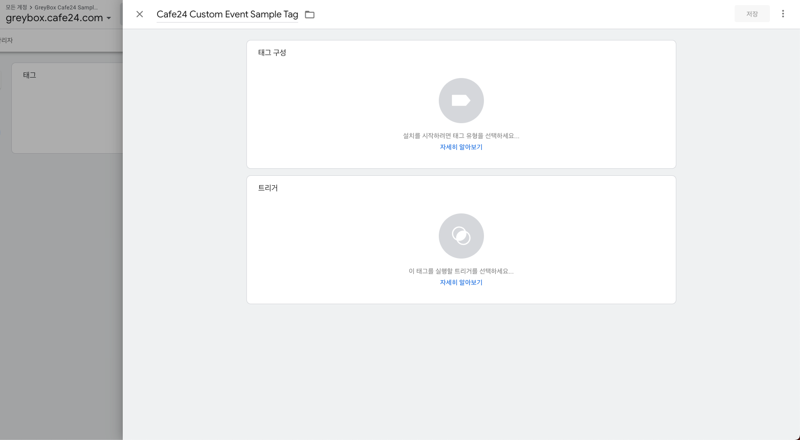
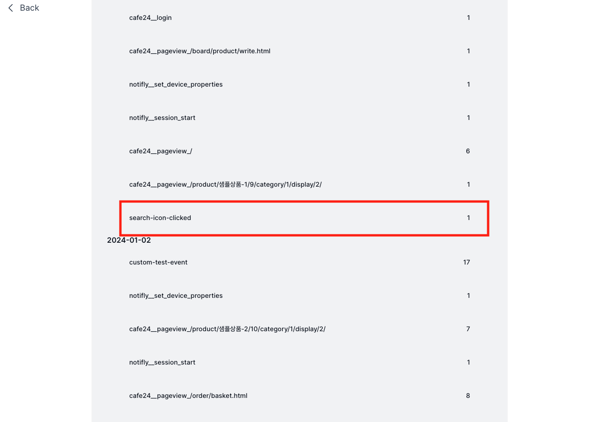

# GTM을 이용한 커스텀 이벤트

## 1. Cafe24 쇼핑몰에 GTM 설치하기{#install-gtm-to-cafe24}

:::note
이미 Cafe24 쇼핑몰에 GTM을 설치하셨다면, 이 단계는 건너뛰셔도 무방합니다.
:::

### 1-1. GTM Account 생성하기

1. [Google Tag Manager](https://tagmanager.google.com/) > 우측 상단 **계정 만들기** 에 들어가 계정 생성을 진행합니다.
   
2. 계정 생성이 완료되면, 화면에 보이는 GTM 설치 코드를 미리 복사해둡니다.
   
3. Cafe24 EC Admin > 쇼핑몰 설정 > 기본 설정 > 검색 엔진 최적화 (SEO) > 고급 설정 > 코드 직접입력에 들어가 2번에 나와있는 GTM 설치 코드를 복사하여 붙여넣습니다.
   
4. 저장 버튼을 누른 후, 2번 화면의 **3. 웹사이트 테스트** > 테스트 버튼 을 눌러 GTM 설치가 정상적으로 되었는지 확인해주세요.
   

## 2. Notifly Cafe24 GTM 템플릿 설치하기{#install-notifly-cafe24-gtm-template}

1. [Notifly Cafe24 Template 다운로드](https://github.com/team-michael/notifly-gtm-template/releases) 페이지에 접속해 주세요.
   최신 버전의 `template-cafe24-custom-event.tpl` 파일을 다운로드 해주세요.
2. 메뉴 왼쪽 하단 **템플릿** 메뉴를 선택하고 우측 상단에 있는 **태그 템플릿 > 새로 만들기** 버튼을 클릭하여 템플릿 편집기를 실행합니다.

   

3. 템플릿 편집기 우측 상단 저장 버튼 오른쪽에 있는 `⋮` 버튼을 클릭하고 **가져오기**를 선택하여 다운받은 맞춤 템플릿 파일을 가져옵니다.

   

4. 템플릿이 잘 불러와졌다면, 저장 버튼을 클릭해주세요. 왼쪽 하단에 **템플릿이 생성됨** 이라는 팝업이 뜨면서 템플릿 설치가 완료 됩니다.

   

## 3. 커스텀 이벤트 사용하기{#how-to-use-custom-event}

### 3-1. 맞춤 태그 생성 준비하기{#prepare-custom-tag}

1. GTM 콘솔에서 좌측 사이드바의 **태그** 메뉴를 선택합니다.
2. 우측 상단 **새로 만들기** 버튼을 클릭합니다.

   

3. 태그 구성 > 맞춤 설정 에서 [Notifly Cafe24 GTM 템플릿 설치하기](#install-notifly-cafe24-gtm-template)에서 설치해 놓았던 템플릿을 선택합니다.

   

### 3-2. 커스텀 이벤트 사용 예제 {#custom-event-example}

:::tip 참고
GTM이 제공하는 더 다양한 기능을 활용하여 여러분의 쇼핑몰에 맞는 고도화된 커스텀 이벤트를 만들어 보세요. 이 섹션에서는 한 가지 예제만을 소개합니다.
:::

#### 3-2-1. 개요

이 섹션에서는 사용자가 Cafe24 쇼핑몰에 들어와서, 돋보기 버튼을 클릭하였을 때 `search-icon-clicked` 이벤트를 Notifly에 전송하는 예제를 보여줍니다.

#### 3-2-2. 돋보기 버튼 특정하기

GTM에서는 태그를 언제 실행할지를 결정하는 **트리거** 라는 개념을 사용합니다. 이를 위해서는, 사용자가 돋보기 버튼을 클릭하였을 때, GTM이 이를 감지할 수 있도록 **트리거** 를 생성해야 하고, 돋보기 버튼을 특정할 수 있어야 합니다.

1. 브라우저에서 돋보기 버튼을 우클릭한 후 **검사** 를 클릭하면 해당 요소의 HTML 코드가 하이라이트 되어 나타납니다.

2. 하이라이트된 코드를 우클릭하고, **복사 > selector 복사** 를 클릭해주세요. 이렇게 복사한 selector는 아래 **트리거 생성**에서 돋보기 버튼을 특정하는데 사용되니, 꼭 어딘가에 복사해두세요. `#top_nav_box > div.top_mypage > a.eSearch > svg` 와 같은 문자열이 복사되었다면 성공입니다.

#### 3-2-3. 트리거 생성하기

1. 3-1 섹션에서 생성한 태그 구성 아래에 있는 **트리거** 를 클릭합니다.
2. 트리거 선택의 우측 상단에 **+** 버튼 > **트리거 구성** 을 클릭해 주세요.

   

3. 트리거 유형 선택 > 클릭 > 모든 요소 를 선택하고, **일부 클릭**을 선택합니다.

   

4. 조건을 **Click Element**, **CSS 선택 도구와 일치**, **`3-2-2에서 복사해둔 selector`** 로 설정합니다.

   

   :::tip Click Element가 비교 대상에 없을 때
   드랍다운 하단 기본 제공 변수 선택 > Click Element를 추가해줍니다.
   :::

5. **저장** 버튼을 클릭하여 생성해둔 트리거를 저장해주세요.

#### 3-2-4. 태그 완성하기

1. [맞춤 태그 생성 준비하기](#prepare-custom-tag)에서 생성해둔 태그에 이벤트 이름을 입력합니다. 돋보기 버튼 클릭 이벤트이기 때문에, `search-icon-clicked` 이벤트라고 이름을 짓겠습니다. 이벤트 이름은 자유롭게 설정 가능합니다.

   

2. 우측 상단 **저장** 버튼을 클릭하여 태그를 저장합니다.

이제 모든 설정이 완료되었습니다. Cafe24 쇼핑몰에 접속하여 돋보기 버튼을 클릭해보세요. Notifly에 `search-icon-clicked` 이벤트가 전송되는 것을 확인할 수 있습니다. 이벤트를 발생시킨 유저를 확인하고 싶다면, **Notifly 콘솔 > 유저 리스트 > 유저 검색하기 > 유저 ID 입력 > 일별 이벤트 발생 빈도** 에서 확인할 수 있습니다.

