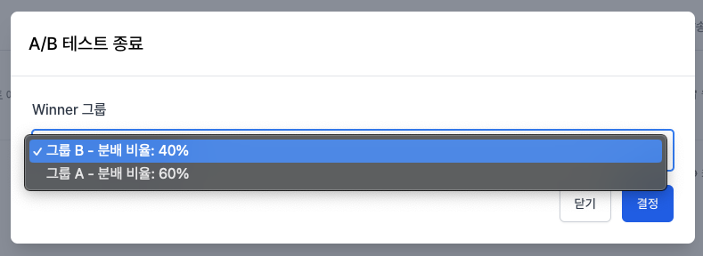
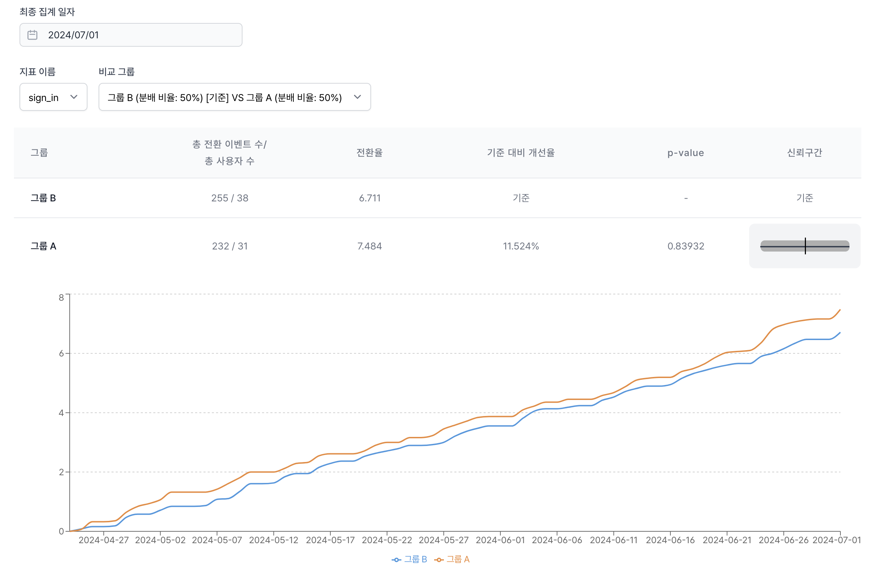

# A/B 테스트

노티플라이의 A/B 테스트 기능을 활용하면 서로 다른 사용자 그룹에게 다른 메시지를 보내어 그 효과를 비교할 수 있습니다.

## 1. A/B 테스트 캠페인 설정

### 1-1. 캠페인 타입 설정

기본 정보 및 채널에서 캠페인 타입을 'A/B 테스트 캠페인'으로 설정하시면 A/B 테스트를 위한 설정 항목이 추가됩니다.

### 1-2. 메시지 및 액션 설정

캠페인에 대해 서로 다른 사용자 그룹별로 다른 메시지 내용을 설정할 수 있습니다. 각 그룹별로 메시지 제목, 내용, 이미지를 다르게 설정할 수 있습니다.
그룹의 비율에 따라 사용자들이 랜덤하게 그룹에 할당됩니다.

:::info
A/B 테스트에서 "컨트롤 그룹"을 지정할 수 있습니다. 컨트롤 그룹은 메시지를 받지 않으며, 메시지 발송의 효과를 검증하는 데 유용합니다.
:::

## 2. A/B 테스트 종료

현재 진행 중인 캠페인에 대한 A/B 테스트를 종료할 수 있습니다. 캠페인 리스트에서 'A/B 테스트 종료'를 클릭하여 Winner 그룹을 설정하시면, 해당 그룹의 메시지가 전체 발송 대상에게 발송되는 '일반 캠페인'으로 전환됩니다.

## 3. A/B 테스트 분석

A/B 테스트 캠페인의 '캠페인 발송 현황' 대시보드에서 A/B 테스트 분석 결과를 확인하실 수 있습니다. 서로 다른 사용자 그룹별로 지표를 비교하는 통계적 분석을 일별 스냅샷 형태로 제공합니다.
기준 그룹을 선택하고, 다른 그룹과 비교하여 전환율, 클릭 수, 전환 이벤트 수 등을 확인할 수 있습니다.

- **총 전환 이벤트 수**: 각 그룹의 전환 이벤트 수를 확인합니다.
- **총 사용자 수**: 각 그룹에서 메시지 발송 대상의 후보에 해당된 사용자 수 입니다. 실제 발송 대상은 이보다 적을 수 있습니다.
- **전환율**: 전환 이벤트 수 / 사용자 수로 계산된 전환율을 확인합니다.
- **기준 대비 개선율**: 기준 그룹 대비 다른 그룹의 전환율을 %로 계산한 값입니다.
- **p-value**: 기준 그룹 대비 비교 그룹에 대한 지표 차이가 통계적으로 얼마나 유의미한지를 설명합니다. p-value는 0부터 1까지의 값을 나타낼 수 있으며, 일반적으로 0.05 미만인 경우 통계적으로 유의미하다고 판단합니다.
- **신뢰 구간**: 기준 그룹 대비 개선율이 나타낼 수 있는 값의 범위를 확인할 수 있습니다. 통계적으로 유의미한 경우, 신뢰 구간이 양수만을 포함하거나 음수만을 포함하게 됩니다.
