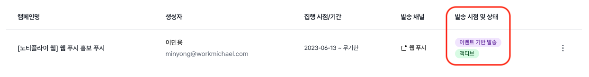
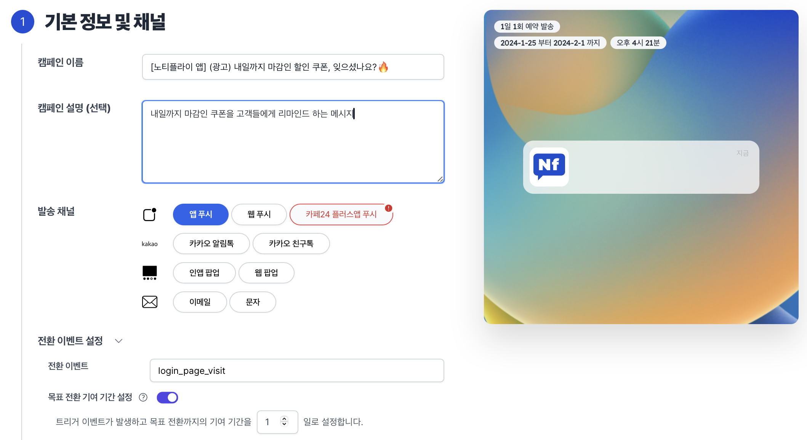
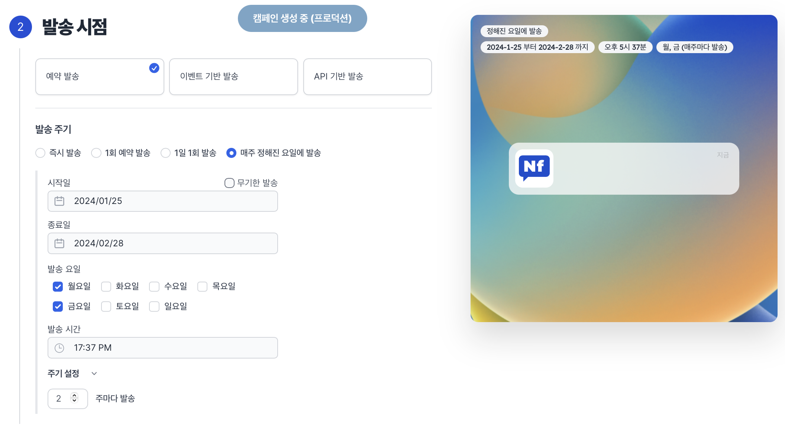
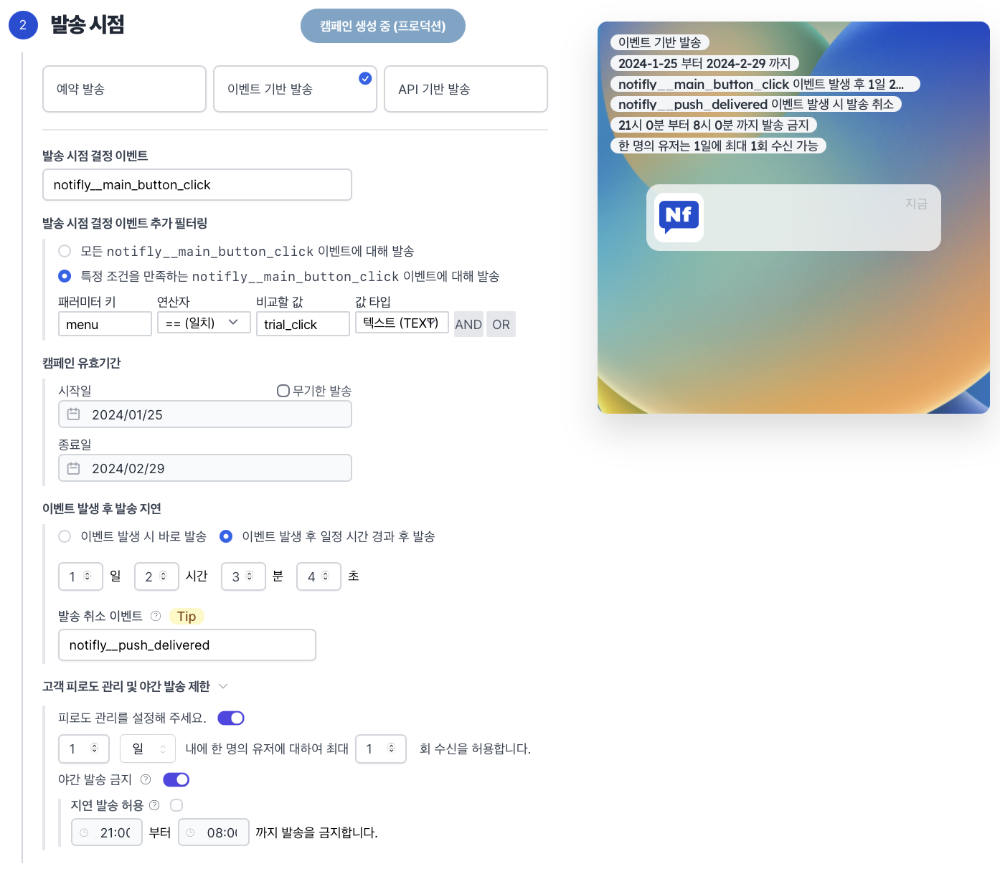
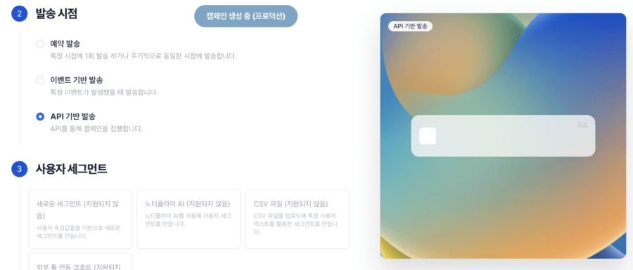
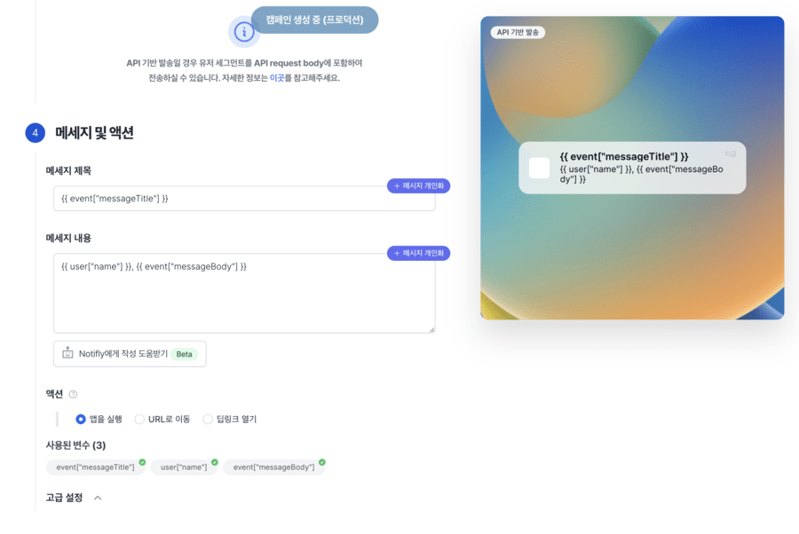

# 시작하기

노티플라이 캠페인을 이용하여 <u>원하는 유저를 타겟</u>하여, <u>원하는 타이밍</u>에 <u>원하는 채널</u>로 보내보세요. 노티플라이 캠페인 생성 페이지에서 캠페인을 **쉽고 빠르게** 생성할 수 있습니다.

<!--
## 캠페인 생애 주기 (Life Cycle)

노티플라이에서 캠페인은 총 네 가지 상태를 가집니다.

(\*_파란색 화살표: 사용자 조작, 검정색 화살표: 자동_)

캠페인 상태는 캠페인 리스트 페이지에서 확인하실 수 있습니다.

1. **드래프트** : 캠페인을 생성하다가 중간에 취소했을 때, 나중에 다시 이어서 작업할 수 있는 상태입니다. 드래프트 캠페인은 실제 발송에서 어떠한 영향도 미치지 않으며, 실제로 발송되었던 캠페인이 아니기 때문에 발송 현황을 확인할 수 없습니다.

2. **액티브**: 캠페인을 생성하면, 기본적으로 캠페인은 액티브 상태로 저장됩니다. (_참고: 즉시 발송 캠페인이거나, 5분 내로 발송되어야 할 캠페인은 곧바로 종료 상태로 들어가며, 차후 발송 취소, 수정 또는 재개할 수 없습니다._) 액티브 상태인 캠페인은 실제로 발송될 가능성이 있는 캠페인들이며, 실시간으로 발송 현황을 확인할 수 있습니다. **액티브 상태 캠페인은 수정이 불가능합니다.**

3. **비활성**: 캠페인 리스트의 **액티브 상태**인 캠페인 항목 가장 오른쪽에 '중지' 버튼을 클릭하면 액티브 상태인 캠페인을 비활성 상태로 만들 수 있습니다. 비활성 상태인 캠페인은 발송 대상에서 제외되지만, 지금까지 발송 현황을 확인할 수 있습니다. 비활성 상태인 캠페인은 다시 재개시켜 액티브 캠페인으로 전환할 수 있습니다. **캠페인 수정은 비활성 상태일때만 가능합니다.**

4. **종료**: 캠페인 집행 기한이 만료된 캠페인은 자동으로 종료됩니다. 또한, 사용자가 **비활성** 상태인 캠페인 가장 오른쪽에 '종료' 버튼을 눌러 캠페인을 종료시킬 수도 있습니다. 한 번 캠페인이 종료되면, 더이상 **재개 또는 수정이 불가능합니다**. 캠페인이 종료된 후에도 발송 현황은 계속 확인할 수 있습니다. **종료 상태인 캠페인만 삭제할 수 있습니다**. 종료된 캠페인과 동일한 캠페인을 다시 재개하고싶다면, 캠페인 복제 기능을 활용해 주세요. -->

## 1. 기본 정보 및 채널

- **캠페인 이름**: 캠페인 리스트에 노출되어 관리하실 때, 해당 켐페인이 어떤 메시지 발송인지 알아보기 쉽도록 하는 용도입니다. 기입된 내용은 <u>메시지 발송에 전혀 영향을 미치지 않습니다.</u>
- **캠페인 설명**: (선택 사항) 켐페인에 대한 설명 및 메모를 남기시면 유용합니다. 제목과 마찬가지로 <u>발송 내용과 무관합니다. </u>
- **발송 채널**: 푸시, 카카오, 팝업, 메시지 등 발송할 채널을 선택합니다.
  :::caution
  - 카카오, 이메일 발송 시 발신자 정보 등록이 필요합니다. 발신자 정보는 프로덕트 좌측 하단 **설정**에서 등록하실 수 있습니다.
  - 발신자 정보를 잘못 등록하시면, 발송에 실패할 수 있으니 주의해주세요.
  - 채널 별로 발신자 정보를 등록하는 방법은 좌측 카테고리의 채널 별 가이드**([카카오](/ko/docusaurus-plugin-content-docs/current/user-guide/kakaotalk/integration.md), [이메일](/ko/docusaurus-plugin-content-docs/current/user-guide/email/guide.mdx))** 에서 확인해주세요.
- **전환 이벤트 설정**: (선택 사항) 캠페인 메시지를 보낸 후, 전환율 지표를 확인하고자 할 때 활용하면 좋습니다.
  - **전환 이벤트**: 캠페인 메시지를 받은 유저가 <u>어떤 행동을 할 때 전환으로 집계</u>할 것인지 설정합니다.
    - ex) 캠페인 메시지를 받은 유저가 `login_page_visit`하는 것을 전환으로 집계하고자 한다면, 해당 이벤트를 선택합니다.
  - **목표 전환 기여 기간 설정**: 전환 이벤트가 발생한 뒤부터, <u>몇 일 동안의 전환 기여를 측정</u>할 것인지 설정합니다.
    기간을 선택하지 않으실 경우 전환 기여를 무기한 측정합니다.
    - ex) 전환 이벤트가 발생한 후 하루 동안의 전환 수를 측정하고자 한다면 `1일`을 선택합니다.

## 2. 발송 시점

캠페인을 발송할 타이밍을 설정합니다. 노티플라이는 세 가지의 발송 시점 결정 방법을 지원합니다. 특정한 시점에 캠페인을 집행하는 **예약 발송**, 특정 이벤트가 발생했을 때 캠페인을 집행하는 **이벤트 기반 발송**, 그리고 HTTP **API 기반 발송**를 활용하여 고객 인게이지먼트를 끌어올려 보세요.

### 2.1. 예약 발송

노티플라이 캠페인은 선택한 시간에 원하는 유저들에게 알림을 발송할 수 있는 기능을 지원합니다. 예약 발송은 네 가지 타이밍을 지원합니다.

1. **즉시 발송**
   - 캠페인을 생성하는 <최종 확인> 버튼을 누르는 즉시 캠페인을 발송하며, 이후에는 <u>발송을 취소할 수 없습니다.</u>
2. **1회 예약 발송**
   - 원하는 시각에 캠페인 집행을 예약합니다.
   - 캠페인 예약 시점 <u>5분 전부터는 발송을 취소할 수 없으며</u>, **종료** 상태로 저장되니 참고해주세요.
3. **1일 1회 발송**
   - 시작일부터 종료일까지 매일 설정하신 시각에 캠페인을 집행합니다.
4. **매주 정해진 요일에 발송**
   - 시작일부터 종료일까지 매주(혹은 격주 등 설정한 주기) 원하시는 요일에만 설정하신 시각에 캠페인을 집행합니다.
     - ex) 2주마다 월요일, 금요일에 발송
     <!--
     일회성 발송이 아닌 주기성 발송인 경우 (위 3, 4번 항목), 캠페인 발송 기간을 선택할 수 있습니다. 캠페인 발송 기간은 **시작일 부터 종료일** 까지로 선택할 수 있으며, 시작일 당일 **00시 00분**부터, 종료일 당일 **23시 59분**까지로 취급됩니다. -->

### 2.2. 이벤트 기반 발송

노티플라이 캠페인은 유저가 특정 이벤트를 발생시켰을 때 해당 유저에게만 알림을 발송할 수 있는 기능을 지원합니다. 이벤트를 발생하는 방법에는 아래 **팁!** 을 참고해주세요.

:::tip 팁!

1.  **[Client SDK](/ko/category/client-sdk)** : 어플리케이션에서 클라이언트 SDK를 이용하여 유저의 특정 액션에 알맞게 이벤트를 발생시킬 수 있습니다.

2.  **[HTTP API](/ko/developer-guide/http-api/http-api-guide)**: 노티플라이는 REST API를 통하여 이벤트를 발생시키는 방법을 제공합니다. REST API를 통하여 특정 유저에게만 발생하는 이벤트 뿐만 아니라, 서비스 레벨에서 발생하는 이벤트(예: 판매 기간 종료 이벤트)도 노티플라이에 전달할 수 있습니다.

3.  **외부 분석 도구 연동** : [Amplitude](/ko/user-guide/amplitude/amplitude-introduction) 혹은 [Mixpanel](/ko/docusaurus-plugin-content-docs/current/user-guide/mixpanel/mixpanel-introduction.md) 이미 사용하고 계시다면, 기존에 사용하시던 이벤트를 그대로 노티플라이에게 전달할 수 있습니다.

:::

이벤트 기반 발송 캠페인은 다음과 같이 생성할 수 있습니다.

- **발송 시점 결정 이벤트**: 캠페인을 발생시킬 이벤트를 선택합니다. 아직 한 번도 발생하지 않은 이벤트 이름을 직접 입력할 수도 있습니다.

  - **발송 시점 결정 이벤트 추가 필터링**: 특정 이벤트에 <u>이벤트 파라미터</u>가 포함되어 발생한다면, 해당 파라미터 값을 이용하여 발송 시점을 결정하는 고도화된 필터링을 설정할 수 있습니다.

    - ex) `main_button_click` 이벤트에 `menu`라는 이벤트 파라미터가 포함되어 발생한다면, `menu`가 `trial_click`인 경우에만 캠페인을 발송합니다.

     

        
<b>이벤트 파라미터 필터링 예시</b> 더 보기

        

        - ex) 구매(`purchase`) 이벤트에 `product_category`라는 이벤트 파라미터가 포함되어 발생한다면, 해당 파라미터 값이 `clothing`인 경우에만 캠페인을 발송합니다.

        **AND/OR 조건**을 이용하여 더 복잡한 필터링을 설정해 보세요.

        

        - ex) 고객이 `blog`를 통해 유입되었고 `/product` 경로를 방문하였으며 `id`라는 쿼리 파라미터가 `123` **이거나**
        고객이 `banner`를 통해`메인 화면`으로 유입되었을 때 캠페인을 집행하는 예시입니다.

        이 때, `page_view` 이벤트는 `utm_medium`, `pathname`, `query.id` 라는 파라미터가 포함한다고 가정합니다.)

     

- **켐페인 유효 기간 설정**: <u>캠페인을 트리거할 이벤트</u>의 시작일과 종료일을 설정합니다.
- **이벤트 발생 후 발송 지연**: 이벤트가 트리거된 시점에, 바로 캠페인을 발송할 지 혹은 일정 시간 뒤에 발송할 지 선택할 수 있습니다.
  - **발송 취소 이벤트**: '발송 시점 결정 이벤트'가 트리거되어 발송 지연을 기다리던 도중, 해당 이벤트가 발생하면 캠페인이 발송 취소됩니다.
    - ex) `notifly__main_button_click` 이벤트가 발생한 시점부터 `1일 2시간 3분 4초` 후에 캠페인을 발송합니다.
      :::tip 사용 예시
      고객이 로그인하면, 1시간 이후 상품 구매 프로모션 알림을 보내지만 그 사이에 해당 고객이 이미 물건을 구매한 경우에는 알림을 보내지 않고 싶을 때, `purchase` 등의 이벤트를 발송 취소 이벤트로 설정하는 방식으로 사용할 수 있습니다.
      :::
- **고객 피로도 관리**: '발송 시점 결정 이벤트'가 여러 번 트리거되더라도 유저에게 발송할 캠페인의 횟수를 제어합니다.
- **야간 발송 금지**: 캠페인을 발송하지 않을 시간을 설정합니다. 설정된 시간에는 캠페인이 발송되지 않습니다.

  - **지연 발송 허용**: 야간 발송 금지 시간에 발송되지 않은 캠페인을 발송 금지 시간이 끝난 뒤에 발송할 지 선택할 수 있습니다.
    :::caution 야간 발송 금지!
    _오후 9시부터 그 다음 날 오전 8시까지의 시간에 전자적 전송매체를 이용하여 영리목적의 광고성 정보를 전송하려는 자는 제1항에도 불구하고 그 수신자로부터 별도의 사전 동의를 받아야 한다. 다만, [**대통령령으로 정하는 매체**](<https://www.law.go.kr/법령/정보통신망이용촉진및정보보호등에관한법률시행령/(20231226,34024,20231226)/제61조>)(전자우편)의 경우에는 그러하지 아니하다._

    - 정보통신망 이용촉진 및 정보보호 등에 관한 법률 [**제50조 제3항**](https://www.law.go.kr/lsLinkProc.do?lsNm=%EC%A0%95%EB%B3%B4%ED%86%B5%EC%8B%A0%EB%A7%9D%20%EC%9D%B4%EC%9A%A9%EC%B4%89%EC%A7%84%20%EB%B0%8F%20%EC%A0%95%EB%B3%B4%EB%B3%B4%ED%98%B8%20%EB%93%B1%EC%97%90%20%EA%B4%80%ED%95%9C%20%EB%B2%95%EB%A5%A0&lsId=000030&chrClsCd=010202&joNo=005000000%5E005000000%5E005002000%5E005003000%5E005004000%5E005005000%5E005006000%5E005007000%5E005008000&mode=2&joLnkStr=%EC%A0%9C50%EC%A1%B0%20%EB%98%90%EB%8A%94%20%EC%A0%9C50%EC%A1%B0%EC%9D%988)

:::note 팝업 캠페인 집행 시 SDK 버전 호환성

- 인웹 팝업
  - **Notifly Javascript SDK 2.6.0** 이상
- 인앱 팝업
  - **Notifly Android SDK 1.4.0** 이상
  - **Notifly iOS SDK 1.4.0** 이상
  - **Notifly Flutter SDK 1.3.5** 이상
  - **Notifly React Native SDK 3.1.0** 이상

만 **발송 시점 결정 이벤트 추가 필터링 설정** 이 가능합니다.

:::

### 2.3. API 기반 발송

노티플라이 캠페인을 HTTP REST API를 통하여 직접 트리거할 수 있습니다. 현재 API 기반 발송은 푸시 알림만 지원합니다. 자세한 API 명세는 [개발자 가이드 - Campaign Triggering API](/ko/developer-guide/http-api/http-api-guide#4-campaign-triggering-endpoint)를 참고해주세요.

- API 기반 발송에서 발송 대상은 <u>UI에서 지정할 수 없습니다</u>. API Request Body에서 발송 대상을 지정해 주세요.

    
<b>API 기반 발송 캠페인 생성 예시</b> 더 보기

- 해당 캠페인은 [**Campaign Triggering API**](/ko/developer-guide/http-api/http-api-guide#4-campaign-triggering-endpoint)의 예시 코드에 기반하여 제작된 캠페인 예시입니다.

<!--  -->

- 주의) 해당 user의 `name` property가 정의되어있다는 가정 하에, 위와 같은 캠페인을 생성하였습니다.

<!-- ## 3. 캠페인 발송 대상 설정

노티플라이 캠페인은 쉽고 빠르게 타겟 사용자에게 메시지를 발송할 수 있습니다. 자세한 정보는 [캠페인 발송 대상 설정](/ko/user-guide/campaigns/campaign-segments) 가이드를 확인해주세요.

## 4. 메시지 개인화

노티플라이 캠페인은 사용자에게 메시지를 개인화하여 발송할 수 있는 방법을 제공합니다. 자세한 정보는 [메시지 개인화](/ko/user-guide/campaigns/message-personalization) 가이드를 확인해주세요. -->
