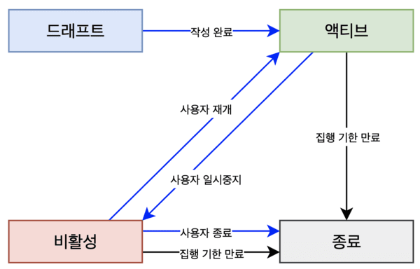
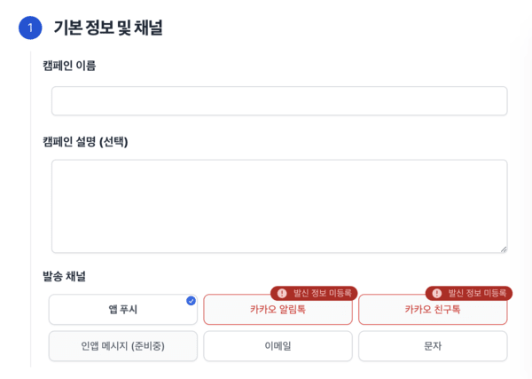
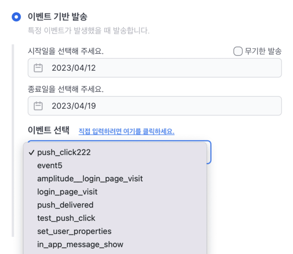
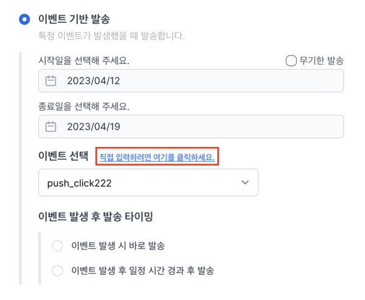

# 시작하기

노티플라이 캠페인을 이용하여 알맞은 유저들에게 원하는 메시지를 원하는 타이밍에 원하는 채널로 보내보세요. [노티플라이 캠페인 생성 페이지](https://notifly.tech/console/campaign/create)에서 캠페인을 쉽고 빠르게 생성할 수 있습니다.

## 캠페인 생애 주기 (Life Cycle)

노티플라이에서 캠페인은 총 네 가지 상태를 가집니다.

(\*_파란색 화살표: 사용자 조작, 검정색 화살표: 자동_)

1. **드래프트** : 캠페인을 생성하다가 중간에 취소했을 때, 나중에 다시 이어서 작업할 수 있는 상태입니다. 드래프트 캠페인은 실제 발송에서 어떠한 영향도 미치지 않으며, 실제로 발송되었던 캠페인이 아니기 때문에 발송 현황을 확인할 수 없습니다.

2. **액티브**: 캠페인을 생성하면, 기본적으로 캠페인은 액티브 상태로 저장됩니다. (_참고: 즉시 발송 캠페인이거나, 5분 내로 발송되어야 할 캠페인은 곧바로 종료 상태로 들어가며, 차후 발송 취소, 수정 또는 재개할 수 없습니다._) 액티브 상태인 캠페인은 실제로 발송될 가능성이 있는 캠페인들이며, 실시간으로 발송 현황을 확인할 수 있습니다. **액티브 상태 캠페인은 수정이 불가능합니다.**

3. **비활성**: 캠페인 리스트의 **액티브 상태**인 캠페인 항목 가장 오른쪽에 '중지' 버튼을 클릭하면 액티브 상태인 캠페인을 비활성 상태로 만들 수 있습니다. 비활성 상태인 캠페인은 발송 대상에서 제외되지만, 지금까지 발송 현황을 확인할 수 있습니다. 비활성 상태인 캠페인은 다시 재개시켜 액티브 캠페인으로 전환할 수 있습니다. **캠페인 수정은 비활성 상태일때만 가능합니다.**

4. **종료**: 캠페인 집행 기한이 만료된 캠페인은 자동으로 종료됩니다. 또한, 사용자가 **비활성** 상태인 캠페인 가장 오른쪽에 '종료' 버튼을 눌러 캠페인을 종료시킬 수도 있습니다. 한 번 캠페인이 종료되면, 더이상 **재개 또는 수정이 불가능합니다**. 캠페인이 종료된 후에도 발송 현황은 계속 확인할 수 있습니다. **종료 상태인 캠페인만 삭제할 수 있습니다**.

## 기본 정보 및 채널

- 캠페인의 이름, 설명을 입력합니다. [캠페인 리스트](https://notifly.tech/console/campaign/list)에 노출되며, 실제 발송에는 전혀 영향을 미치지 않습니다. 캠페인 이름은 필수적으로 기입해주셔야 합니다.
- 발송할 채널을 선택해 주세요.
  - 
  - 채널 별로 발송에 필수적인 발신자 정보가 존재합니다. 만약 해당 정보가 충분하지 않은 채널이라면, 선택할 수 없습니다.
  - 발신자 정보는 [노티플라이 프로젝트 설정](https://notifly.tech/console/settings)에서 등록할 수 있습니다. 발신자 정보를 잘못 등록하는 경우, 발송에 실패할 수 있으니 주의해주세요. 채널 별로 발신자 정보를 등록하는 방법은 채널 별 가이드에서 확인해주세요.

## 발송 시점

캠페인을 발송할 타이밍을 설정합니다. 노티플라이는 세 가지의 발송 시점 결정 방법을 지원합니다. **특정한 시점**에 캠페인을 집행하거나, **특정 이벤트가 발생했을 때** 캠페인을 집행하는 것 뿐만 아니라 **HTTP API**를 활용하여 고객 인게이지먼트를 끌어올려 보세요.

### 예약 발송

노티플라이 캠페인은 선택한 시간에 원하는 유저들에게 알림을 발송할 수 있는 기능을 지원합니다. 예약 발송은 총 네 가지로 지원됩니다.

1. **지금 바로 발송**
   - 캠페인을 지금 바로 집행합니다.
   - '지금 바로 발송' 캠페인은 생성 후 발송을 취소할 수 없으며, **종료**상태로 저장되니 참고해주세요. 캠페인 상태에 대한 자세한 정보는 [캠페인 생애 주기](#캠페인-생애-주기-life-cycle) 섹션을 확인해주세요.
2. **1회 예약 발송**
   - 원하는 시각에 캠페인을 집행합니다.
   - 시간 선택은 15분 간격으로 선택할 수 있습니다. 예) 08시 15분, 20시 45분 ...
   - '1회 예약 발송' 캠페인인 경우, 캠페인이 **5분 이내로 발송되어야 한다면** 생성 후 발송을 취소할 수 없으며, **종료** 상태로 저장되니 참고해주세요. 캠페인 상태에 대한 자세한 정보는 [캠페인 생애 주기](#캠페인-생애-주기-life-cycle) 섹션을 확인해주세요.
3. **1일 1회 발송**
   - 매일 원하는 시각에 캠페인을 집행합니다.
4. **1주일 1회 발송**
   - 매주 원하는 요일에, 원하는 시각에 캠페인을 집행합니다.

일회성 발송이 아닌 주기성 발송인 경우 (위 3, 4번 항목), 캠페인 발송 기간을 선택할 수 있습니다. 캠페인 발송 기간은 **시작일 부터 종료일** 까지로 선택할 수 있으며, 시작일 당일 **00시 00분**부터, 종료일 당일 **23시 59분**까지로 취급됩니다.

### 이벤트 기반 발송

노티플라이 캠페인은 특정 이벤트가 발생했을 때 원하는 유저들에게 알림을 발송할 수 있는 기능을 지원합니다. 이벤트를 발생시키는 방법은 크게 세 가지 방법이 있습니다.

1. **Client SDK** : 어플리케이션에서 클라이언트 SDK를 이용하여 유저의 특정 액션에 알맞게 이벤트를 발생시킬 수 있습니다. 자세한 내용은 [Client SDK](/ko/category/client-sdk)를 참고해주세요.

2. **HTTP API**: 노티플라이는 REST API를 통하여 이벤트를 발생시키는 방법을 제공합니다. REST API를 통하여 특정 유저에게만 발생하는 이벤트 뿐만 아니라, 서비스 레벨에서 발생하는 이벤트(공연 종료 이벤트 등)도 노티플라이에 전달할 수 있습니다. 자세한 내용은 [HTTP API](/ko/developer-guide/http-api/http-api-guide)를 참고해주세요.

3. **외부 분석 도구 연동** : Amplitude를 이미 사용하고 계시다면, 기존에 사용하던 이벤트를 그대로 노티플라이에게 전달할 수 있습니다. 자세한 방법은 [Amplitude 연동](/ko/user-guide/amplitude/amplitude-introduction)을 참고해주세요.

이벤트 기반 발송 캠페인은 다음과 같이 생성할 수 있습니다.

1. **트리거링 이벤트 선택**: **캠페인을 발생시키는 이벤트**를 선택합니다. 노티플라이는 발생되고 있는 이벤트를 자동으로 수집하여 제공합니다. 드랍다운에서 이벤트를 선택할 수 있습니다. 혹시 아직 한번도 발생하지 않았던 이벤트를 트리거링 이벤트로 사용하고 싶다면, 이벤트 이름을 직접 입력할 수도 있습니다.

2. **딜레이 지정**: 트리거링 이벤트가 발생한 후, 실제 발송이 일어날 타이밍을 선택할 수 있습니다. 딜레이는 분 단위로 지정할 수 있습니다.

### API 기반 발송

노티플라이 캠페인을 HTTP REST API를 통하여 직접 트리거할 수 있습니다. 현재 API 기반 발송은 푸시 알림만 지원합니다. 자세한 API 명세는 [Campaign Triggering API](/ko/developer-guide/http-api/http-api-guide#4-campaign-triggering-endpoint)를 참고해주세요. **_API 기반 발송에서 발송 대상 세그먼팅은 UI에서 지정할 수 없습니다. API Request Body에서 발송 대상을 지정해 주세요._**

## 사용자 세그먼트

노티플라이 캠페인은 쉽고 빠르게 원하는 사용자에게 도달하는 방법을 제공합니다. 현재 지원하는 대상 설정 방법은 **새로운 세그먼트를 제작하는 방법, 믹스패널 등의 외부 분석 툴로부터 코호트 정보를 불러오는 방법, 그리고 CSV 파일을 업로드 하는 방법**이 있습니다. 자세한 정보는 [발송 대상 세그먼팅](/ko/user-guide/campaigns/segment) 페이지를 확인해주세요.

## 메시지 개인화

노티플라이 캠페인은 사용자에게 메시지를 개인화하여 발송할 수 있는 방법을 제공합니다. 자세한 정보는 [메시지 개인화](/ko/user-guide/campaigns/message-personalization) 페이지를 확인해주세요.
