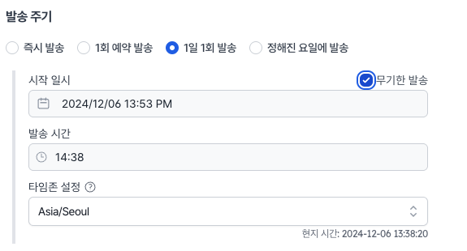
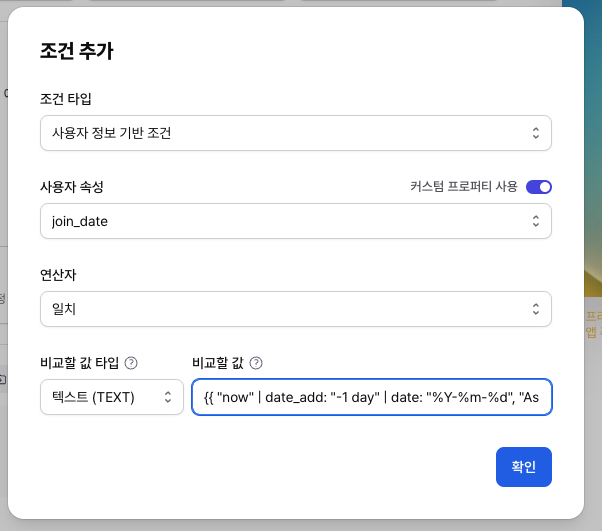

# 개인화 유저 조건 설정

노티플라이에서는 사용자의 속성에 대한 조건을 설정할 때 개인화를 활용할 수 있습니다.

## 1. D-day 기반 캐페인

사용자의 특정 날짜 정보(가입일, 생일 등)와 발송 시점을 비교하여 대상자를 설정할 수 있습니다.

활용 예시

- 가입 다음날 오전 8시에 웰컴 메시지 발송
- 생일 3일 전 축하 메시지 발송

### 1-1. 사전 확인 사항

- 유저 속성이 한국 시간 (GMT+9, Asia/Seoul) 기준 YYYY-MM-DD, YYMMDD 등 표준화된 형태를 따라야 합니다.
- `https://notifly.tech/console/products/{제품명}/utils/liquid-playground` 에서 작성하신 Liquid 구문을 테스트해보실 수 있습니다. (`{제품}`에 프로덕트명을 입력해주세요)

### 1-2. 캠페인 집행 가이드

매일 한국 시간 오전 08시에, 발송 당시 기준으로 하루 전에 가입한 고객에게 메시지를 발송하는 예시입니다.

- 발송 타이밍

  - 1일 1회 발송, 주기 발송
  - 시간: 오전 8시 (조정 가능)
  - 발송 시점 설정 스크린샷

    

- 발송 대상

  - 유저 프로퍼티 join_date 가 `오늘 기준 하루 전` 의 일자와 일치하는 유저에게 발송
  - 비교할 값을 다음과 같이 작성합니다.
    ```
    {{ "now" | date_add: "-1 day" | date: "%Y-%m-%d", "Asia/Seoul" }}
    ```
    - `“now”`: 현재 시점
    - `date_add: "-1 days"` : 1일 전 설정
    - `date: "%Y-%m-%d", "Asia/Seoul"` : 한국 시간 기준 날짜 형식 지정
  - 발송 대상 조건 설정 스크린샷 예시

    
