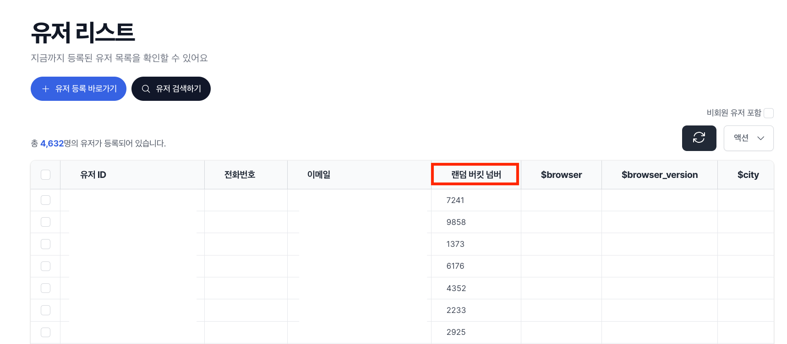

# 랜덤 버킷 넘버

본 문서는 사용자 속성 값으로 자동으로 생성되는 버킷 넘버를 사용하는 방법을 설명합니다.

- 노티플라이에 사용자가 등록이 되면, 사용자 속성 값으로 자동 생성되는 버킷 넘버를 사용할 수 있습니다.
- 랜덤 버킷 넘버는 0부터 9999까지의 숫자로 구성되며, 각 사용자에 할당된 버킷 넘버는 유저 리스트 페이지에서 확인할 수 있습니다.
- 사용자에게 할당된 랜덤 버킷 넘버는 균일하게 분포되어 있으며 사용자가 등록된 시점에 랜덤으로 할당됩니다. 따라서 유저 그룹 내에서 랜덤하게 분포되어 있는 유저를 선택하고자 할 때 활용할 수 있습니다.

## 랜덤 버킷 넘버 활용하기

랜덤 버킷을 이용하여 유저 그룹을 나누어 다양하게 활용할 수 있습니다.

### 활용 방안 1: 점진적 캠페인 노출

- 본 캠페인을 집행하기 전, 일부 유저에게만 먼저 캠페인을 실험해보고자 할 때 활용할 수 있습니다.

- 예시: 새로운 캠페인을 진행하기 전, 10%의 유저에게 먼저 캠페인을 진행해보고 캠페인의 효과를 확인한 후 나머지 90%의 유저에게 캠페인을 진행합니다.

  - 다음 예시에서는 랜덤 버킷 넘버가 0~999인 유저를 약 10%의 유저로 설정하고, 랜덤 버킷 넘버가 1000~9999인 유저를 약 90%의 유저로 설정하여 진행합니다.
    - 예비 캠페인(캠페인 A): 랜덤 버킷 넘버가 0~999인 유저를 대상으로 진행
    - 본 캠페인(캠페인 B): 랜덤 버킷 넘버가 1000~9999인 유저를 대상으로 진행
      - 예비 캠페인에 노출된 유저에게는 본 캠페인이 노출되지 않게 할 수 있습니다.
    - 캠페인 A와 B의 콘텐츠는 노출할 대상을 제외하고 모두 동일합니다.
  - 캠페인 A를 먼저 집행해본 후, 캠페인 B를 노출시킴으로써 점진적으로 캠페인 대상을 늘려갈 수 있습니다.

  

    
    
  

### 활용 방안 2: 캠페인 메시지 비교 실험

- 캠페인 메시지 구성을 다르게 한, 두 버전으로 나누어 테스트할 때 활용할 수 있습니다.
- 예시: 캠페인 메시지의 제목을 조금 다르게 한 두 가지 버전으로 나누어 테스트합니다.
  - 캠페인 A: 제목 A
  - 캠페인 B: 제목 B
  - 캠페인 A와 B를 노출시킬 비율을 조정하여 테스트할 수 있습니다.
    - 예시: 랜덤 버킷 넘버가 0~4999인 유저에게는 캠페인 A를 노출시키고, 랜덤 버킷 넘버가 5000~9999인 유저에게는 캠페인 B를 노출시킵니다.
  - 캠페인 A와 B의 콘텐츠는 노출할 대상과 메시지 제목을 제외하고 모두 동일합니다.
  - 캠페인 A와 B의 성과 지표를 비교하여 더 효과적인 캠페인 메시지를 선택할 수 있습니다.

  
  

