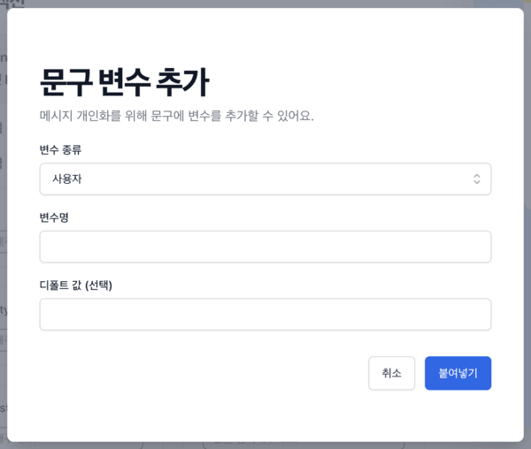
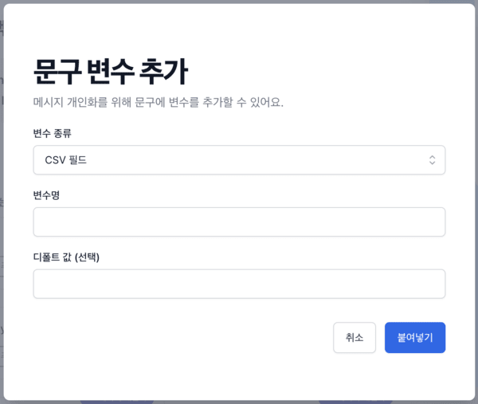
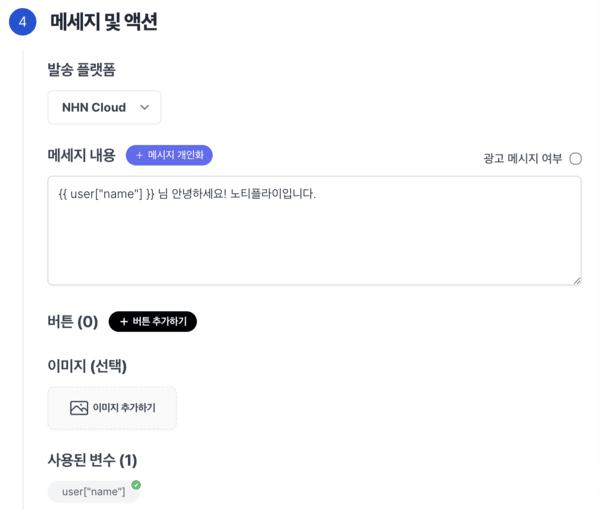

# 메시지 개인화

노티플라이에서는 [Liquid 템플릿 언어](https://liquidjs.com/tutorials/intro-to-liquid.html)를 기반으로 메시지 개인화를 지원합니다.

## 기본 문법

- 노티플라이에서 발송 메시지를 개인화하는 문법은 기본적으로 `{{ 카테고리["변수명"] | default: "기본값" }}` 포맷입니다.
- "기본값"은 해당 카테고리에 속성이 존재하지 않을 때에, 대체되어 발송될 값입니다. 만약 기본값이 존재하지 않고, 카테고리에도 속성이 존재하지 않는다면 해당 부분이 빈 값으로 치환되어 메시지가 발송되니 주의해주세요.
- 변수명에 사용할 수 있는 카테고리는 아래 [카테고리](/ko/user-guide/campaigns/message-personalization#카테고리) 섹션을 참고하세요. 캠페인에 사용할 세그먼트 타입과 발송 타이밍 타입에 따라 사용할 수 있는 카테고리가 달라지니 유의해주세요.
- [노티플라이 캠페인 생성](https://notifly.tech/console/campaign/create) 페이지에서는 해당 문법이 어렵게 느껴지실 분들을 위하여 개인화 문구 추가 UI를 지원합니다.

## 카테고리

카테고리의 목록은 다음과 같습니다. **세그먼팅 타입과 발송 타이밍 타입에 따라 사용할 수 있는 카테고리가 달라지니**, 꼭 유의해주세요. 세그먼팅 타입에 대한 자세한 내용은 [발송 대상 세그먼팅](/ko/user-guide/campaigns/segment)에서, 발송 타이밍 타입에 대한 자세한 내용은 [캠페인 시작하기 - 발송 시점](/ko/user-guide/campaigns/basic#발송-시점)에서 확인할 수 있습니다.

1. 노티플라이 데이터베이스에 등록된 유저의 속성

   - 카테고리의 이름은 `user`입니다.
   - 해당 카테고리는 **새로운 세그먼트** 를 사용하는 캠페인에 대해서만 사용 가능하며, **모든 발송 타이밍 타입** 에서 사용할 수 있습니다.
   - 예) 유저의 나이에 접근하고 싶은 경우, `user["age"]` 등으로 접근할 수 있습니다. 이때, '유저의 나이'가 `age`라는 속성명으로 **노티플라이 데이터베이스에 등록**되어 있어야 정상적으로 치환되어 메시지가 발송되니, 꼭 유의해주세요.

2. 노티플라이 데이터베이스에 등록된 유저 디바이스 정보

   - 카테고리 이름은 `device`입니다.
   - 해당 카테고리는 **새로운 세그먼트** 를 사용하는 캠페인에 대해서만 사용 가능하며, **모든 발송 타이밍 타입** 에서 사용할 수 있습니다.
   - `device` 카테고리는 특정 속성명만 지원합니다. 현재 지원되는 디바이스 속성 명은 다음과 같습니다.
     - `external_user_id`: 서비스 유저 ID입니다.
     - `platform`: 디바이스의 플랫폼(`ios` 또는 `android`) 입니다.
     - `os_version`: 디바이스의 OS 버전입니다.
     - `app_version`: 앱 버전입니다.

3. 이벤트 파라미터

   - 카테고리 이름은 `event`입니다.
   - 해당 카테고리는 **새로운 세그먼트** 를 사용하는 캠페인에 대해서만 사용 가능하며, **이벤트 기반 발송** 에서만 사용할 수 있습니다.
   - 파라미터가 포함된 이벤트가 발생했을 시, 해당 이벤트 파라미터를 메시지에 사용할 수 있습니다. 이벤트 파라미터를 담아 이벤트를 발송하는 방법은 [이벤트](/ko/user-guide/campaigns/basic#이벤트-기반-발송) 섹션의 설명을 참고해주세요.
   - 예) 이벤트가 `name`이라는 파라미터를 포함하고 있을 때, `event["name"]`을 이용하여 접근이 가능합니다. 이 때, 발생한 이벤트에 `name` 이라는 필드가 존재하지 않을 경우, 정상적으로 치환되지 않으니 유의해주세요.

4. CSV 데이터 (CSV 업로드 기반 세그먼팅일 경우)
   - 카테고리 이름은 `user`입니다.
   - 해당 카테고리는 **CSV 업로드** 를 사용하는 캠페인에 대해서만 사용 가능하며, **예약 발송** 에서만 사용할 수 있습니다 (CSV 업로드 세그먼팅은 이벤트 기반 발송을 지원하지 않습니다).
   - 업로드된 CSV 파일 내에 존재하는 필드의 이름만 접근 가능합니다.
   - 예) CSV 파일 내에 `budget`이라는 필드가 존재할 경우, `user["budget"]`으로 접근할 수 있습니다. 만약 존재하지 않는 필드에 접근하였을 경우 캠페인을 생성할 수 없으니 유의해주세요.

## 지원 범위

현재 개인화가 지원되는 채널은 다음과 같습니다.

- 앱 푸시 알림
- 카카오 친구톡, 알림톡
- 문자 메시지

## 메시지 개인화 문구 추가 UI 이용법

1. 메시지 입력란 우측 상단의 '메시지 개인화' 버튼을 클릭해주세요. (현재 개인화가 지원되지 않는 채널은 해당 버튼이 보이지 않을 수 있습니다.)
2. 캠페인 발송 타이밍 타입과 세그먼팅 타입에 따라 자동으로 지원되는 변수의 종류(카테고리)가 드랍다운 리스트로 제공됩니다.
   - 
   - 
3. 변수명에 치환하고 싶은 변수의 필드명을 입력해주세요. 해당 입력란은 필수입니다.
4. 기본값을 입력해주세요. 기본값은 해당 필드명이 존재하지 않을 때, 빈 값 대신 기본적으로 치환될 문구입니다.

모든 과정을 완료하셨다면 메시지 입력란 속에 Liquid 구문이 잘 들어간 것을 확인할 수 있습니다.

