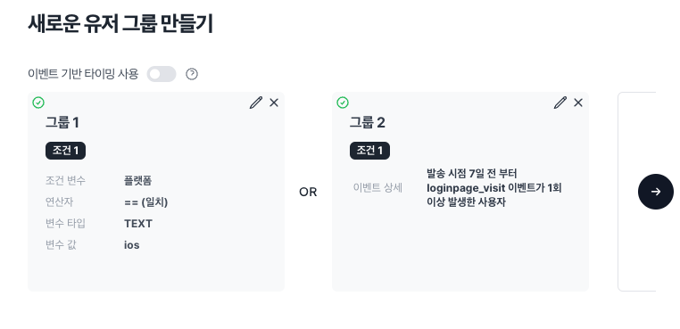

# 발송 대상 세그먼팅

노티플라이 캠페인은 쉽고 빠르게 원하는 사용자에게 도달할 수 있는 방법을 제공합니다. 발송 대상을 설정하는 방법은 **새로운 세그먼트 만들기**, **외부 분석 툴으로부터 코호트 정보 불러오기**, **CSV 파일 업로드**가 지원됩니다.

## 발송 필수 정보

발송 채널 별로 유저 정보로 등록되어야 할 필수적인 요소들이 존재합니다.

- **푸시 알림 - 디바이스 토큰** : 디바이스 토큰은 현재 [Client SDK](/ko/category/client-sdk)에서 자동으로 수집된 정보로만 사용 가능합니다. 디바이스 토큰을 매뉴얼하게 업로드 할 수 있는 기능도 제공될 예정이니 조금만 기다려주세요.
- **카카오톡 계열 (카카오 알림톡, 카카오 친구톡), 문자 메시지 - 휴대폰 번호** : 휴대폰 번호는 [유저 등록](https://notifly.tech/users/register) 페이지에서 CSV 업로드, 또는 직접 입력하여 등록할 수 있습니다. 휴대폰 번호는 `$phone_number` 특수 필드 이름으로 등록해야 합니다. 자세한 정보는 [유저 등록](https://notifly.tech/users/register) 페이지의 '특수 항목' 섹션을 참고해 주세요. [HTTP API - Set User Properties](/ko/developer-guide/http-api/http-api-guide#3-set-user-properties-endpoint)나 [Client SDK](/ko/developer-guide/client-sdk/react-native-sdk#2-사용자-프로퍼티-등록하기)를 통해서도 등록할 수 있습니다.
- **이메일 - 이메일 주소** : 이메일 주소 또한 [유저 등록](https://notifly.tech/users/register) 페이지에서 CSV 업로드, 또는 직접 입력하여 등록할 수 있습니다. 이메일 주소는 `$email` 특수 필드 이름으로 등록해야 합니다. [HTTP API - Set User Properties](/ko/developer-guide/http-api/http-api-guide#3-set-user-properties-endpoint)나 [Client SDK](/ko/developer-guide/client-sdk/react-native-sdk#2-사용자-프로퍼티-등록하기)를 통해서도 등록할 수 있습니다.

## 새로운 세그먼트

노티플라이 데이터베이스에 등록된 사용자들은 [노티플라이 유저 리스트](https://notifly.tech/users)에서 확인할 수 있습니다. 사용자의 속성, 디바이스 정보와 이벤트 발생 기록을 활용하여 발송 대상 사용자를 지정할 수 있습니다.

### 그룹과 조건

세그먼트를 새로 만드는 경우, '그룹'과 '조건'에 대해 유의하여 세그먼트를 제작해 주세요.

1. 그룹: 그룹은 조건들의 모임입니다. 그룹은 필요한 만큼 생성할 수 있으며, 각각의 그룹은 `OR` 연산자로 연결됩니다.
2. 조건: 조건에 대한 자세한 정보는 [아래 섹션](/ko/user-guide/campaigns/segment#조건의-종류)을 참고해주세요. 그룹 내의 조건들 끼리는 `AND` 연산자로 연결됩니다.

예를 들어, [그룹 1]이 [조건 a], [조건 b], [조건 c]으로 구성되어있고, [그룹 2]가 [조건 d], [조건 e]로 구성되어 있다면 발송 대상 필터는 `([조건 a] AND [조건 b] AND [조건 c]) OR ([조건 d] AND [조건 e])` 와 같이 정의되게 됩니다.

### 조건 설정에 사용되는 정보

대상을 지정할 때에는 다음 세 가지의 정보를 이용하여 조건을 설정합니다.

1. 사용자의 속성

- [유저 등록](https://notifly.tech/users/register) 페이지에서 CSV 업로드, 또는 직접 입력하여 등록할 수 있습니다. [HTTP API - Set User Properties](/ko/developer-guide/http-api/http-api-guide#3-set-user-properties-endpoint)나 [Client SDK](/ko/developer-guide/client-sdk/react-native-sdk#2-사용자-프로퍼티-등록하기)를 통해서도 등록할 수 있습니다.

2. 사용자의 디바이스 정보

- 디바이스 정보는 현재 [Client SDK](/ko/category/client-sdk)에서 자동으로 수집된 정보로만 사용 가능합니다. 디바이스 정보를 업로드 할 수 있는 기능도 제공될 예정이니 조금만 기다려주세요.

3. 사용자의 이벤트 발생 기록

- 이벤트를 발생시키는 방법은 [캠페인 시작하기 - 이벤트 기반 발송](/ko/user-guide/campaigns/basic#이벤트-기반-발송) 섹션을 참고해주세요.
- 노티플라이 엔진은 자동으로 사용자별로 발생한 이벤트를 적재하고 있습니다. 유저 별로 발생한 이벤트의 목록은 [노티플라이 유저 리스트](https://www.notifly.tech/users)에서 표 항목 클릭 - 유저 상세 정보 페이지에서도 확인할 수 있습니다.

### 조건의 종류

세그먼트 조건에는 **사용자 속성 기반 조건**, **이벤트 기반 조건**이 존재합니다.

#### 사용자 속성 기반 조건

- 사용자의 디바이스 정보 또는 속성을 이용하여 조건을 설정합니다.
- 해당 경우, 필수적으로 입력되어야하는 세 가지의 정보는 다음과 같습니다.
  1. 조건 변수: 조건 변수는 직접 입력하거나, 드랍다운 옵션에서 선택할 수 있습니다.
  2. 연산자: 연산자는 일치, 불일치, 이상(이하), 초과(미만)이 지원됩니다. 조건 변수의 종류에 따라 지원되는 범위가 상이할 수 있으니 유의해주세요.
  3. 변수값: 변수값은 조건 변수와 연산될 값입니다.
- 세 가지의 정보가 제대로 입력되지 않을 경우, 캠페인을 생성할 수 없으니 주의해주세요.
- 

<!-- TODO: Detailed explanation -->

#### 이벤트 기반 조건

- 사용자의 이벤트 발생 기록을 활용하여 조건을 설정합니다.
- 해당 경우, 입력되어야 할 정보들은 다음과 같습니다.
  1. 기간: 기간은 이벤트 횟수를 카운트할 기간입니다.
  2. 이벤트 이름: 특정 이벤트의 식별자입니다.
  3. 이벤트 발생 횟수: 특정 이벤트의 발생 횟수입니다. 현재는 한 번이상 발생, 한 번도 발생하지 않음으로만 선택할 수 있습니다.

다음은 유효한 조건 작성 예시입니다.

그룹과 조건이 잘 설정되었다면, 그룹 카드 좌측 상단에 초록색 체크 마크가 표시됩니다. 다음은 유효한 세그먼트 제작의 예시입니다.

### 주의사항

- **새로운 세그먼트** 제작 기능은 노티플라이 시스템 내부에 등록된 유저를 사용하는 기능입니다. 따라서, **메시지 개인화를 할 때에 유저 및 디바이스 정보 뿐만 아니라 발생한 이벤트 파라미터(이벤트 기반 발송일 경우)를 모두 사용**하실 수 있습니다. 메시지 개인화에 대한 자세한 정보는 [메시지 개인화](/ko/user-guide/campaigns/message-personalization) 섹션을 참고해주세요.
- [채널 별 발송 필수 정보](#발송-필수-정보)가 노티플라이 유저 데이터베이스에 존재해야 발송이 가능하며, 존재하지 않을 경우에는 발송되지 않습니다.

## CSV 업로드

노티플라이 데이터베이스에 등록되지 않은 사용자를 대상으로 직접 발송하고 싶다면, CSV 업로드 기능을 활용할 수 있습니다. 다음 사항들을 유의하여 CSV 파일을 업로드 해주세요.

- 파일의 첫 번째 줄은 컬럼명이어야 합니다.
- 컬럼명은 중복될 수 없고, 비어있거나 공백문자를 포함할 수 없으며 공백문자 및 따옴표(', ", `) 비 ASCII 문자(한글 포함)를 사용할 수 없습니다.
- 비어있거나 공백문자로만 이루어진 값은 빈 값으로 처리됩니다.
- 값 양 끝의 공백문자는 제거됩니다.

### 주의사항

- CSV 업로드를 할 때, [발송 필수 정보](#발송-필수-정보)가 존재해야 CSV 파일이 정상적으로 업로드 됩니다.

  - **푸시 알림**: 현재 CSV 업로드 기능이 지원되지 않습니다.
  - **카카오톡 계열 (카카오 알림톡, 카카오 친구톡), 문자 메시지**: `phone_number` 컬럼이 존재해야 합니다.
  - **이메일** : `email` 컬럼이 존재해야 합니다.

- Microsoft Excel 사용시, Excel 문서를 CSV 파일로 내보낼 때에 문자열 인코딩을 UTF-8로 설정하여 저장해주세요. 만약 인코딩에 문제가 있다면, 발송된 메시지의 문자열이 깨져서 보일 수 있습니다.

- **CSV 업로드** 기능은 노티플라이에 등록된 유저와 무관하게 발송됩니다. 따라서 메시지 개인화를 할 때에는, 노티플라이 데이터베이스에 등록된 유저 정보를 활용할 수 없습니다. CSV 파일 업로드를 했을 때는 **CSV 파일에 등록된 정보만으로 메시지 개인화를 할 수 있으며**, 메시지 개인화에 대한 자세한 정보는 [메시지 개인화](/ko/user-guide/campaigns/message-personalization) 섹션을 참고해주세요.

<!-- TODO: 외부 툴 연동 코호트 -->
