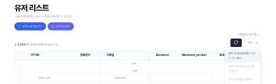
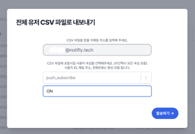
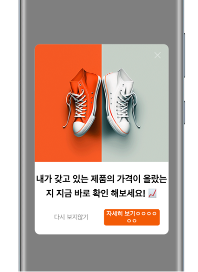

# FAQ

## 1. 메시지 형식

### Q. 문자메시지(SMS) 발송에 이모티콘 사용은 불가한가요?

국내 통신사 3사는 모두 ‘EUC-KR’ 문자열 인코딩의 규격을 정하고 있어 이모티콘(🥰)과 같이 이곳에 없는 문자는 <u>사용할 수 없습니다</u>.
자세한 문자 목록은 [**EUC-KR 코드 표**](https://m.blog.naver.com/clous02/110008727032)를 참고해 주세요

### Q. 사용자 속성으로 메시지를 개인화할 때, 속성값에 이모지🤔가 포함되어도 괜찮을까요?

이모지가 포함된 사용자 속성(프로퍼티)로 개인화는 가능합니다. 다만, 실제 발송에서 지원되는지 여부는 발송 채널에 따라 다릅니다.

**가능**: 이메일, 웹 푸시, 앱 푸시, 카카오 친구톡, 카카오 알림톡

**불가능**: 문자

### Q. 개인화 메세지에서 default값을 사용하지 않을 때 변수 값이 없으면 어떻게 문자열이 나가나요?

예를 들어, `안녕하세요 {{ csv["name"] }} 회원님` (name값이 null일 경우)

해당 케이스는 <u>빈 공백</u>으로 들어가게 됩니다! 즉, 아래와 같이 발송됩니다.

발송: **안녕하세요, 회원님**

### Q. 메시지 발송 시, 오늘 날짜를 변수값으로 처리해서 yyyy-mm-dd로 표기 가능할까요?

해당 구문은 [Liquid Expression](https://liquidjs.com/filters/date.html)을 이용하여 사용 가능합니다. 아래와 같이 입력해주시면 발송 날짜 기준으로 현재 시각을 YYYY-MM-DD 치환할 수 있습니다.

`{{ "now" | date: "%Y-%m-%d, "Asia/Seoul" }}`

## 2. 유저 리스트와 유저 프로퍼티

### Q. [유저 리스트 페이지](https://notifly.tech/console/products/michael/users?environment=1)에 '등록되지 않음' 으로 표기된 유저 ID가 있는데, 이는 어떤 유저인가요?

<u>비회원 유저</u>가 서비스 상의 이벤트를 발생시킬 때는 유저의 ID가 등록되지
않으므로 '등록되지 않음'으로 표기됩니다.

다만, 추후 해당 유저가 회원으로 등록한다면 비회원으로 발생시켰던 모든 이벤트와 정보들이 자동으로 해당 ID로 이전되므로 걱정하지 않으셔도 됩니다.

### Q. 저희 앱을 설치한 유저가 00명인데, 노티플라이 유저 리스트 상에는 그보다 적은 유저 수가 등록되어 있습니다. 어떤 문제가 있는 것인가요?

노티플라이 SDK를 앱에 설치하여 배포하셨을 것입니다. 노티플라이에 유저가 등록되려면 사용자가 노티플라이 SDK가 설치된 앱을 최소 한 번 실행시켜야 합니다.

만약 <u>아직 노티플라이 SDK가 설치된 버전의 앱을 아직 실행하지 않은 유저</u>가 있다면 노티플라이 유저 리스트 상에 등록이 되지 않은 상태이므로 적은 수로 나타납니다. 따라서 노티플라이 도입 후 충분한 시점이 지나면 실 사용자만이 유저 리스트에 등록이 될 것으로 보입니다.

### Q. 유저 프로퍼티의 길이 제한이 있나요?

유저 프로퍼티 값의 제한이 255MB이나, 메시지 내용으로 활용할 경우에는 <u>사실상 제약이 없습니다</u>.

## 3. CSV 업로드 및 활용

### Q. 푸시 알림 캠페인을 설정할 때, CSV 업로드에서는 `user_id` 컬럼만 업로드 하면 되는 건가요?

푸시 캠페인의 경우 <u>`user_id` 컬럼만 업로드</u> 하면 됩니다. 다만 `user_id` 컬럼에 명시된 ID들이 노티플라이 유저 리스트에 정상적으로 등록되어있는지 확인해주세요.

:::caution 주의

CSV 업로드 방법은 노티플라이 테이터베이스와는 관련 없는 작업이므로 해당 유저 리스트만을 이용하여 발송이 진행됩니다.

:::

### Q. 유저 데이터를 가져오는 방법 중 CSV 업로드와 수동 입력이 있는데, firebase DB에서 실시간으로 연동할 수 있는 방법이 있나요?

노티플라이에서는 보안적인 이유 및 확장성을 고려하여 <u>DB에 직접 연동하는 방식은 제공하지 않습니다</u>. 실시간 연동을 위해 노티플라이 SDK나 API를 활용해 주시는 것을 제안드립니다. 어려움을 겪고 계시다면 데이터 구조와 서비스에 대해 말씀해주세요. 해결 방안을 가이드 드릴 수 있습니다 🙂

> 예시: [개발자 가이드-Client SDK](https://docs.notifly.tech/ko/developer-guide/client-sdk/javascript-sdk#2-%EC%9C%A0%EC%A0%80-%ED%94%84%EB%A1%[…]-%EB%93%B1%EB%A1%9D%ED%95%98%EA%B8%B0),
> [개발자 가이드-HTTP API](https://docs.notifly.tech/ko/developer-guide/http-api/http-api-guide#3-set-user-properties-endpoint)

## 4. 일부 유저 추출하기

### Q. 푸시 알림 수신 동의 유저에게만 메시지를 보내고 싶으면 어떻게 하나요?

유저 그룹 조건에서 `push_subscribe = ON` 등 <u>푸시 수신 동의와 관련된 프로퍼티를 설정</u>하시면 됩니다.

### Q. 앱 푸시 수신 동의자 리스트를 추출하는 방법이 있나요?

노티플라이의 <u>[유저 리스트 페이지](https://notifly.tech/console/products/michael/users?environment=1)에서 아래 사진과 같이 전체 유저를 CSV로 추출할 수 있습니다</u>. 이 CSV에는 유저의 프로퍼티 정보( `push_subscribe` 포함)가 각 컬럼을 구성하므로 손쉽게 `push_subscribe=“ON"`인 유저를 추출하실 수 있습니다! 이 방법은 유저의 다양한 프로퍼티가 함께 있기 때문에 자유도 높게 활용하실 수 있습니다!
지
그리고 두 번째 사진과 같이 <u>특정 속성만을 추출하는 것도 가능</u>합니다 🙂

 

## 5. 메시지 발송 관련

### Q. 야간 발송 제한(ex. 21:00~익일 \*:00)에 걸린 이벤트 발송은 제한 시간 이후에 몰아서 보내지는 것인가요?

발송 제한 시간 직후 한 번에 전송하거나, 제한 기간 동안의 알림을 스킵할 지 <u>선택하실 수 있습니다</u>. [노티플라이 캠페인 > 시작하기](https://docs.notifly.tech/ko/user-guide/campaigns/basic#21-%EC%98%88%EC%95%BD-%EB%B0%9C%EC%86%A1)를 참고해주세요.

### Q. 캠페인 생성 시, 조건 설정에서 ‘0일'로 설정하면 ‘당일' 실행된 이벤트에 대한 설정이 되는 것인가요?

네 그렇습니다. 예를 들어, 1월 18일 오후 6시에 집행할 캠페인을 설정하셨다면, <u>해당 일시까지의 이벤트</u>를 조사해 메시지를 보낼 대상을 선정합니다.

### Q. 노티플라이를 통해 발송되는 앱 및 웹 푸시는 어떤 로고가 들어가나요?

앱 푸시는 고객사에서 설정한 앱 로고, 웹 푸시의 로고는 브라우저 로고 + 파비콘 로고로 발송됩니다.

### Q. 웹 팝업을 캠페인을 취소하였으나 아직 노출되는 것이 있는데 왜 그런가요?

노티플라이를 통해 웹 팝업을 실행하실 경우, 효율적인 서비스 운영을 위해 노티플라이는 30분에 한 번씩 새로고침을 하게 됩니다. 따라서, 30분 이후에 팝업 캠페인의 변경 내용이 반영됩니다.

만약 주기를 줄이고 싶으시다면, SDK 초기화 옵션에서 `sessionDuration` 필드에서 값을 설정하실 수 있습니다. 자세한 방법은 [개발자 가이드 > Client SDK > Notifly JS SDK 셋업 > SDK 초기화 옵션](https://docs.notifly.tech/ko/developer-guide/client-sdk/javascript-sdk#sdk-셋업) 을 참고해주세요.

## 6. 캠페인 커스텀하기

### Q. 여러 유저 그룹에 대한 조건 대상에 대한 문의입니다. 만약 [그룹 1]의 조건이 A와 B이고 [그룹 2]의 조건이 C와 D라면 어떤 유저들에게 발송되는 것인가요?

조건 간에는 AND, 그룹 간에는 OR 관계라고 이해하시면 편합니다. 따라서 예시의 발송 대상은 <u>(A and B) or (C and D)</u>, 즉 A와 B에 동시에 속하거나 C와 D에 동시에 속한 유저에게 발송하게 됩니다. [노티플라이 캠페인 > 발송 대상 설정](https://docs.notifly.tech/ko/user-guide/campaigns/campaign-segments/segment#%EA%B7%B8%EB%A3%B9%EA%B3%BC-%EC%A1%B0%EA%B1%B4)을 참고해주세요.

### Q. 앱 팝업의 디테일한 css를 직접 수정할 수 있나요? 텍스트 크기, 좌우 padding 여백, 버튼 배경 색, 줄바꿈 등을 커스텀하고 싶습니다.

팝업 제작 페이지에서 직접 html 코드, 혹은 JavaScript를 수정하여 커스텀하실 수 있습니다. 만약 팝업 템플릿을 커스텀하고자 하신다면, 저희에게 디자인 시안을 보내주실 경우 원하시는 대로 만들어 제공해 드립니다 🙂

## 0. 요금제 및 비용 청구

### Q. 저희가 서비스를 두 개로 사용하고 있는데, 두 서비스에 각각 따로 프로젝트를 구분해서 사용할 수 있나요? 요금제는 어떻게 변경되나요?

네 가능합니다. 분리된 서비스 두 가지를 운영하신다면 프로덕트를 추가로 하나 더 만드실 수 있습니다. 노티플라이의 과금 체계는 프로덕트 단위로서 무료 트라이얼 프로모션을 포함한 월정액 및 과금은 <u>각 프로덕트가 별개로 진행됩니다</u>.

### Q. 메시지 발송 비용의 청구는 언제 진행되는 것인가요?

월 정기 결제는 선불, 건당 과금은 후불로 청구됩니다.

### Q. 세금계산서 발행 시점은 언제인가요?

실 결제는 카드 결제로 진행되므로 <u>세금 계산서 발행은 따로 해드리지 않습니다</u>. 자세한 설명은 아래 링크를 참고해 주세요.

> [B2B몰 세금계산서](http://www.isoyo.co.kr/bbs/sub0403/53647),
> [법령조문](https://glaw.scourt.go.kr/wsjo/lawod/sjo192.do?contId=2221888&jomunNo=33&jomunGajiNo=0)
>
> “2006년 4월 1일부터 신용카드 결제하시면, 세금계산서를 받으실 수 없습니다. 부가세법 시행령 제57조 2항에 따라 결제대행업체를 통한 신용카드 매출전표를 발행한 경우에는 사업자가 별도의 세금계산서를 교부할 수 없습니다. 따라서 신용카드로 결제하신 고객님은 신용카드 매출전표를 출력하시어 부가세 증빙 자료로 활용해 주시기 바랍니다.”
