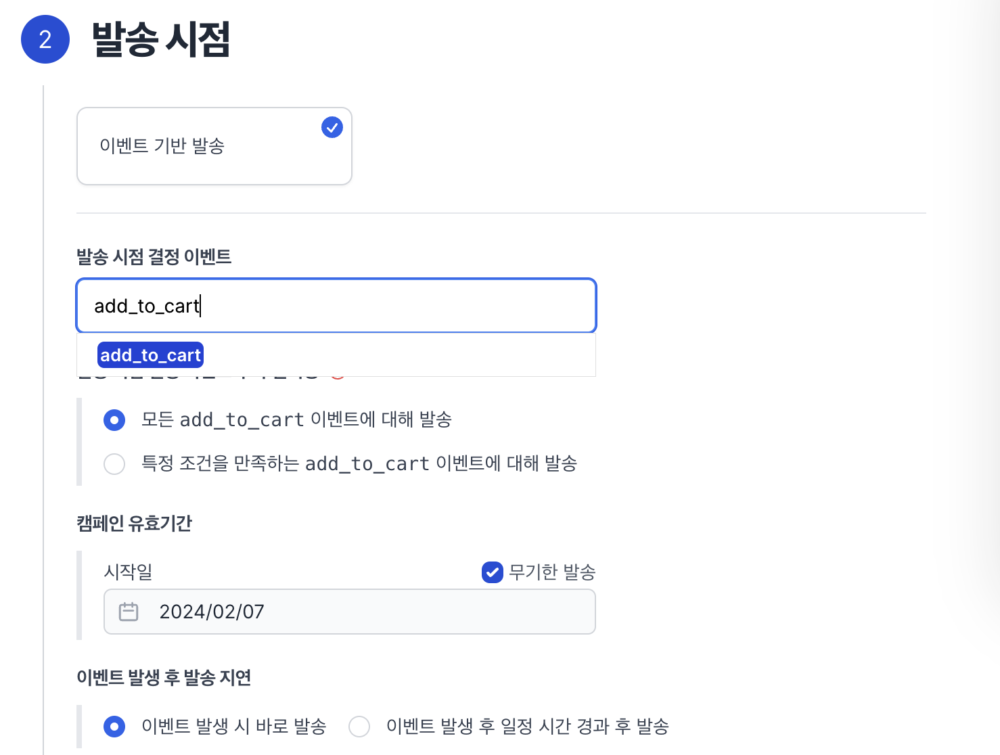
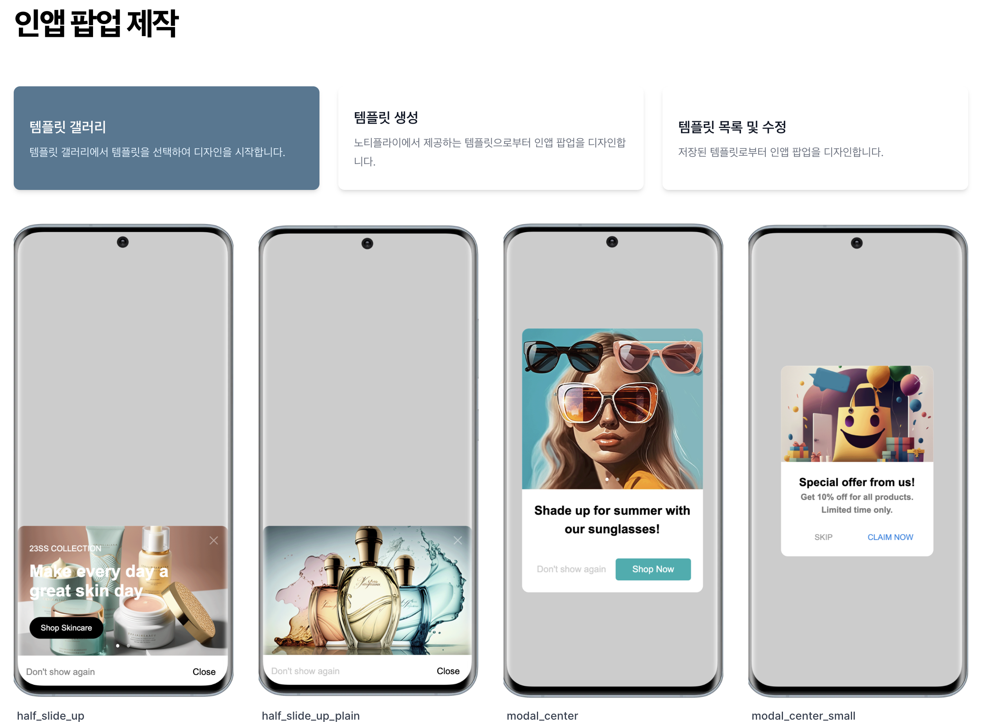
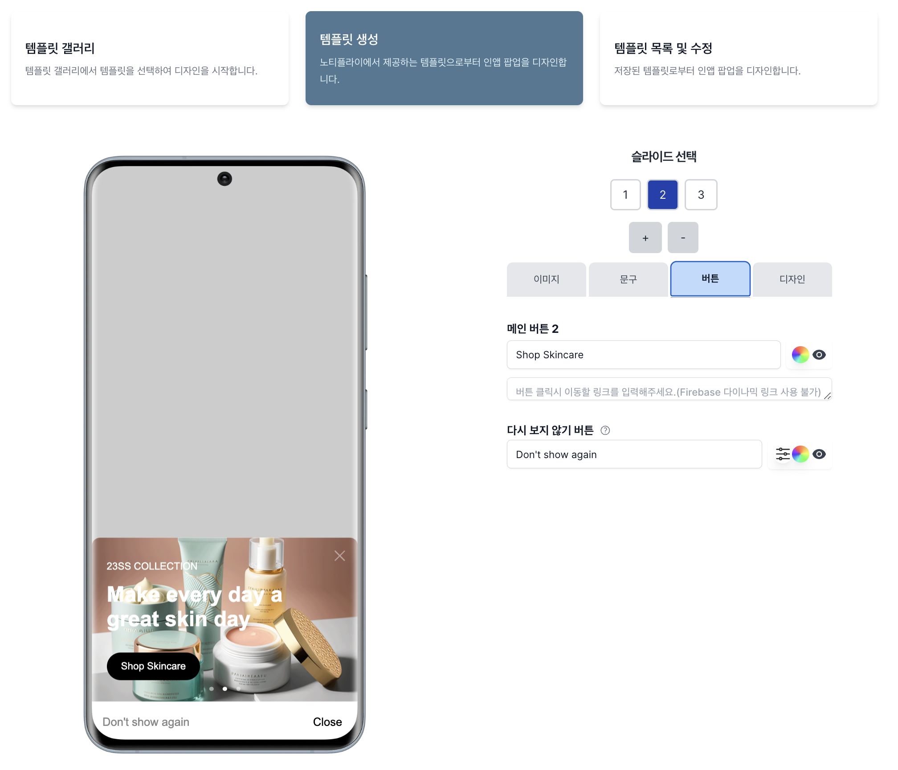
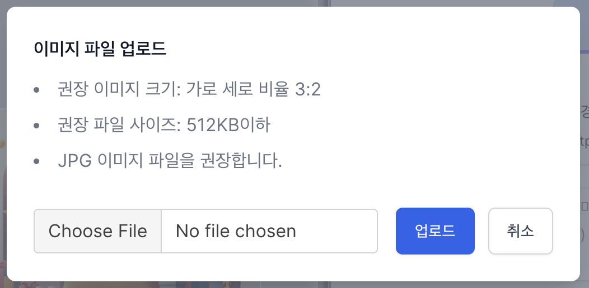
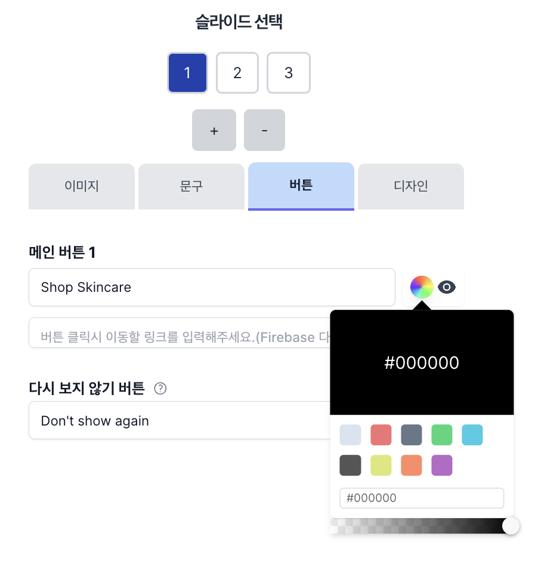
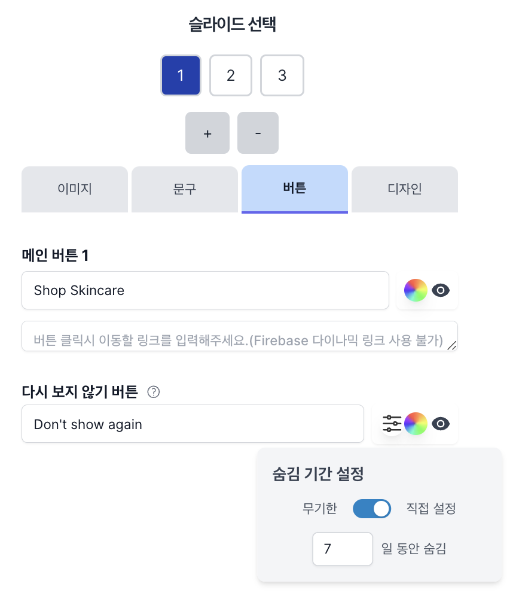
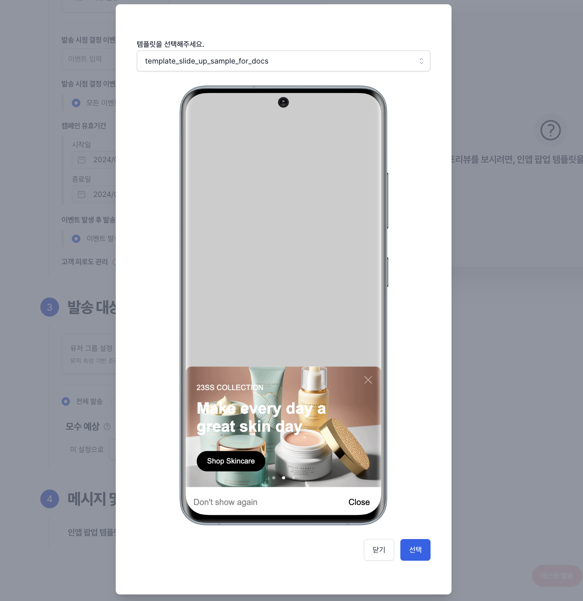

# 인앱 팝업 띄우기

## 개요

1. 노티플라이에서는 인앱 팝업을 원하는 타이밍에 띄울 수 있습니다.
2. [Android SDK](/ko/developer-guide/client-sdk/android-sdk)/[iOS SDK](/ko/developer-guide/client-sdk/ios-sdk) 개발 세팅이 선행되어야 합니다.
3. 새롭게 생성 하거나 내용이 변경된 인앱 팝업 캠페인의 정보는 사용자의 애플리케이션이 새로 시작되는 시점에 적용이 됩니다.
   * 앱이 실행중인 상태에서 생성/변경한 캠페인의 정보는 다음 앱 재시작 시 적용 됩니다.

## 1. 발송 대상 설정

웹 팝업의 경우, 유저 그룹들을 설정하여 발송 대상을 지정하시면 됩니다.
자세한 내용은 [유저 그룹 설정](/ko/user-guide/campaigns/campaign-segments/segment#user-group-setup) 섹션을 참고해주세요.

## 2. 발송 시점 설정

인앱 팝업의 경우, 지원되는 캠페인 발송 시점 종류는 `이벤트 기반 발송`으로, 특정 이벤트가 발생했을 때, 팝업을 띄우게 됩니다.

### 예시

다음과 같이 `add_to_cart` 이벤트 발생 시 즉각 띄우도록 설정할 수 있으며, 시작일과 종료일도 설정할 수 있습니다.

## 3. 메시지

인앱 팝업은 **템플릿 기반으로** 제작하게 됩니다. 사이드바 메뉴 중 `팝업 제작` 하단 `인앱 팝업 제작`을 선택해 제작할 수 있습니다. 템플릿 갤러리에서 원하는 템플릿을 선택한 후 컨트롤 패널을 이용해 커스텀 템플릿을 제작할 수 있으며, 캠페인 생성 시 템플릿을 선택해 사용할 수 있습니다.

_템플릿 기반 팝업 생성_

### 이미지 삽입

팝업에 포함 될 이미지를 업로드 할 수 있습니다. 템플릿 별로 권장 비율이 다르기 때문에 이미지 업로드시 안내되는 권장 비율을 확인 부탁드립니다. 

_이미지 업로드시 권장 비율 확인_

### 텍스트 및 버튼 스타일링 커스터마이징

애플리케이션 내 메시지 템플릿을 이용하여 텍스트와 버튼의 내용 및 스타일을 사용자의 요구에 맞춰 변경할 수 있습니다. 색상 선택 및 스타일링 옵션을 통해 애플리케이션의 브랜드에 부합하는 디자인을 적용할 수 있습니다.

_텍스트 및 버튼 스타일링 커스터마이징_

### '다시 보지 않기' 버튼 기한 설정

메시지 템플릿에 '다시 보지 않기' 버튼을 추가하여 사용자가 메시지를 한 번만 볼 수 있도록 설정할 수 있습니다. 또한, 이 버튼에 대한 기한을 설정함으로써, 사용자가 설정된 기간 동안 해당 메시지를 보지 않도록 할 수 있어, 사용자 경험을 더욱 세밀하게 관리할 수 있습니다.

_'다시 보지 않기' 버튼 기한 설정_

### 완성된 템플릿을 선택해서 캠페인 생성

사용자가 디자인한 인앱 팝업 템플릿은 캠페인 생성 프로세스 중에 쉽게 선택하고 사용할 수 있습니다. 캠페인 생성 옵션을 선택한 후, 이전 단계에서 완성한 템플릿 중 하나를 선택합니다. 캠페인 생성에 대한 자세한 설명은 [여기](/ko/user-guide/campaigns/basic)를 참고하세요.

_생성된 템플릿 선택 (캠페인 생성 플로우)_

