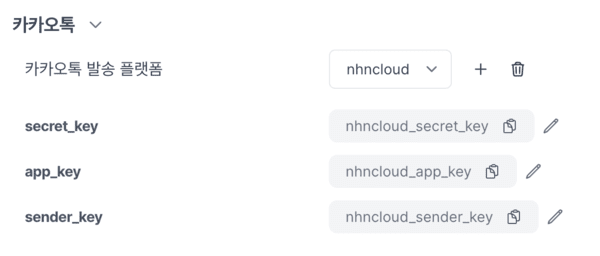
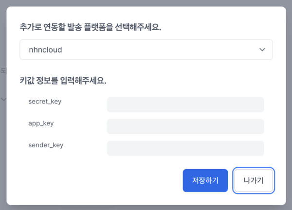
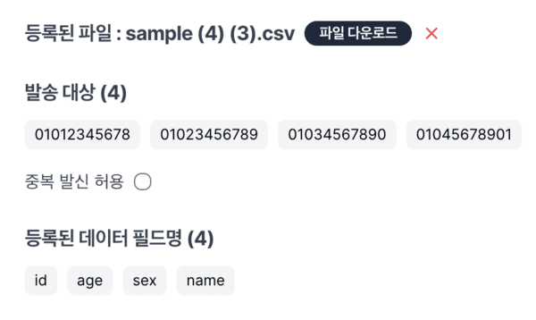
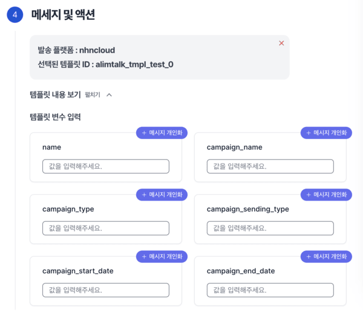
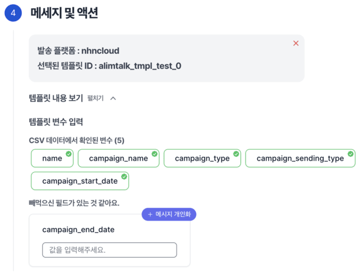

# 카카오 알림톡 발송

## 개요

노티플라이에서는 사용자들에게 카카오 알림톡을 원하는 타이밍에 보낼 수 있습니다.

1. 현재 서비스에서 사용중인 카카오 알림톡 발송 대행사가 있는 경우:
   - 노티플라이에 카카오 알림톡 발송 대행사에 대한 정보를 등록하시면 바로 카카오 알림톡 발송 캠페인을 시작하실 수 있습니다.
2. 현재 서비스에서 사용중인 문자 발송 대행사가 없는 경우:
   - 노티플라이 팀에 말씀해 주시면 적절한 카카오 알림톡 발송 대행사를 통해 저렴하게 카카오 알림톡 발송이 가능하도록 안내 드리겠습니다.
   - 카카오톡 비즈메시지(알림톡, 친구톡)를 발송하려면 카카오톡 채널을 먼저 등록해야 합니다. 카카오톡 채널은 [카카오톡 채널 등록 페이지](https://center-pf.kakao.com)에서 무료로 만들 수 있습니다.
   - 카카오톡 비즈메시지 발송을 위해서는 비즈니스 채널로의 전환이 필수입니다. 자세한 정보는 [카카오 비즈니스 가이드](https://kakaobusiness.gitbook.io/main/channel/start)에서 확인해주세요.
   - 카카오 알림톡은 **템플릿 기반으로 발송됩니다**. 템플릿은 검수 후 발송 가능하며, 검수 기간은 대행사별로 상이하지만 대략 1~3일정도 소요됩니다. 자세한 내용은 대행사의 템플릿 가이드를 참고해 주세요.

## 카카오 알림톡 발신자 정보 등록하기

[노티플라이 프로젝트 설정 페이지](https://notifly.tech/console/settings)에서 카카오 알림톡 발송 플랫폼과 정보를 입력할 수 있습니다.
(_참고: 현재 지원되는 발송 플랫폼도 여기서 확인하실 수 있습니다. 사용하시는 대행사가 목록에 없는 경우 노티플라이 팀에 말씀해 주세요._)

여러 플랫폼을 등록해서 캠페인마다 다른 플랫폼을 통해 카카오 알림톡을 발송하실 수 있습니다.

플랫폼 별 발송 정보 등록은 [카카오 알림톡 발송 대행사 연결](/ko/user-guide/kakao-alimtalk/integration) 페이지를 확인해주세요.

## 카카오 알림톡 캠페인 시작하기

[노티플라이 캠페인 생성 페이지](https://notifly.tech/console/campaign/create)에서 카카오 알림톡을 선택해 주세요.

카카오 알림톡에서 **휴대폰 번호** 정보는 발송에 필요한 필수 요소입니다. 휴대폰 번호를 불러오는 방법은 발송 대상 세그먼팅의 방법마다 조금씩 상이할 수 있습니다.

### 세그먼팅

카카오 알림톡의 경우, 지원되는 발송 대상 세그먼팅의 종류는

1. [새로운 세그먼트](/ko/user-guide/campaigns/segment#새로운-세그먼트)
2. [CSV 업로드](/ko/user-guide/campaigns/segment#csv-업로드)
3. 코호트 불러오기

#### 새로운 세그먼트

자세한 내용은 [새로운 세그먼트](/ko/user-guide/campaigns/segment#새로운-세그먼트) 섹션을 참고해주세요.

#### CSV 업로드

노티플라이 데이터베이스에 등록되지 않은 사용자에게도 직접 발송하고 싶다면, CSV 업로드 기능을 활용할 수 있습니다. 자세한 내용은 [발송 대상 세그먼팅 - CSV 업로드](/ko/user-guide/campaigns/segment#csv-업로드) 섹션을 참고해주세요.

- **카카오톡 발송에서 `phone_number` 컬럼은 필수이며 중복되거나 비어있으면 안됩니다.**

등록이 잘 되었다면 다음과 같이 발송 대상과 등록된 필드명이 표시됩니다.

<!-- TODO: 외부 툴 연동 코호트 -->

### 메시지

카카오 알림톡은 **템플릿 기반으로 발송**됩니다. 템플릿에는 치환 가능한 변수 필드가 존재하며, `#{변수}`와 같은 형식으로 되어있습니다. 해당 변수는 **직접 입력**으로도 치환가능하며, **[메시지 개인화](/ko/user-guide/campaigns/message-personalization)**를 통하여 개인에게 다르게 알림톡을 보낼 수도 있습니다.

1. 새로운 세그먼트 기능을 이용하여 대상을 지정할 때에는, **모든 변수명에 대하여 치환할 문구**를 입력하셔야 합니다. 치환 문구를 입력하실 때에, 개인화가 필요하다면 우측 상단 '메시지 개인화' 버튼을 눌러서 개인화 문구를 추가해주세요. 필요하지 않다면 고정된 내용을 입력해 주세요. 메시지 개인화에 대한 자세한 정보는 [메시지 개인화](/ko/user-guide/campaigns/message-personalization) 섹션을 참고해주세요.

2. CSV 업로드 기능을 이용한 캠페인인 경우, **CSV 필드명과 카카오톡 템플릿 변수의 이름이 같을 경우 자동으로 매칭됩니다.** 빼먹은신 필드는 직접 입력이 가능하며, 해당 경우에도 메시지 개인화가 가능합니다.

