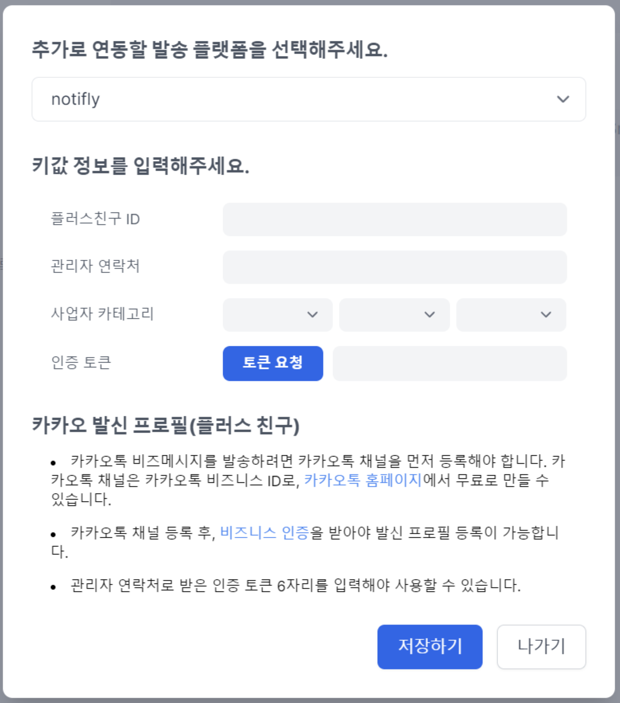
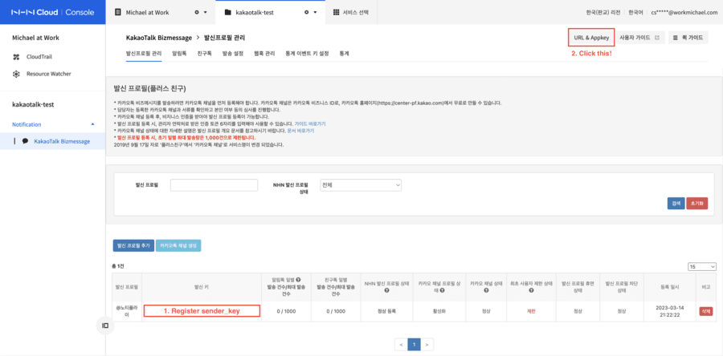
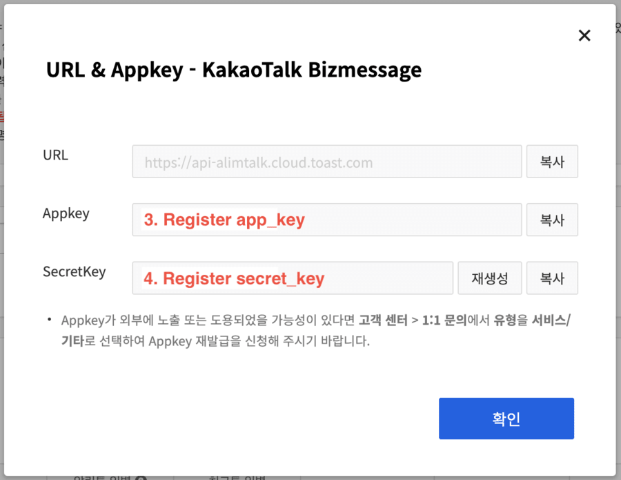
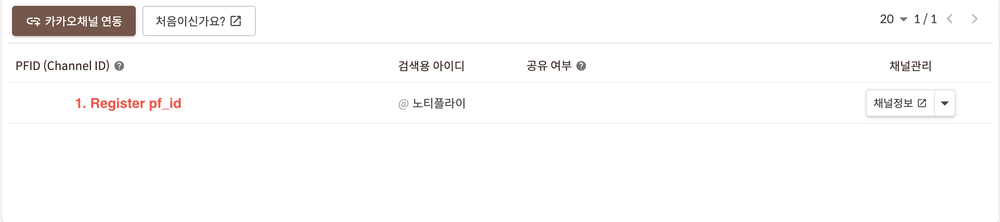
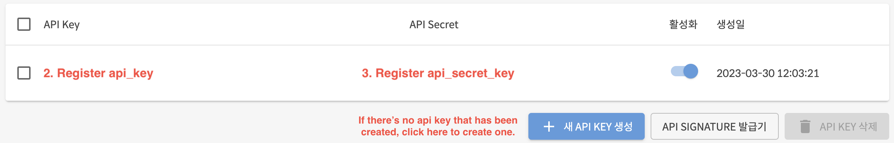
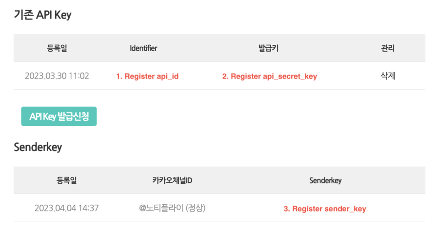
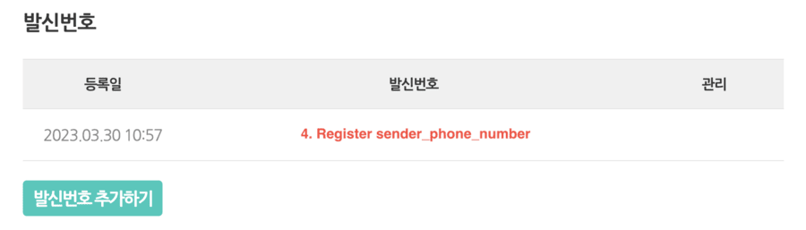

# 카카오 알림톡 발송 프로필 등록

노티플라이에서는 대행사 연동 없이 자체적으로 카카오 알림톡 발송이 가능 합니다. 또한 사용중이신 카카오 알림톡 발송 대행사를 연결하여 캠페인에 활용하실 수도 있습니다. 현재 연결 가능한 대행사 목록은 실시간으로 추가되고 있으니 제품 내에서 확인하시기 바랍니다.

## 사용 가능 대행사 목록

- [노티플라이(자체발송)](#notifly)
- [NHN Cloud](https://www.nhncloud.com/kr)
- [SOLAPI](https://solapi.com/)
- [알리고](https://smartsms.aligo.in/)

## 연동 방법

### 노티플라이 (자체발송) {#notifly}

#### 등록 방법

1. [노티플라이 프로젝트 설정 페이지](https://notifly.tech/console/settings)의 카카오톡 섹션에서 등록하기를 누르면 발송 프로필 등록 팝업이 나옵니다.
2. 개설하신 카카오톡 플러스 친구 ID(플러스 친구 검색용 ID) 및 채널 관리 권한이 있는 관리자의 연락처, 사업자 카테고리를 각각 입력해주세요.
3. 토큰 요청 버튼을 누르시면 입력하신 관리자 연락처의 카카오톡 계정으로 인증 요청이 전송 됩니다. 카카오톡으로 전송된 인증 토큰을 입력하신 후 저장하기를 눌러주시면 노티플라이 자체발송 설정이 완료 됩니다.

### NHN Cloud {#nhncloud}

#### 등록 정보 목록

NHN Cloud의 경우, 세 가지의 정보를 필수적으로 등록해야 정상적인 연동이 가능합니다.

1. `secret_key`
2. `app_key`
3. `sender_key`

#### 등록 방법

1. [NHN Cloud 콘솔](https://console.nhncloud.com/)에 접속 후, 프로젝트 내의 KakaoTalk Bizmessage 관리 페이지에 방문합니다.
2. 발신 프로필 관리 탭에서 추가하고 싶은 카카오톡 채널의 **발신 키** 값을 노티플라이 발신자 등록 창의 `secret_key` 값에 등록합니다.
3. 우측 상단 "URL & AppKey" 버튼을 클릭하면 나타나는 모달 창에서 `AppKey`, `SecretKey`값을 각각 노티플라이 발신자 등록창의 `app_key`, `secret_key` 값에 등록합니다.

### SOLAPI {#solapi}

#### 등록 정보 목록

SOLAPI의 경우, 세 가지의 정보를 필수적으로 등록해야 정상적인 연동이 가능합니다.

1. `pf_id`
2. `api_key`
3. `api_secret_key`

#### 등록 방법

1. [Solapi 콘솔](https://console.solapi.com/)에 접속 후, 좌측 사이드바의 **카카오채널 (플러스친구)** 탭에 방문합니다.
2. 페이지 상단의 카카오 채널 목록에서 **PFID (Channel ID)** 값을 노티플라이 발신자 등록 창의 `pf_id` 값에 등록합니다.
3. 좌측 사이드바의 **API Key 관리** 탭에 방문 후, 상단의 API Key 목록에서 `API Key`, `API Secret`값을 각각 노티플라이 발신자 등록창의 `api_key`, `api_secret_key` 값에 등록합니다. API Key를 생성하지 않았다면, 하단의 **새 API KEY 생성** 버튼을 이용하여 API Key를 등록합니다.

### Aligo {#aligo}

#### 등록 정보 목록

SOLAPI의 경우, 네 가지의 정보를 필수적으로 등록해야 정상적인 연동이 가능합니다.

1. `api_id`
2. `api_secret_key`
3. `sender_key`
4. `sender_phone_number`

#### 등록 방법

1. [알리고](https://smartsms.aligo.in/)에 접속, 로그인 후 상단 **문자 API - 신청/인증** 탭에 방문합니다.
2. **알리고 플랫폼은 반드시 노티플라이 발송 서버의 IP 인증이 필요합니다.** 해당 방법에 대해서는 [이 곳](/ko/user-guide/text-message/integration#알리고-연결)을 참고해 주세요.
3. 상단 네비게이션의 **카카오톡 - 신청/인증** 탭에 방문 후, **기존 API Key** 목록에서 `Identifier`, `발급 키`값을 각각 노티플라이 발신자 등록창의 `api_id`, `api_secret_key` 값에 등록합니다. API Key를 생성하지 않았다면, 하단의 **API KEY 발급 신청** 버튼을 이용하여 Key를 발급합니다.
4. 아래 **발신 번호** 목록에서 `발신 번호`를 노티플라이 발신자 등록창의 `sender_phone_number` 값에 등록합니다. 등록된 발신번호가 없다면, **발신 번호 추가하기** 버튼을 눌러 발신번호를 추가해주세요.
