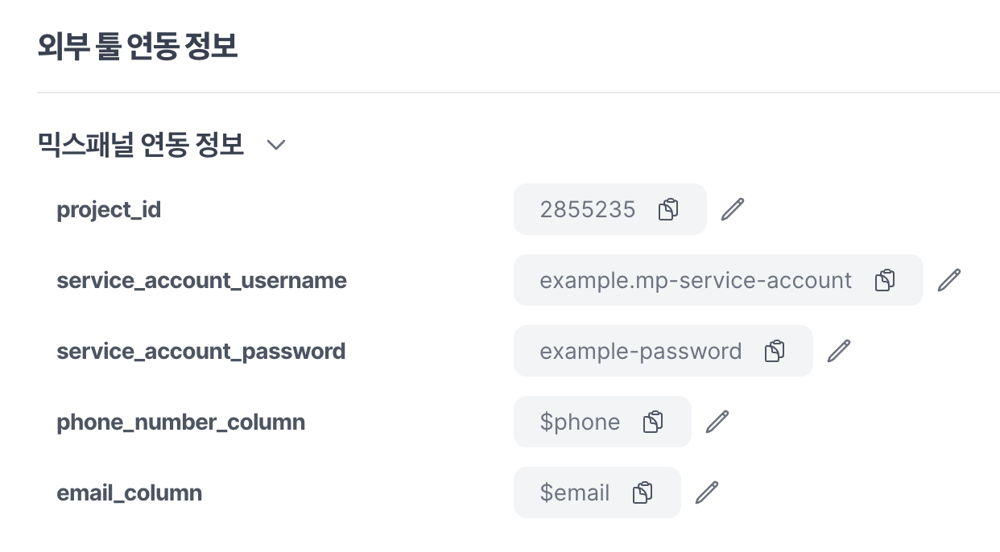
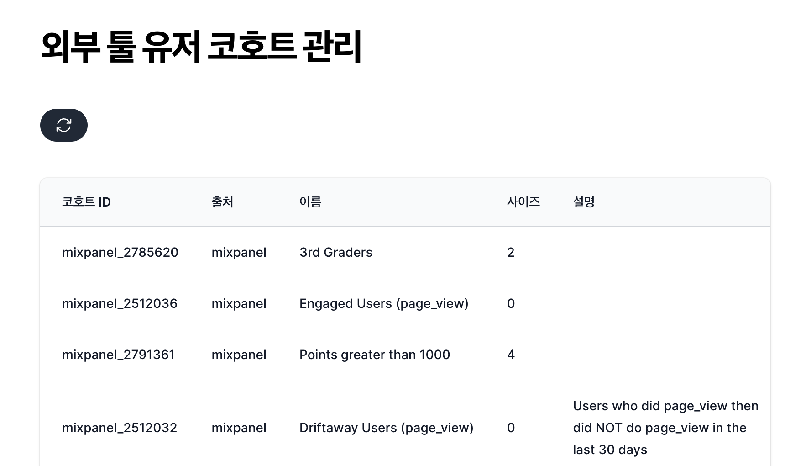
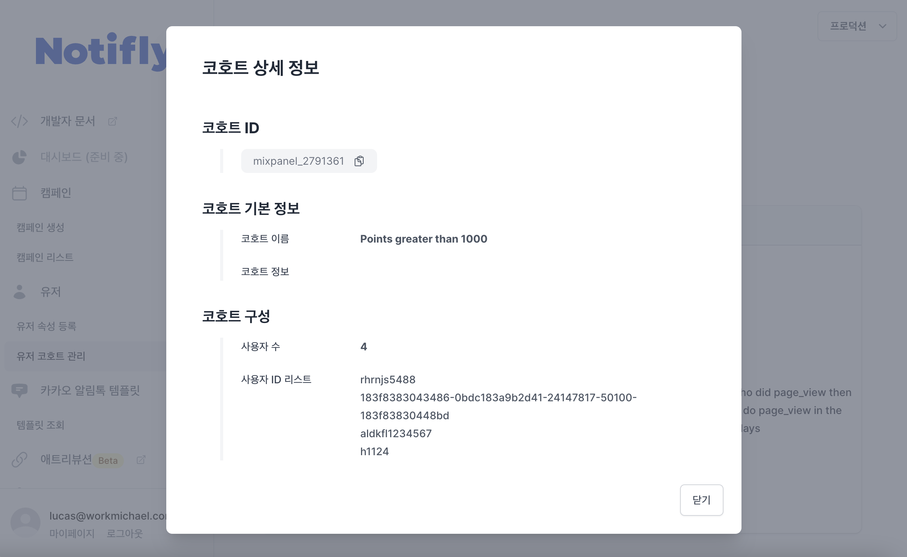
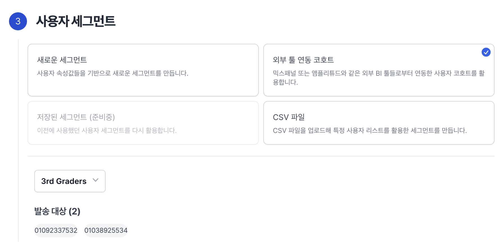

# Mixpanel 코호트 연동

Mixpanel을 사내 분석 도구로 사용하고 계신 고객사들을 위해 Mixpanel 내에 정의된 사용자 코호트 정보를 노티플라이에 그대로 연동해서 활용할 수 있는 기능입니다. Mixpanel 사용자 코호트를 별도의 개발 작업 없이 노티플라이 캠페인에 적용해 간편한 타겟팅 발송을 할 수 있습니다.

## 사전 준비 사항

#### 1. Mixpanel 프로젝트 ID 받아오기

Mixpanel 도구 내 `Project Settings/Overview` 페이지를 방문해 Project ID를 받아옵니다. Mixpanel에서 제공하는 [해당 가이드](https://help.mixpanel.com/hc/en-us/articles/115004490503-Project-Settings#project-id)를 참고하시면 도움이 됩니다.

#### 2. Mixpanel Service Account 계정 정보 받아오기

Mixpanel 도구 내 `Project Settings/Service Account` 페이지를 방문해 Service Account를 생성합니다. 해당 페이지 우측 상단의 `+ Add Service Account`를 누른 후, consumer role 이상의 권한을 부여한 Service Account를 생성합니다. Service Account의 계정 정보를 잘 보관해놓습니다. Username과 secret 정보를 모두 보관해놓습니다. Mixpanel 코호트 연동 기능 사용을 위해 노티플라이 툴에 등록하게 될 정보들입니다.

#### 3. Mixpanel 전화번호, 이메일 속성 컬럼명 받아오기

Mixpanel 코호트 정보를 노티플라이 툴에 연동을 하게 되면 정의된 코호트들에 속한 사용자들의 속성들이 노티플라이 CRM에 기록됩니다. 기록된 속성들 중 사용자들의 전화번호와 이메일을 추출할 수 있다면 코호트 기반 발송이 가능해집니다. 따라서, Mixpanel 툴 내에 전화번호와 이메일 속성들이 어떤 컬럼명으로 저장되어 있는지를 노티플라이 툴에 명시해주는 과정이 필요합니다.

##### _전화번호 속성 컬럼명_

대게 `$phone`이라는 컬럼명으로 관리됩니다. 따라서, 대부분의 경우 `$phone` 컬럼명을 사용하시면 됩니다. 만약 해당 컬럼명을 사용하지 않고 custom 컬럼명을 사용하고 계신다면 Mixpanel 사용자 정보를 csv로 다운로드해서 전화번호 컬럼명을 파악한 후 해당 컬럼명을 사용하시면 됩니다.

##### _이메일 속성 컬럼명_

대게 `$email`이라는 컬럼명으로 관리됩니다. 따라서, 대부분의 경우 `$email` 컬럼명을 사용하시면 됩니다. 만약 해당 컬럼명을 사용하지 않고 custom 컬럼명을 사용하고 계신다면 Mixpanel 사용자 정보를 csv로 다운로드해서 이메일 컬럼명을 파악한 후 해당 컬럼명을 사용하시면 됩니다.

## Mixpanel 연동 정보 등록

1. 설정 페이지를 방문합니다.
2. 프로젝트 설정 페이지 내 외부 툴 `연동 정보/믹스패널 연동 정보` 섹션을 방문해 **Mixpanel 프로젝트 ID**, **Service Account 계정 정보**, **전화번호, 이메일 속성 컬럼명**을 기입합니다.
   

## Mixpanel 코호트 정보 등록

1. 유저 코호트 관리 페이지를 방문합니다.
2. `외부 툴 유저 코호트 관리` 섹션 내 리프레시 버튼을 클릭합니다.
3. 리프레시 버튼 클릭 후, 코호트 정보가 잘 등록되었음을 확인합니다.
4. 만약, 버튼 클릭 후, 코호트 정보가 UI에 뜨지 않는다면 페이지를 새로고침을 한 후 재차 확인합니다. 만약 그래도 정보가 뜨지 않는다면, 리프레시 버튼을 한번 더 클릭 해보신 후, 여전히 문제가 있다면 노티플라이 팀에게 문의 부탁드립니다.

> _리프레시 버튼 클릭 후, 코호트 정보가 연동된 모습_:
> 

> _코호트 리스트 아이템 클릭 후, 코호트 상세 정보가 모달 내에 표기된 모습_:
> 

## 캠페인 생성 시 Mixpanel 코호트 활용

1. 캠페인 생성 페이지를 방문합니다.
2. 현재 Mixpanel 코호트 기반 캠페인 발송은 `카카오 알림톡`, `카카오 친구톡`, `문자` 이렇게 3가지 채널에 대해서 지원됩니다. 추후, 다른 채널에 대한 지원도 계획되어 있습니다.
3. `발송 대상` 섹션에서, `외부 툴 연동 코호트`를 클릭하여 선택합니다.
4. 클릭 후, 하단에 `코호트 선택` 섹션이 새로이 나타남을 확인하고, 드롭다운 선택을 통해 원하는 코호트를 선택합니다.
5. 나머지 캠페인 생성 플로우를 마무리합니다.

