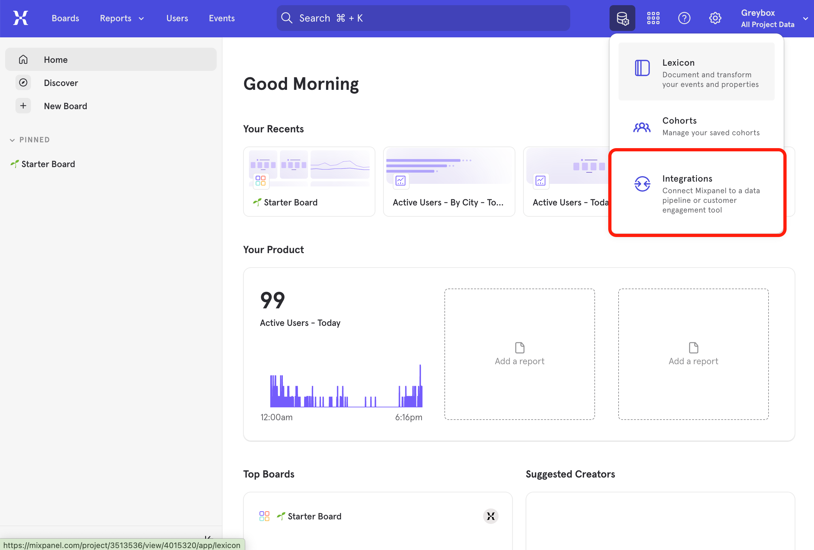
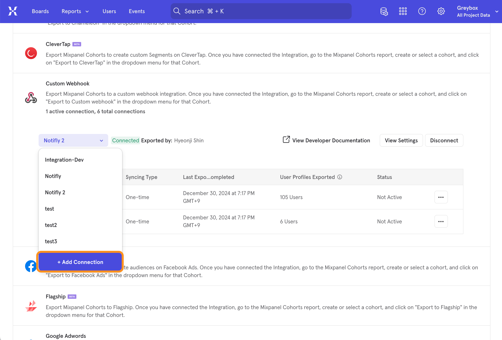
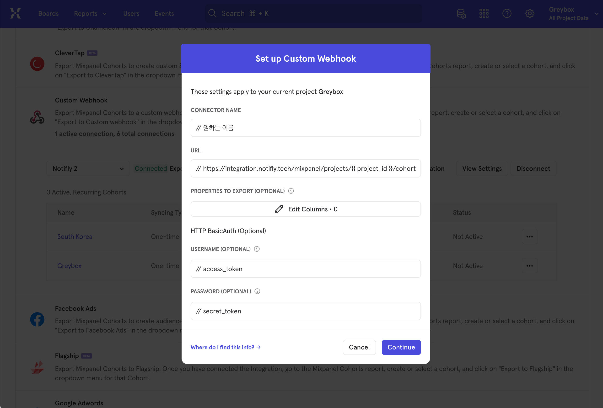
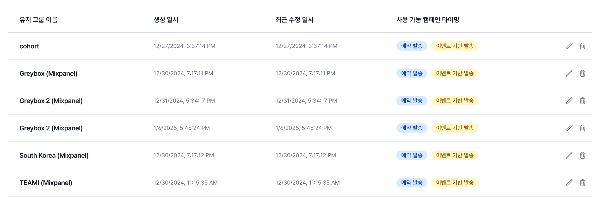

# Mixpanel 연동

Mixpanel을 사용하고 계시는 고객사에서 Mixpanel의 cohort를 사용해 notifly의 발송 대상 조건에 활용할 수 있도록, cohort sync 기능을 제공합니다.

:::tip Mixpanel 유료 플랜 이상 사용 가능
Mixpanel의 integration 기능을 사용하기 위해서는 Mixpanel의 유료 플랜을 사용중이어야 합니다.
:::

- cohort sync는 one-time, recurring 옵션을 선택할 수 있으며, recurring(실시간) 연동은 최대 60개까지만 연동할 수 있습니다.
- cohort는 유저 속성으로 연동 됩니다.

## 1. Mixpanel에 연동 정보 등록하기

1.  Mixpanel의 우측 상단 메뉴를 클릭하여 Integration 메뉴에 진입합니다.
    

2.  Integration 하단의 Customer Webhook을 새롭게 추가합니다. 'Add Connection을 선택해주세요'
    

3.  아래의 정보를 정확하게 입력해주세요.
    

    | 필드명         | 값                                                                          | 설명                                                                   |
    | -------------- | --------------------------------------------------------------------------- | ---------------------------------------------------------------------- |
    | Connector Name | 원하는 커넥션 이름                                                          | 예를 들면, Notifly - cohort sync                                       |
    | URL            | https://integration.notifly.tech/mixpanel/projects/{{ project_id }}/cohorts | project_id는 노티플라이 콘솔 > 설정에서 확인 가능                      |
    | USERNAME       | {{ access_key }}                                                            | access_key는 노티플라이 콘솔 > 설정 > API 인증 정보 영역에서 확인 가능 |
    | PASSWORD       | {{ secret_key }}                                                            | secret_key는 노티플라이 콘솔 > 설정 > API 인증 정보 영역에서 확인 가능 |

4.  연동이 완료되었다면, Mixpanel > cohort 에서 연동을 원하는 cohort에 export 메뉴를 클릭해 연동 타입을 선택한 후 연동합니다. (One-time, Recurring sync)

## 2. 노티플라이에서 Mixpanel Cohort 연동하기

1. 연동이 시작되면 해당 cohort에 대해 노티플라이의 유저 그룹이 생성됩니다.
2. 발송 대상에서 유저 그룹 불러오기를 통해서 cohort를 불러올 수 있으며, 추가 조건을 설정할 수 있습니다.
   

## FAQ

- Q. Recurring sync의 개수 제한이 있나요?
  - A. 최대 60개 까지의 Recurring sync (실시간 연동) 를 사용할 수 있습니다. 사용하지 않는 cohort sync는 제거해주시는게 좋습니다. 해당 정책은 Mixpanel의 외부연동 정책인 점 참고해주세요.
