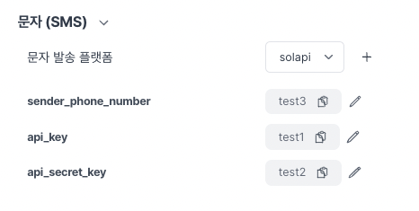
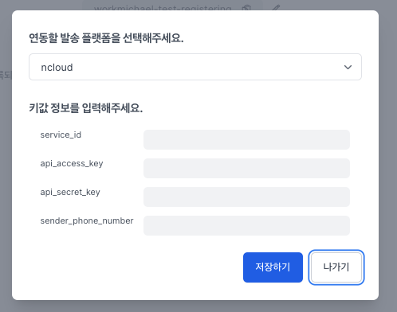
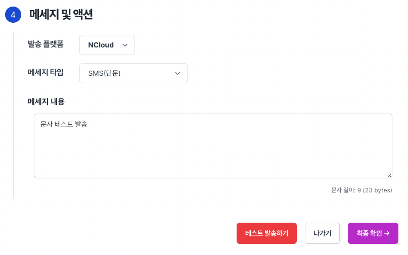
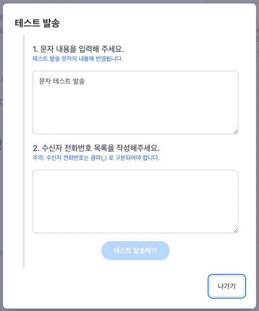

# 문자 발송

노티플라이에서는 사용자들에게 문자를 원하는 타이밍에 보낼 수 있습니다.

1. 현재 서비스에서 사용중인 문자 발송 대행사가 있는 경우:
   - 노티플라이에 대행사에 대한 정보를 등록하시면 바로 문자 발송 캠페인을 시작하실 수 있습니다.
2. 현재 서비스에서 사용중인 문자 발송 대행사가 없는 경우:
   - 노티플라이 팀에 말씀해 주시면 적절한 문자 발송 대행사를 통해 저렴하게 문자 발송이 가능하도록 안내 드리겠습니다.
   - 발신번호 등록을 위해 미리 사업자등록증, 통신가입이용증명원, 재직증명서를 준비해 주세요.

## 문자 발송 발신번호 설정하기

[노티플라이 프로젝트 설정 페이지](https://notifly.tech/console/settings)에서 문자 발송 플랫폼과 정보를 입력할 수 있습니다.
(_참고: 현재 지원되는 발송 플랫폼도 여기서 확인하실 수 있습니다. 사용하시는 대행사가 목록에 없는 경우 노티플라이 팀에 말씀해 주세요._)

여러 플랫폼을 등록해서 캠페인마다 다른 플랫폼을 통해 문자를 발송하실 수 있습니다.

문자를 발송하기 위해서는 발신번호 사전 등록이 필수입니다. 실제 발송 전에 발신번호 사전 등록이 완료되었는지를 플랫폼에서 확인해 주세요.

## 문자 발송 테스트하기

[노티플라이 캠페인 생성 페이지](https://notifly.tech/console/campaign/create)에서 문자를 선택하시고 내용 입력 후 테스트 발송하기 버튼을 눌러주세요.

(_참고: 문자 발송 설정이 완료되지 않은 경우에는 설정을 완료하신 뒤에 테스트 가능합니다._)

