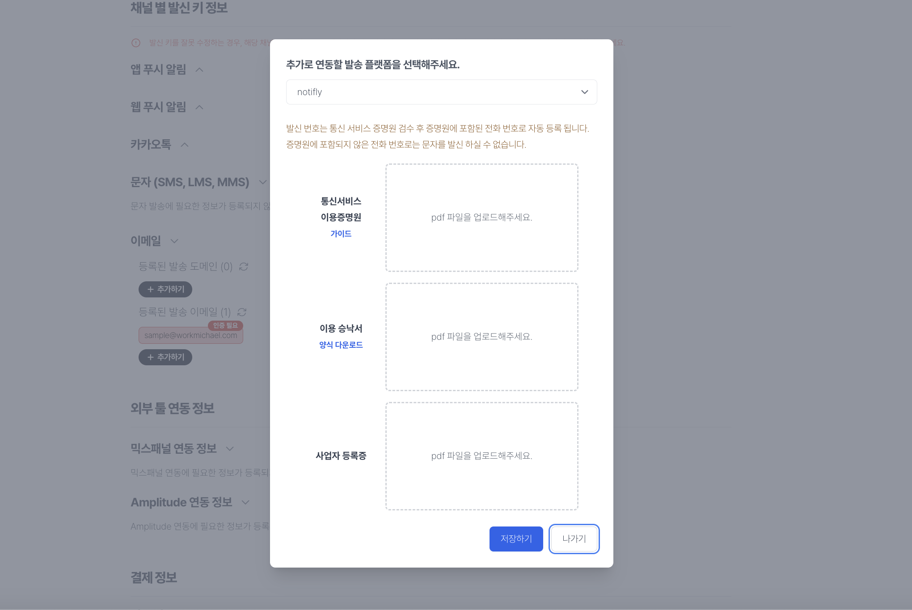

# 노티플라이에서 문자 발송하기

1. 대행사를 연동하지 않더라도, 노티플라이에서 직접 문자를 발송할 수 있습니다.
2. 노티플라이에서 문자를 발송하려면, **발송 번호 사전등록**이 선행되어야 합니다.

## 1. 발신 번호 사전등록

:::note 발신번호 사전등록제란
전기통신사업법 제84조(통신사업자의 의무)의2 전화번호의 거짓표시 금지 및 이용자 보호에 따라, 발신번호 사전등록제가 시행되고 있습니다. 
본 제도의 통신사의 스팸문자 차단 정책에 따라, 발신번호를 사전에 등록해야만 문자를 발송할 수 있도록 하는 제도입니다.
:::

### 1-1. 필요 서류 준비

#### 1. 통신서비스 이용증명원

:::note 통신서비스 이용증명원이란
통신서비스 이용증명원이란 이용자 본인이 사용하는 전화번호를 증명하는 서류입니다. 
이용하시는 통신사에서 발급 가능하며 발급방법은 고객 센터에 전화를 통해 발급 요청할 수 있습니다.
:::

:::note 각 통신사별 서류명 및 연락처

| 통신사              | 서류명          | 연락처        |
| ------------------- | --------------- | ------------- |
| KT 고객센터         | 가입증명원      | 1588-0114     |
| LG U+               | 가입사실 확인서 | 1544-0001     |
| SKT                 | 이용계약증명서  | 080-8282-123  |
| 세종텔레콤          |                 | 1699-1000     |
| KCT한국케이블텔레콤 |                 | 070-8188-0114 |
| 헬로모바일KT        |                 | 1855-1144     |
| 헬로모바일SKT       |                 | 070-8188-0114 |

:::

:::caution 주의사항

1. 통신서비스 이용증명원 상의 명의자는 **사업자 또는 대표자**여야 합니다. 
2. 통신서비스 이용증명원에는 마스킹(숨김) 처리한 부분이 없어야 하며, 최근 **3개월 이내** 발급된 서류만 등록 가능합니다. 
   :::

#### 2. 이용승낙서

- (주)그레이박스에서 제공하는 양식을 [다운로드](https://notifly-content.s3.ap-northeast-2.amazonaws.com/common-files/%E1%84%8C%E1%85%A5%E1%86%AB%E1%84%92%E1%85%AA%E1%84%87%E1%85%A5%E1%86%AB%E1%84%92%E1%85%A9+%E1%84%8B%E1%85%B5%E1%84%8B%E1%85%AD%E1%86%BC%E1%84%89%E1%85%B3%E1%86%BC%E1%84%82%E1%85%A1%E1%86%A8%E1%84%89%E1%85%A5+%E1%84%8B%E1%85%A3%E1%86%BC%E1%84%89%E1%85%B5%E1%86%A8.docx)하여 필요한 내용을 작성합니다.

#### 3. 사업자등록증

### 1-2. 노티플라이에 발신번호 등록하기

1. 노티플라이에 로그인 후, **[설정](https://www.notifly.tech/console/settings) > 채널별 발신 키 정보 > 문자 ** 메뉴로 이동하여 등록하기 버튼을 클릭합니다.
2. 플랫폼을 notifly로 선택합니다.
3. 1-1에서 준비한 서류를 첨부하고, 등록하기 버튼을 클릭합니다.

