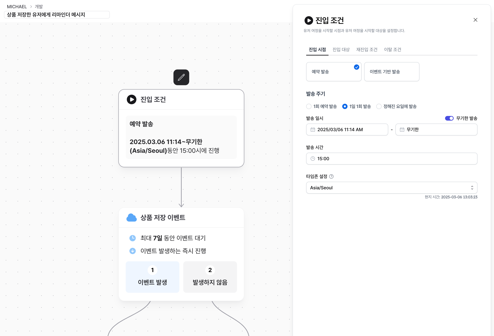

# 유저 여정 기본 설정

## 유저 여정 만들기

`노티플라이 콘솔 > 유저 여정 생성하기` 메뉴를 통해서 새로운 유저 여정을 생성할 수 있습니다.

## 기본 정보 설정하기

유저 여정의 제목과 설명을 설정할 수 있습니다.

## 유저 여정 진입 조건과 전환 성과 설정하기

유저 여정을 시작하는 대상과 시점을 시작 노드에서 수정할 수 있습니다. 시작 노드의 편집 버튼을 클릭해 유저 여정의 시작 조건을 설정할 수 있습니다.

### 진입 시점

유저 여정을 시작할 시점을 설정합니다. 설정된 시간에 반복적으로 실행하거나, 이벤트 기반으로 실시간으로 시작할 수 있습니다. 설정된 시점에 대상을 만족하는 유저에 대해 유저 여정을 시작합니다.

### 진입 대상

유저 여정을 시작할 대상을 설정합니다. 대상을 만족하는 유저만 유저 여정을 시작할 수 있습니다. 대상에는 사용자 속성 기반, 이벤트 기반 등의 조건을 활용할 수 있습니다.
진입 대상 조건은 진입 시점에서만 검사하며 진행중인 세션의 조건이 진입 대상 조건에 해당하지 않도록 변경되더라도 세션은 계속해서 유지됩니다.
유저 여정을 시작할 시점을 설정합니다. 설정된 시간에 반복적으로 실행하거나, 이벤트 기반으로 실시간으로 시작할 수 있습니다. 설정된 시점에 대상을 만족하는 유저에 대해 유저 여정을 시작합니다.

### 재진입 조건

시작 대상과 시작 시점을 만족한 유저가 유저 여정을 재진입할 수 있는 조건을 설정할 수 있습니다. 기본 값은 '종료 후 재진입 가능' 입니다.'

| 조건                | 설명                                                                                                                  |
| ------------------- | --------------------------------------------------------------------------------------------------------------------- |
| 재진입 불가능       | 한 번이라도 해당 유저 여정을 시작한 유저에 대해서는 조건을 만족하더라도 유저 여정을 시작하지 않습니다.                |
| 종료 후 재진입 가능 | 유저 여정이 진행중인 상태에서는 재진입이 불가하며, 이탈/종료 된 이후 조건을 만족하는 유저에 대해서 재진입 가능합니다. |
| 재진입 가능         | 기존 진행중인 유저 여정의 상태와 상관없이 재진입할 수 있습니다.                                                       |

### 이탈 조건

유저가 유저 여정을 시작한 이후, 다음 노드로 진행하지 않고 중간에 여정을 이탈하는 조건을 설정합니다.
예를 들어, 재구매 유도 유저 여정 도중, 상품을 구매한 유저에게는 더이상 다음 메시지를 전달하지 않고자 하는 경우, `상품 구매`를 이탈 이벤트로 지정할 수 있습니다.
이탈한 유저는 별도의 통계로 집계됩니다.

### 전환 성과

유저 여정의 성과를 측정할 목표 이벤트를 설정할 수 있습니다. 최대 3개의 전환 이벤트를 설정할 수 있으며, 각 메시지 노드의 전환도 동일한 기준으로 설정됩니다. 전환 성과는 세션별 최대 1회 측정됩니다. (중복 제거됨)

---

## 유저 여정의 상태

유저 여정은 드래프트/활성/종료 세 가지 상태를 가질 수 있습니다. 드래프트/종료 상태인 유저 여정만 노드의 추가/삭제/이동이 가능합니다.
유저 여정이 종료 상태로 변경되면, 진행중인 모든 세션은 이탈처리됩니다. 또한, 진입 조건 종료 기간이 도래하더라도, 유저 여정은 종료 상태로 변경되지 않습니다.
반대로, 종료 상태인 유져 여정은, 진입 조건 (시점과 대상)을 만족하는 유저가 발생하더라도, 진입할 수 없습니다.

### 유저 여정 수정

유저 여정 드래프트/종료 상태일때만 수정가능하며, 노드를 삭제, 이동하여 재구성할 수 있습니다.
