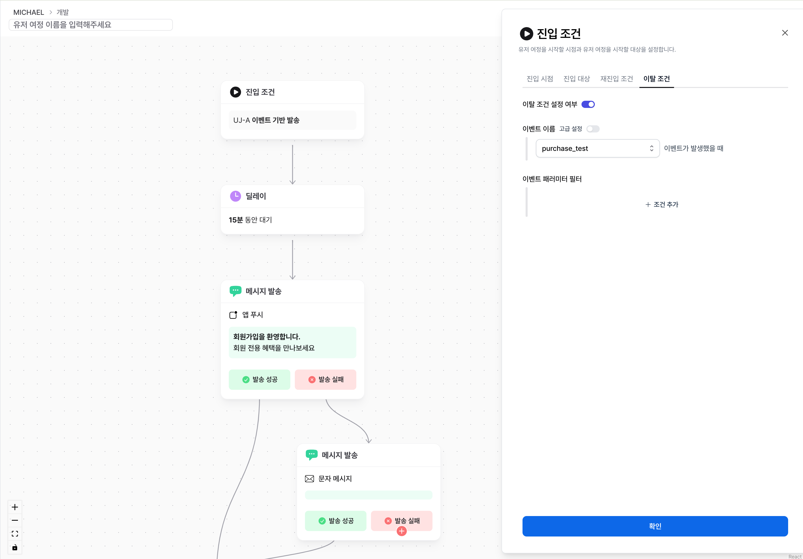

# 시작하기

## 유저 여정이란?

유저 여정은 CRM 시나리오를 자동화하여 메시지를 적절한 시점과 조건에 따라 발송하고, 사용자와의 효과적인 상호작용을 통해 전환율을 높이는 도구입니다. 이 기능은 유저의 행동 데이터를 기반으로 다양한 시나리오를 설계하고 운영할 수 있도록 설계되었습니다.

## 유저 여정에 사용되는 개념

유저 여정은 다음의 핵심 개념과 요소를 기반으로 구성됩니다.

| 용어                           | 설명                                                                                                                                                   |
| ------------------------------ | ------------------------------------------------------------------------------------------------------------------------------------------------------ |
| 노드 (Node)                    | 유저 여정을 구성하는 각 단계의 단위입니다. 메시지 노드, 딜레이 노드 등으로 구성되어 있으며 유저 여정은 여러 노드의 연결로 구성됩니다.                  |
| 대상 (Target)                  | 유저 여정에 포함되는 유저 조건입니다. 대상 조건에 만족하는 대상에 대해서만 유저 여정이 시작됩니다.                                                     |
| 시작 조건 (Starting Condition) | 대상 중 유저 여정을 시작하는 조건을 설정합니다. 일회성, 반복, 이벤트 기반 조건을 선택할 수 있습니다.                                                   |
| 이탈 조건 (Exit Condition)     | 유저 여정을 시작한 유저가 도중 유저 여정에서 이탈하는 조건을 설정합니다. 이탈 조건을 만족하면, 다음 노드로 이동하지 않으며 유저 여정에서 이탈됩니다.   |
| 전환 (Conversion)              | 여정을 시작한 유저가 미리 지정된 전환 이벤트를 발생시킨 성과를 집계합니다. 유저 여정 중 메시지를 받은 이후에 발생한 전환만 유효한 전환으로 기록됩니다. |
| 세션 (Session)                 | 유저가 여정을 시작하는 동안의 여정 정보를 기록하는 단위입니다. 여정을 시작할 때 마다 생성됩니다.                                                       |
| 종료 (Complete)                | 유저가 여정의 가장 마지막 노드에 도달한다면, 해당 세션은 종료로 기록됩니다.                                                                            |

## 유저 여정의 목표

유저 여정은 캠페인과는 다르게 오랜 기간 동안 유저에게 다양한 매세지를 보내 전환을 이끌어낼 수 있는 기능입니다. 각 유저 여정별로 '회원가입 전환율 개선', '재구매율 높이기' 등의 목표를 설정하여 구성하면 더 정확한 시나리오 설계와 성과 분석이 가능합니다.
