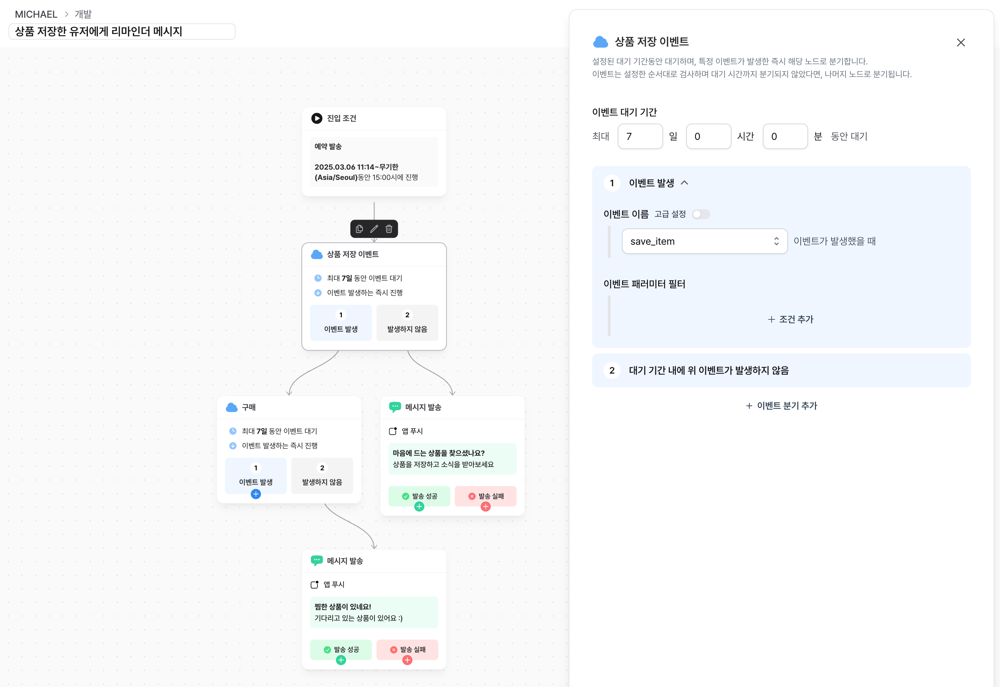
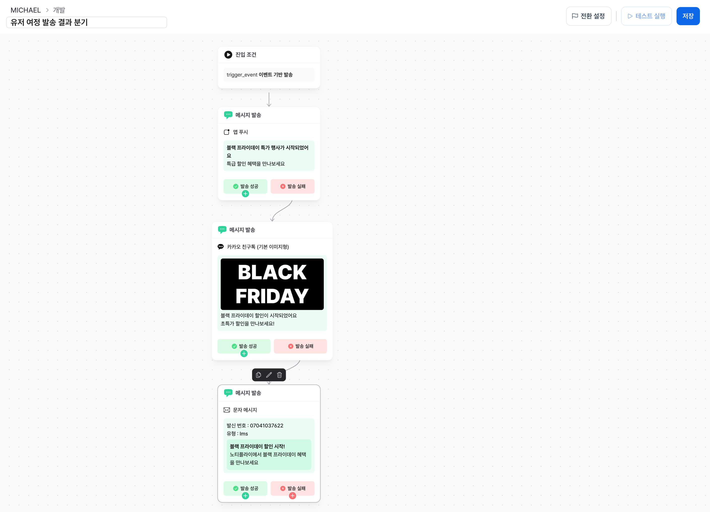
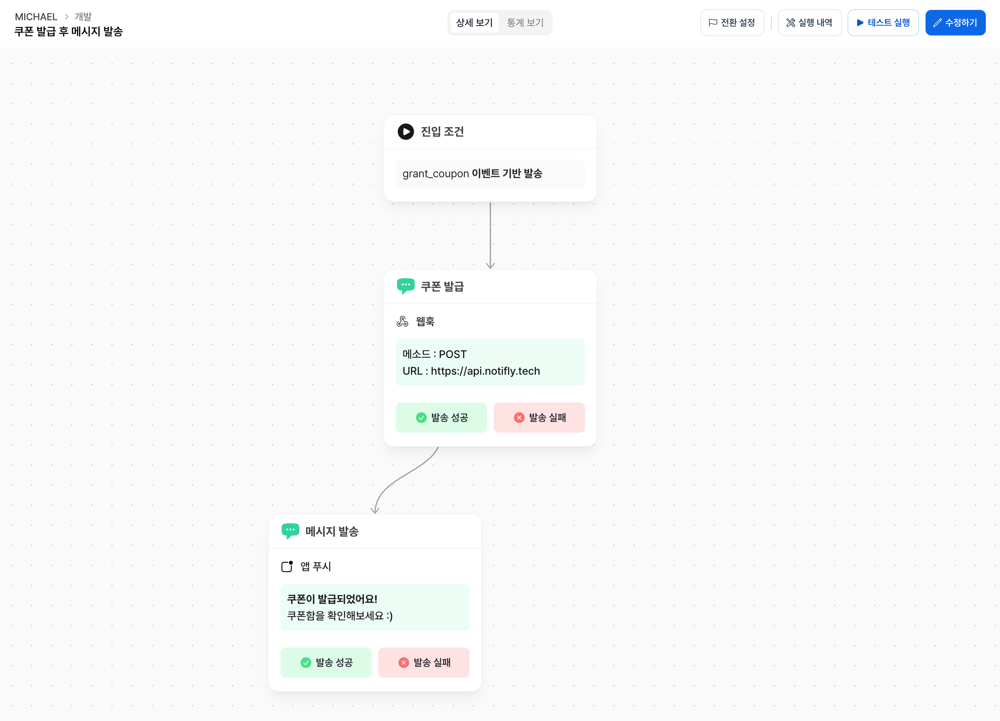
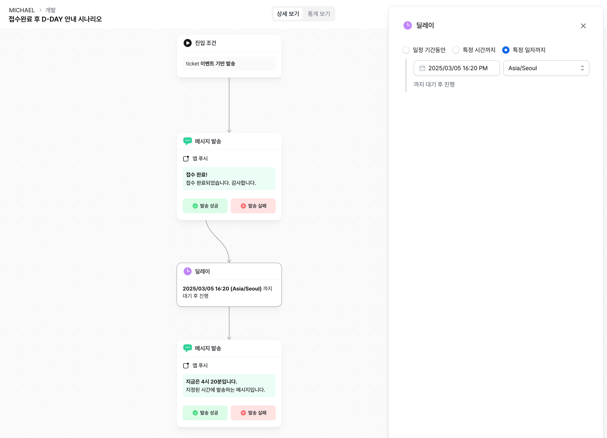

# 유저 여정 활용

유저 여정을 활용해서 구현할 수 있는 다양한 시나리오에 대한 예시를 제공합니다. 제시된 예시 외에도 자유롭게 시나리오를 생성해 목표를 달성할 수 있습니다.

## 여러 조건의 유저에게 맞춤형 메시지 시나리오 제공

이벤트 분기/유저 그룹 분기 노드를 사용해서 각 조건에 맞는 유저에게 서로 다른 시나리오를 손쉽게 구현할 수 있습니다.
메시지 노드를 포함한 유저 여정의 노드는 각 조건별로 분기 및 병합이 가능하므로 복잡한 시나리오 구성이 가능합니다.

아래 예시는 최근 상품 저장 이벤트 발생 여부에 따라서 다른 메시지를 보내는 시나리오의 일부입니다.

## 발송 결과에 따른 대체 발송

유저 여정의 메시지 노드는 발송 결과에 따른 성공/실패 분기를 통해 다양한 채널로 메시지를 대체발송할 수 있습니다.
예를들어, 카카오 친구톡을 수신하지 못한 유저에게 문자를 보낼 수 있습니다.

아래 예시는 푸시를 수신하지 못한 유저에게 친구톡을, 친구톡도 수신하지 못한 유저에게 문자를 보내는 시나리오의 일부입니다.

## 웹훅 호출과 동시에 메시지 전송

쿠폰 발급 후 해당 유저에게 알림톡을 보내고 싶다면, 쿠폰 발급 웹훅을 호출하는 메시지 노드 직후에 알림톡 메시지 노드를 연결하여
동시에 두 메시지가 순차적으로 발송되도록 구성할 수 있습니다.

아래 예시는 쿠폰 발급 웹훅을 호출한 이후 발급에 성공한 유저에 대해 곧이어 쿠폰 발급 친구톡을 전송하는 시나리오의 일부입니다.

## 이벤트 사전 접수 및 오픈 안내

사전 접수 신청 직후 메시지를 보내고, D-DAY 3일전 등 특정일에 일괄적으로 메시지를 보내도록 설정할 수 있습니다.
메시지 노드와 딜레이 노드의 특정 일시까지 대기 기능을 사용하면, 이벤트 발생 직후와 특정시간에 전송하는 메세지를 하나의 유저 여정으로 구현할 수 있습니다.

아래 예시는, 접수 직후 접수 문자를 보내고, 지정일 당일 리마인드 문자를 보내는 시나리오의 일부입니다.

