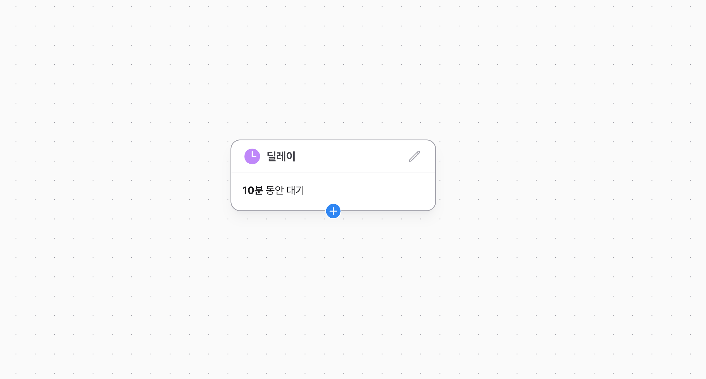

# 딜레이 노드

딜레이 노드에 도달한 유저는 설정된 시간만큼 딜레이 노드에서 대기합니다. 메시지간의 시간 간격을 두고자 하는 경우, 혹은 특정 시간에 다음 노드로 진입하기를 원하는 경우 딜레이 노드를 활용할 수 있습니다.

## 딜레이 설정

딜레이 노드에서는 일정 시간 / 가장 가까운 시간 / 특정 날짜까지 딜레이를 설정할 수 있습니다.
딜레이 노드에서 대기하는 동안, 이탈 조건을 만족한다면, 딜레이 노트에서 이탈로 기록됩니다.

### 일정 시간

설정한 시간만큼 대기합니다. 예를 들어, '12시간 30분'으로 설정된 경우 딜레이 노드에 진입한 시간부터 12시간 30분 이후에 다음 노드로 진행합니다.

### 가장 가까운 시간

다가오는 특정 시간까지 대기하도록 설정할 수 있습니다. 예를 들어 '오후 3시'로 설정된 딜레이 노드에 7월 23일 오후 6시에 진입한다면, 다가오는 오후 3시인 7월 24일 오후 3시에 다음 노드로 진행합니다.
만약 이틀 뒤 다가오는 시간으로 설정하고자 하는 경우, 해당 딜레이 노드 앞에 또다른 딜레이 노드로 '2일 동안' 대기하도록 설정할 수 있습니다.

### 특정 날짜까지

설정한 특정 날짜 시간까지 대기합니다. 설정된 시간 이후에 노드에 진입한다면 유저 여정에서 자동으로 이탈됩니다.
