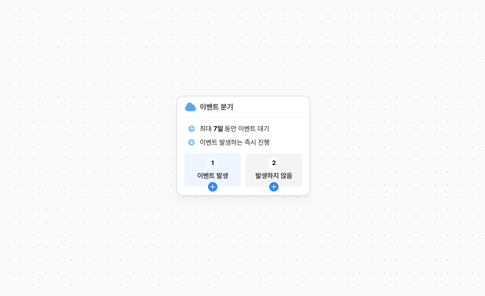

# 이벤트 분기 노드

이벤트 분기 노드에 도달한 유저는 **진입 후** 정해진 시간 동안 각 분기 노드에 설정된 조건에 해당하는 노드로 분기됩니다. 정해진 시간을 넘길때 까지 노드 조건에 만족하는 이벤트가 발생하지 않는 경우, '발생하지 않음' 노드로 분기됩니다.

## 최대 대기 기간 설정

이벤트 발생을 검사할 최대 대기 기간을 설정합니다. 시간은 분 단위로 설정가능하며, 최소 1분에서 최대 14일까지 설정할 수 있습니다. 노드 진입 시점 이후로, 설정한 최대 시간내에 노드 조건에 만족하는 이벤트가 발생하지 않는 경우, '발생하지 않음' 노드로 분기됩니다.

## 노드별 조건 설정

각 노드에는 하나의 이벤트를 설정할 수 있으며 패러미터 조건을 함께 설정할 수 있습니다. 이벤트 발생 횟수는 설정할 수 없으며 여러번 이벤트 발생을 검사해야하는 경우, 이벤트 분기 노드를 연결하여 사용하면 됩니다.

## 분기된 노드로 진행

각 노드에 설정된 ** 이벤트 조건을 만족하는 즉시 다음 노드로 진입 **합니다. 이벤트가 조건을 만족하는지는, 이벤트 발생 순서에 따라 분기되며 서버이벤트와 클라이언트 이벤트가 함께 사용되는 경우 순서 보장이 되지 않을 수 있습니다.
