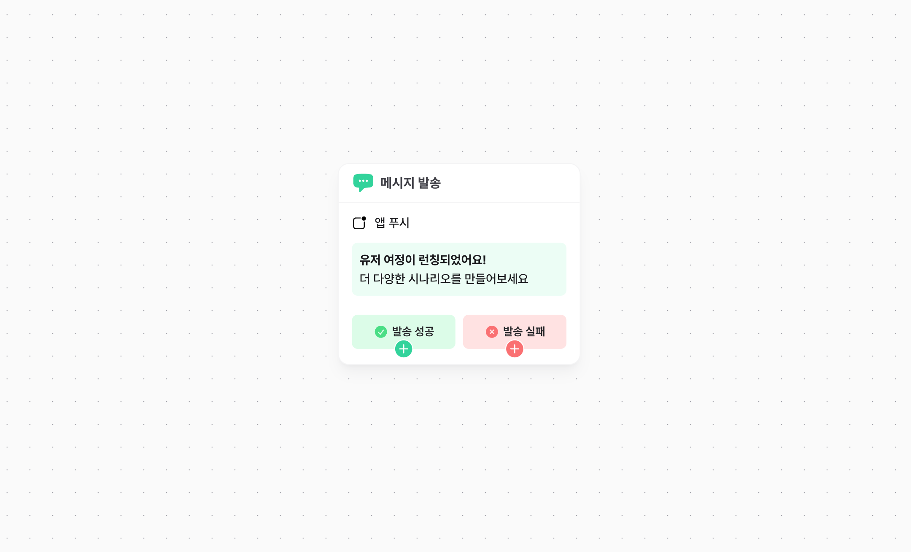
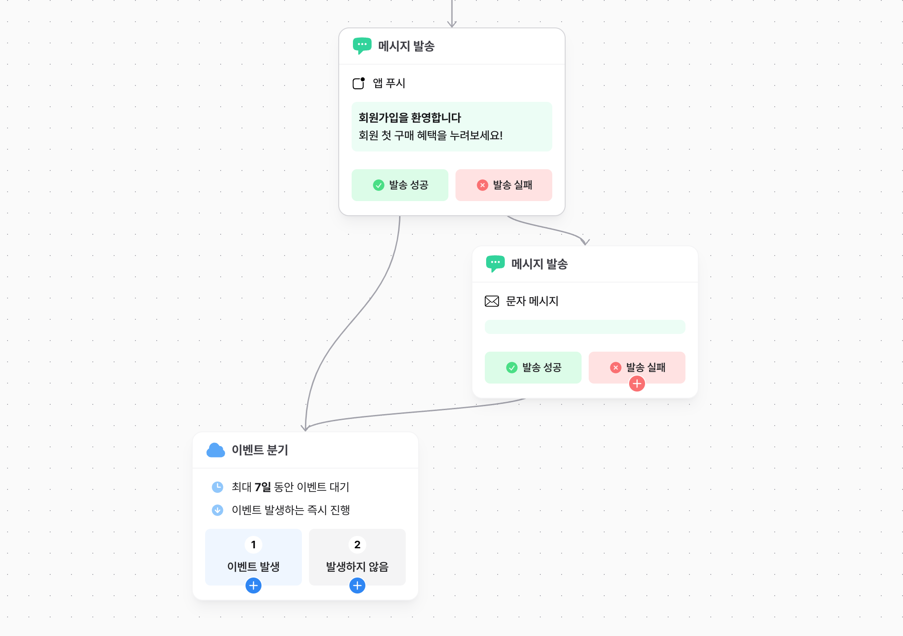
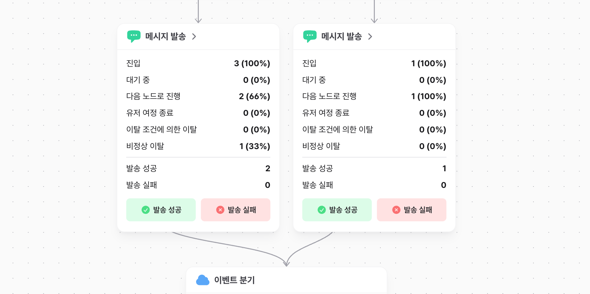

# 메시지 노드

메시지 노드에 도달한 유저에게 메시지를 전송합니다. 노티플라이에서 발송 가능한 모든 채널에 대한 전송을 지원합니다.

## 채널 선택

메시지 노드에서 발송한 메시지의 채널을 선택합니다. 하나의 메시지 노드에서 하나의 채널을 선택할 수 있습니다.

앱 푸시/웹 푸시/문자/이메일/카카오 알림톡/카카오 친구톡/인앱 팝업/인웹 팝업/웹훅 채널을 지원힙니다.

### 즉시 발송 가능 채널

앱/웹 팝업을 제외한 이메일, 문자, 알림톡 등 즉시 발송이 가능한 채널은 유저가 ** 노드에 도달한 즉시 ** 메시지가 발송됩니다.
특정 시간에 메시지를 발송하고자 하는 경우, 딜레이 노드를 연결해 특정 시간에 메시지 노드에 진입하도록 설정해주세요.

### 앱/웹 팝업 채널

즉시 발송이 가능한 다른 채널들과는 다르게, 앱/웹 팝업은 유저가 특정 이벤트를 만족하는 시점에 노출됩니다.
따라서 팝업 노출 트리거 이벤트를 추가로 지정해주셔야 합니다.

## 메시지 내용 입력

각 채널별로 메시지 구성에 필요한 내용을 입력합니다. 템플릿 선택이 필요한 경우(이메일, 알림톡), 미리 만들어진 템플릿을 선택합니다.

## 발송 결과에 따른 분기

앱 푸시, 문자, 카카오톡 채널(알림톡, 친구톡), 이메일의 경우 발송 결과에 따라 다음 노드를 분기할 수 있습니다.
따라서 해당 채널에서는 발송 후 발송 결과를 수신하는 시점에 다음노드로 진행합니다.

- 발송 성공은 수신 성공을 보장하지 않습니다. (기기가 꺼져있는 경우 등)
- 발송 성공과 실패가 같은 노드로 연결될 수 있습니다.
- ** 메시지 발송이 불가능한 경우 ** (문자 발송일때 전화번호가 없거나, 앱 푸시에 등록된 유효한 디바이스가 없는 경우) 발송 불가로 인한 ** '이탈'로 유저 여정에서 제외됩니다. **

## 메시지 노드 통계

캠페인의 통계 보기 모드에서는 메시지 노드의 상세 통계를 확인할 수 있습니다. 메시지 노드를 클릭하면 우측 시트에서 발송 성공/실패를 포함한 발송 통계와 메시지 노드별 전환 통계를 확인할 수 있습니다.

