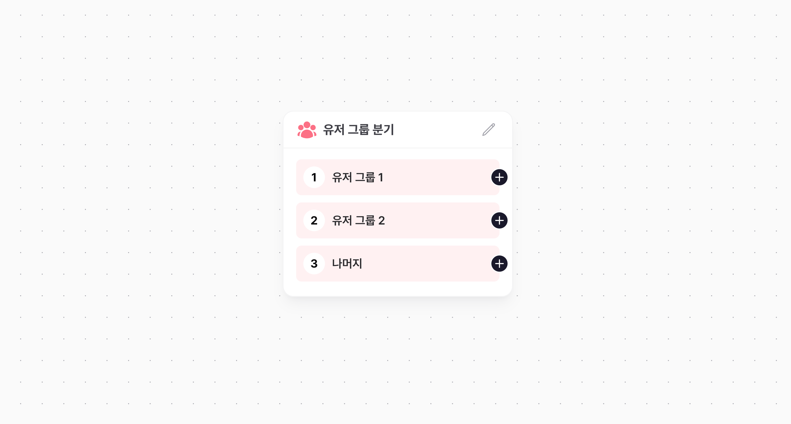

# 유저 그룹 분기 노드

유저 그룹 분기 노드에 도달한 사용자의 속성을 기준으로 여러 그룹으로 나눕니다. 각 그룹은 순서대로 유저의 조건을 검사하며, 먼저 조건을 만족한 그룹으로 분기됩니다. 설정된 유저 그룹 조건에 하나라도 만족하지 못하는 유저는 '나머지'로 분기됩니다. 이 노드에서는 별도의 딜레이 조건 없이 바로 분기 후 다음 노드로 진행됩니다.

## 유저 그룹 설정

### 그룹 조건 설정

각 그룹의 조건을 설정할 수 있습니다. 유저 속성 기반 조건 / 이벤트 기반 조건 / 캠페인 노출 횟수 기반 조건을 AND 조건으로 각 세그먼트에 추가해 구성할 수 있으며 세그먼트들은 OR 조건으로 합칠 수 있습니다. 또한, 모든 세그먼트에 공통적으로 적용할 조건은 추가 필터에 설정할 수 있습니다.

### 그룹의 순서

유저 그룹의 순서에 따라 조건을 만족하는 지 검사하기 때문에, 그룹의 순서도 중요합니다. 유저는 먼저 만족하는 유저 그룹 노드로 즉시 분기됩니다.

### 그룹의 최대 개수

유저 그룹 분기 노드에는 나머지 노드를 포함해 최대 4개의 유저 그룹을 만들 수 있습니다.
