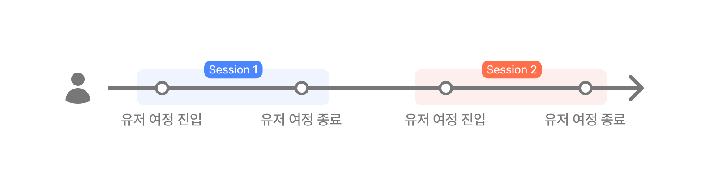
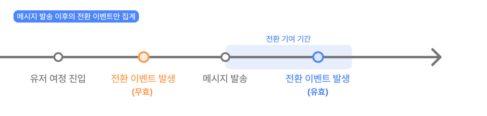
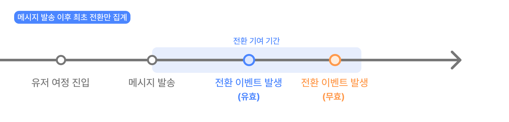
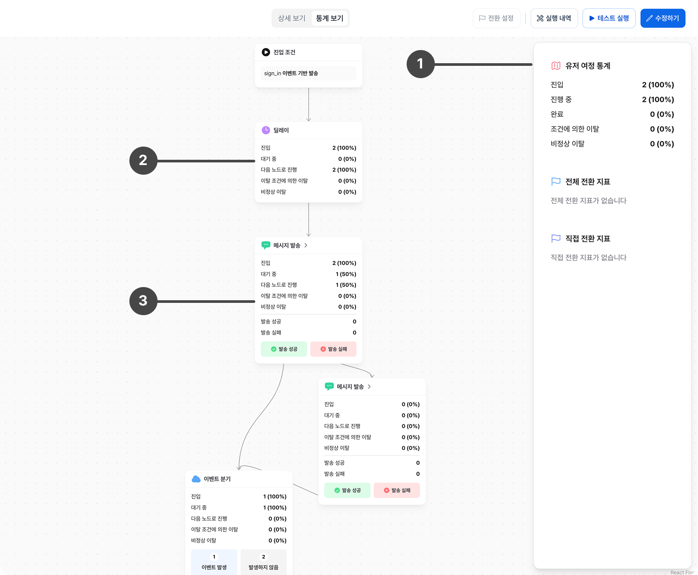

# 유저 여정 통계

## 유저 여정 기본 통계

유저 여정은 전체 여정의 통계와 각 노드별 통계를 제공합니다.
유저 여정 전체의 통계로는 진입 세션 수, 이탈 세션 수, 종료 세션 수를 제공합니다.
각 노드별 기본 통계에는 노드별 진입 세션 수, 이탈 세션 수를 기록합니다.

## 유저 여정 성과 통계

유저 여정 생성시 전환 이벤트를 최대 4개까지 설정할 수 있습니다. 전환 이벤트는 전체 유저 여정, 분기 노드, 메시지 노드 단위로도 측정됩니다.
유저 여정을 시작한 세션에서 발생한 전환 이벤트를 유효한 전환 이벤트로 측정하기 위해서는 아래의 기준이 적용됩니다.

### 세션

유저가 유저 여정을 시작할 때 마다 새로운 세션 정보가 생성됩니다. 세션은 하나의 유저에 대한 유저 여정 시작 - 종료 정보를 담고 있습니다.
만약 유저가 재진입 조건을 만족하여 동일한 유저 여정을 여러 번 진입했다면, 세션은 진입한 횟수만큼 생성됩니다.
유저 여정의 성과 측정은 유저수가 아닌 세션 수로 집계합니다.

### 유효한 전환 집계 기준

- 세션 별 메시지 수신 후 전환 기간 내에 발생한 전환 이벤트를 유효한 전환으로 집계합니다.
  (유저 여정을 시작했지만 메시지를 수신하지 않았거나 마지막 메시지 수신 후 전환 기간을 지난 경우 유효한 전환으로 측정되지 않습니다.)

- 세션 내 유효한 전환이 1회 이상 발생한 경우, 처음 발생한 전환만 유효한 전환으로 집계합니다.
  (유효한 기간 내에 전환 이벤트가 3번 발생한 경우, 최초 발생한 전환 이벤트만 유효한 전환으로 집계)

## 통계 구성

유저 여정 상세 페이지에서 '통계 보기' 를 선택하면 유저 여정 통계를 확인할 수 있습니다. 유저 여정 통계는 최대 30분의 딜레이가 발생할 수 있으며 발송 집계의 경우 최대 2시간의 딜레이가 존재할 수 있습니다.
유저 여정 통계에서 확인할 수 있는 통계는 아래와 같습니다.

** 1. 유저 여정 전체 통계 **

유저 여정의 전체 통계를 집계합니다. 전체 여정에 진입/완료/이탈한 세션 수와 전환수를 확인할 수 있습니다.

** 2. 유저 여정 노드 통계 **

유저 여정을 구성하는 각 노드에 진입/완료/이탈한 세션 수를 확인할 수 있습니다.

** 3. 유저 여정 메시지 노드 통계 **

메시지 노드는 기본 노드 통계와 함께 메시지 발송량과 발송 결과별 통계를 확인할 수 있습니다.

### 유저 여정 전체 통계

조회한 시점의 최신 유저 여정 통계 값을 확인할 수 있습니다.

- 진입: 진입 시점과 진입 대상을 만족하여 유저 여정에 진입한 세션 수를 집계합니다.
- 진행중: 진입 후 종료되지 않고 진행중인 세션 수를 집계합니다.
- 완료: 마지막 노드까지 진행되어 정상적으로 종료된 세션 수를 집계합니다.
- 조건에 의한 이탈: 이탈 조건을 설정한 경우 해당 조건을 만족해 이탈한 세션 수를 집계합니다.
- 비정상 이탈: 노드에서 발송에 문제가 발생하거나 정상적인 진행이 되지 않은 경우, 유저 여정에서 이탈된 세션 수를 집계합니다.

- 전체 전환 지표: 유저 여정 전체에서 발생한 유효한 전환을 집계합니다. (세션별 최대 1회)
- 직접 전환 지표: 유저 여정 전체에서 발생한 유효한 직접 전환을 집계합니다. (세션별 최대 1회) \* 직접 전환: 유저가 메시지를 클릭한 이후 발생한 전환

### 노드 통계

유저 여정을 구성하는 각 노드별 진입/이탈/진행에 대한 통계를 확인할 수 있습니다.
이를 통해 이탈이 많이 발생하는 노드, 현재 머물러있는 세션 수, 전환 수 등을 분석할 수 있습니다.

#### 노드 기본 통계

| 통계값             | 설명                                                                                                                                                       |
| ------------------ | ---------------------------------------------------------------------------------------------------------------------------------------------------------- |
| 진입               | 노드에 세션이 진입할때 집계됩니다.                                                                                                                         |
| 이탈 (정상/비정상) | 노드에서 이탈 조건을 만족하거나, 오류가 발생해 다음 노드로 진행할 수 없는 경우, 유저 여정이 종료처리된 경우 이탈로 집계되며 다음 노드로 진행되지 않습니다. |
| 진행               | 노드에서의 작업을 정상적으로 종료하고 다음 노드로 진행합니다.                                                                                              |

#### 메시지 노드 통계

메시지 노드에서는 메시지 발송 성공/실패 수신 성공/실패 전환 등의 지표를 집계합니다.
각 메시지 노드에서 집계되는 전환은, 유저 여저 전체의 전환과 관계없이, 메시지 전달 후 전환 기여 기간내에 발생한 최초의 전환을 집계합니다.
메시지가 발송되기 이전에 발생한 전환 이벤트는 메시지 노드에서 유효한 전환으로 측정되지 않습니다.

#### 랜덤 분기 노드 통계

랜덤 분기 노드에서는 분기된 하위 노드들에서 발생한 전환을 별도로 집계합니다.
각 전환은 세션별 최대 1회 집계되며, 메시지 수신 후 전환 기여 기간내에 발생한 전환을 유효한 전환으로 측정합니다.
