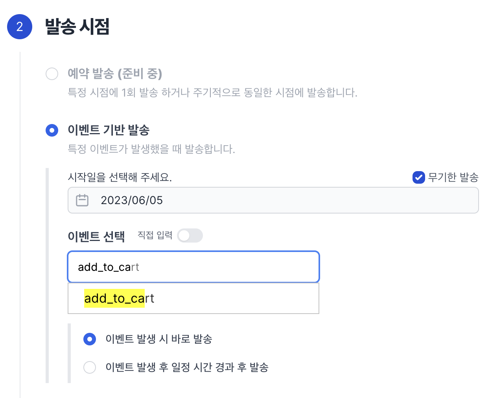
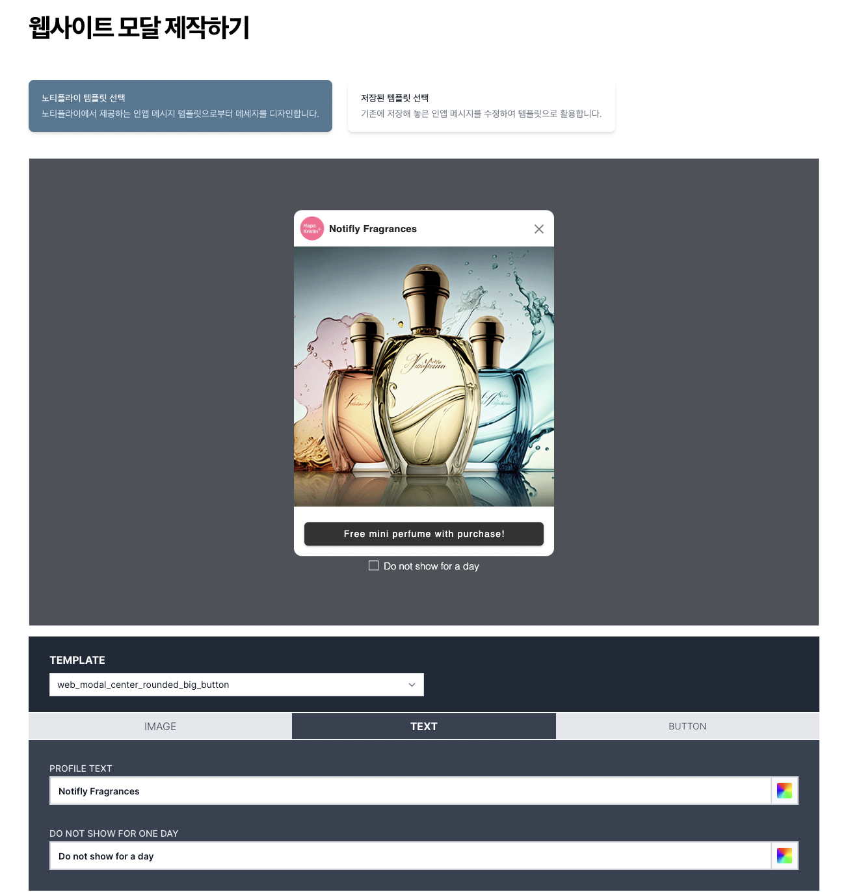
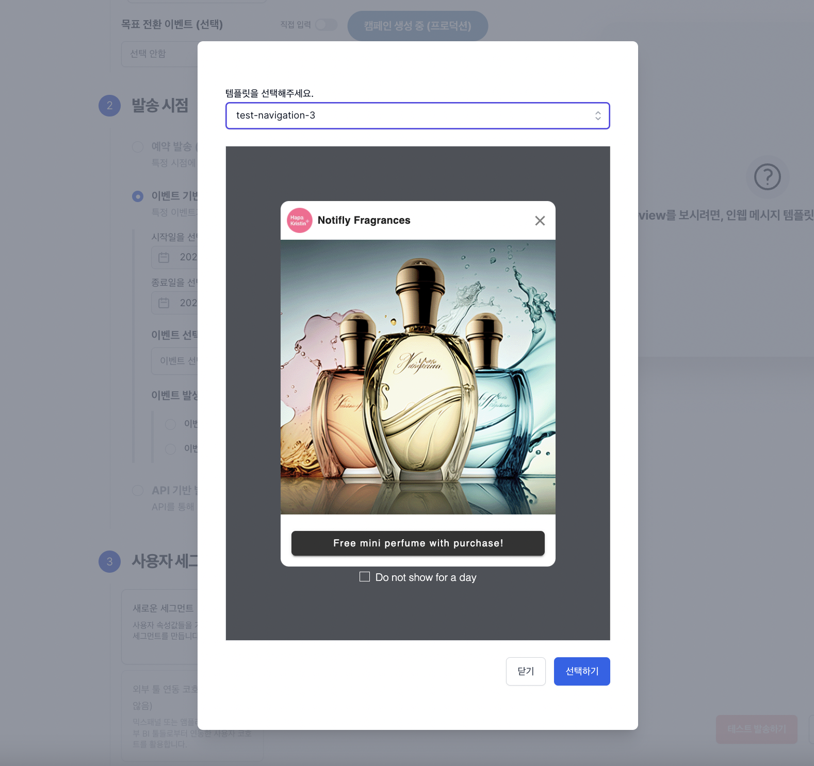

# 웹 팝업 띄우기

## 개요

1. 노티플라이에서는 웹 팝업을 원하는 타이밍에 사용자들의 브라우저에 띄울 수 있습니다.
2. JS SDK 개발 세팅이 선행되어야 하며, 이는 [개발자 가이드](https://docs.notifly.tech/ko/developer-guide/client-sdk/javascript-sdk)에 설명이 되어 있습니다.

### 세그먼팅

웹 팝업의 경우, 지원되는 발송 대상 세그먼팅의 종류는 다음과 같습니다:

1. [새로운 세그먼트](/ko/user-guide/campaigns/segment#새로운-세그먼트)

#### 새로운 세그먼트

자세한 내용은 [새로운 세그먼트](/ko/user-guide/campaigns/segment#새로운-세그먼트) 섹션을 참고해주세요.

### 타이밍

웹 팝업의 경우, 지원되는 캠페인 타이밍의 종류는 `이벤트 기반 발송`으로 특정 이벤트가 발생했을 때, 팝업을 띄울 수 있도록 설정이 가능합니다.

#### 예시

다음과 같이 `add_to_cart` 이벤트 발생 시 즉각 띄우도록 설정할 수 있으며, 시작일과 종료일도 설정할 수 있습니다.

### 메시지

웹 팝업은 **템플릿 기반으로** 제작하게 됩니다. 사이드바 메뉴 중 `팝업 제작` 하단 `웹 팝업 제작`을 선택해 제작할 수 있습니다. 기본 제공되는 템플릿 기반으로 원하는 커스텀 템플릿을 제작한 후, 캠페인 생성 시 템플릿을 선택해 사용할 수 있습니다.

_템플릿 기반 팝업 생성_

_생성된 템플릿 선택 (캠페인 생성 플로우)_

