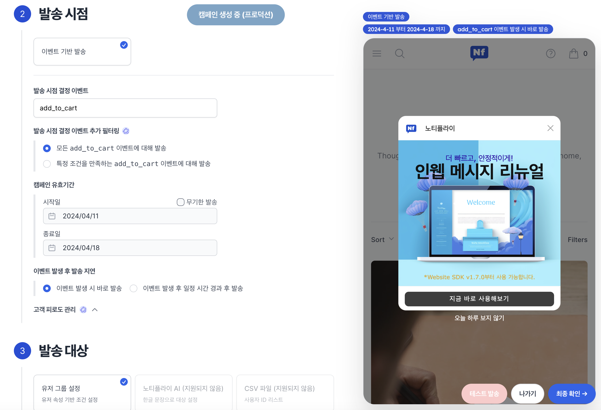
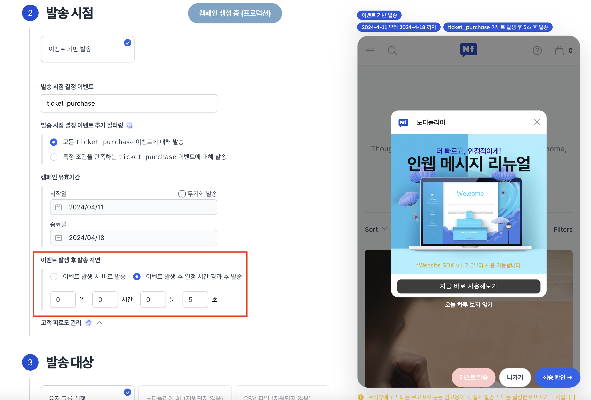
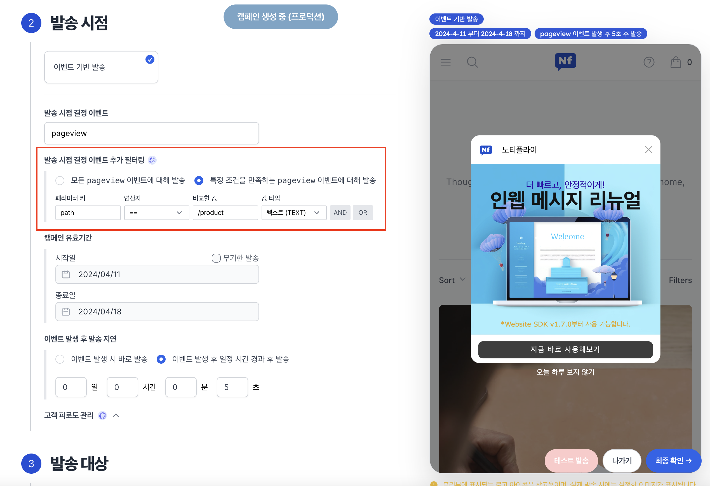
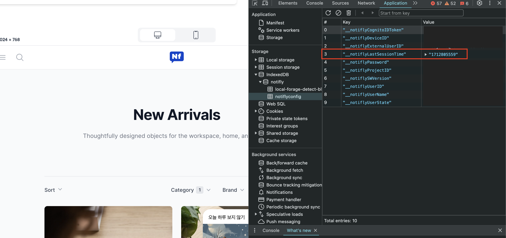

# 웹 팝업 띄우기

## 개요

노티플라이에서는 웹 팝업을 원하는 타이밍에, 원하는 사용자의 브라우저에 팝업을 노출시킬 수 있습니다. 웹 팝업을 띄우기 위해서 먼저 다음 작업이 선행되어야 합니다.

1. Javascript SDK setup - 개발 가이드는 [이곳](https://docs.notifly.tech/ko/developer-guide/client-sdk/javascript-sdk)을 참고해주세요.
2. 팝업 템플릿 제작 - 아래를 참고해주세요.

## 1. 팝업 템플릿 제작 {#create-template}

인앱 팝업 및 웹 팝업은 템플릿 기반으로 제작되며, 템플릿은 [노티플라이 콘솔 - 웹 팝업 제작](https://notifly.tech/console/in-web-message?environment=1) 에서 생성할 수 있습니다.

## 2. 발송 대상 설정 {#targeting}

발송 대상을 설정하여, 원하는 사용자에게만 웹 팝업을 노출시킬 수 있습니다. 자세한 내용은 [이곳](/ko/user-guide/campaigns/campaign-segments/segment#user-group-setup)을 참고해주세요.

## 3. 발송 시점 설정 {#timing}

웹 팝업의 경우, **이벤트 기반 발송** 캠페인에서만 사용 가능하며, 특정 이벤트가 발생했을 때 팝업을 띄우게 됩니다.

### 예시 1) `add_to_cart` 이벤트 발생 시 팝업 띄우기

다음과 같이 설정 시, `add_to_cart` 이벤트 발생 시 팝업이 즉시 노출되게 됩니다.

### 예시 2) `ticket_purchase` 이벤트 발생 시 5초 후 팝업 띄우기

다음과 같이 설정 시, `ticket_purchase` 이벤트 발생 후 5초 후 팝업이 노출되게 됩니다.

### 예시 3) `pageview` 이벤트의 `path` 이벤트 패러미터 값이 `/product`인 경우 5초 후 팝업 띄우기

다음과 같이 설정 시, `pageview` 이벤트의 `path` 이벤트 패러미터 값이 `/product`인 경우 5초 후에 팝업이 노출되게 됩니다.

## 4. 웹 팝업 사용 시 주의사항 {#caution}

노티플라이 서비스는 웹사이트 내 불필요한 다중 로깅을 방지하기 위해, 한 세션의 만료 기한을 정의합니다. 세션의 만료 기한의 기본값은 30분입니다.
또한, 불필요한 네트워킹 리소스 사용을 방지하기 위해, 노티플라이는 한 세션 내에서는 한 번만 초기화를 시도합니다.
**인웹 팝업 캠페인은 초기화 시에 불러와**지기 때문에, Notifly 콘솔에서 인웹 팝업 캠페인을 생성하셨더라도
이미 한 세션동안의 초기화가 진행된 상태라면 팝업이 정상적으로 노출되지 않을 수 있습니다.

따라서, 캠페인 집행 전 **테스트**를 하고 싶으시다면, SDK를 강제 초기화 시키기 위하여 다음 중 한 가지 방법을 사용해주세요.

### 1. Incognito 모드 (시크릿 모드) 사용

브라우저 창을 완전히 닫고, Incognito 모드로 다시 열어주세요. SDK가 다시 초기화되어 캠페인이 정상적으로 노출됩니다.

### 2. `setUserId`를 이용하여 유저 아이디 변경

`setUserId`를 호출하여 유저 아이디를 변경하면, SDK는 강제로 초기화됩니다.

### 3. IndexedDB에서 세션 데이터 삭제

- 개발자 도구의 Application Tab으로 이동합니다.
- 좌측 Storage > IndexedDB > notifly > notiflyconfig 항목을 열어주세요.
- `__notiflyLastSessionTime` 값을 선택 후, 우측 상단의 X 버튼을 눌러 해당 row를 삭제해주세요.
- 브라우저 창을 새로고침하면 SDK가 다시 초기화되어 캠페인이 정상적으로 노출됩니다.

:::caution 주의

`__notiflyLastSessionTime` 이외의 데이터는 절대 삭제하지 마세요. Notifly SDK가 정상적으로 동작하지 않을 수 있습니다.

:::
