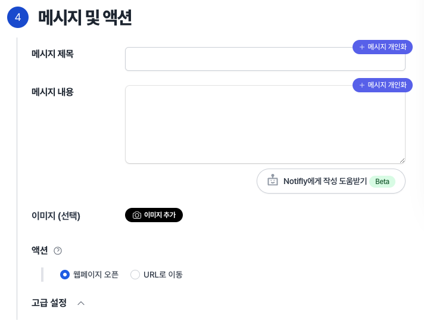
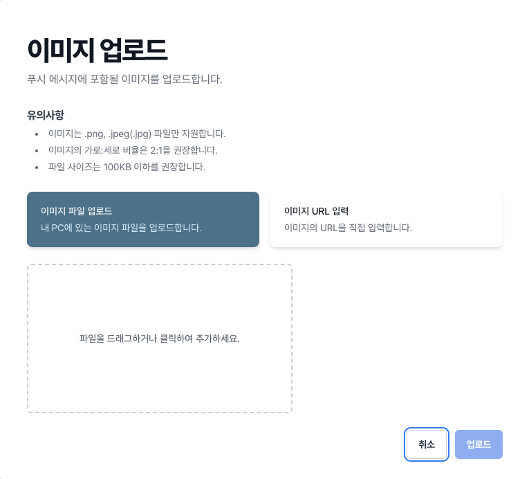

# 웹 푸시 알림 발송

노티플라이에서 웹 푸시 기능을 이용하기 위해서는 다음 두 가지를 먼저 확인해 주세요:

1. 웹사이트에 [노티플라이 Google Tag Manager 템플릿](/ko/developer-guide/client-sdk/google-tag-manager) 또는 [노티플라이 Javascript SDK](/ko/developer-guide/client-sdk/javascript-sdk)가 설치되었는지 확인해 주세요.
2. [연동 테스트 - 웹 푸시 알림 테스트](/ko/developer-guide/client-sdk/sdk_test#web-push-notification-test)를 진행해 주세요.

## 1. 발송 시점 설정 {#web-push-notification-send-time}

웹 푸시의 경우 예약 발송, 이벤트 기반 발송이 지원됩니다.  
자세한 내용은 [노티플라이 캠페인 - 시작하기 - 발송 시점](/ko/user-guide/campaigns/basic#2-발송-시점) 섹션을 참고해주세요.

사용자가 여러 기기 또는 여러 브라우저 (Chrome, Edge 등)에서 웹사이트를 사용하고 있는 경우, 웹 푸시 알림은 다음과 같이 발송됩니다:

- 예약 발송, API 기반 발송인 경우에는 사용자의 모든 브라우저로 웹 푸시 알림이 발송됩니다.
- 이벤트 기반 발송인 경우에는 사용자가 해당 이벤트를 발생시킨 브라우저로만 웹 푸시 알림이 발송됩니다.

## 2. 발송 대상 설정 {#web-push-notification-target}

웹 푸시의 경우 유저 그룹 설정 또는 CSV 업로드 방식으로 발송 대상을 설정할 수 있습니다.  
자세한 내용은 [유저 그룹 설정](/ko/user-guide/campaigns/campaign-segments/segment#user-group-setup) 섹션을 참고해주세요.

## 3. 웹 푸시 알림 내용 및 액션 설정 {#app-push-notification-content}

### 3-1. 웹 푸시 알림 기본 내용 설정

웹 푸시에서는 제목, 내용, 이미지, 클릭 시 액션 등을 설정할 수 있습니다.

#### 3-1-1. 웹 푸시 제목 및 내용 설정

웹 푸시의 제목과 내용을 설정하시면 프리뷰를 확인할 수 있습니다.

- 브라우저 및 기기에 따라 실제로 표시되는 글자 수가 다를 수 있습니다. 일반적으로 제목은 75자, 설명은 225자까지 작성 가능합니다.
- 이모티콘 사용이 가능합니다.

#### 3-1-2. 웹 푸시 이미지 설정 (Optional)

- 이미지는 .png, .jpeg(.jpg) 파일만 지원합니다.
- 이미지의 가로:세로 비율은 2:1을 권장합니다.
- 파일 사이즈는 100KB 이하를 권장합니다.
- 이미 업로드된 이미지를 사용하고자 하는 경우 URL 입력 옵션을 선택하시면 됩니다.

#### 3-1-3. 웹 푸시 클릭 시 액션 설정 (Optional)

- 기본적으로 웹 푸시를 클릭하면 해당 웹사이트의 홈페이지로 랜딩됩니다.
- 웹 푸시 클릭 시 특정 URL로 이동하도록 설정할 수 있습니다.

## 4. 웹 푸시 권한 요청 프롬프트 {#web-push-notification-permission-prompt}

앱 푸시와 유사하게, 웹 푸시 알림을 받기 위해서는 사용자가 브라우저의 알림 권한을 허용해야 합니다. 이를 위해 사용자에게 알림 권한 요청을 할 수 있는데요, 이때 사용자가 권한을 차단하면 다시는 브라우저에서 권한 요청을 할 수 없고 사용자가 브라우저 설정에 가서 직접 바꿔주어야 한다는 점을 유의해야 합니다.

노티플라이에서는 웹 푸시 권한을 웹 팝업으로 먼저 확인하고, 사용자가 수락하면 브라우저에서 알림 권한을 요청하도록 단계를 세분화하여, 당장은 관심이 없는 사용자에게 추후 다시 요청할 수 있도록 합니다.
노티플라이의 웹 푸시 알림 요청 프롬프트를 웹사이트에 알맞게 커스터마이징하기 위해 개발자 가이드의 [웹 푸시 알림 권한 요청](/ko/developer-guide/client-sdk/javascript-sdk#web-push-permission-request) 섹션을 참고해주세요.
