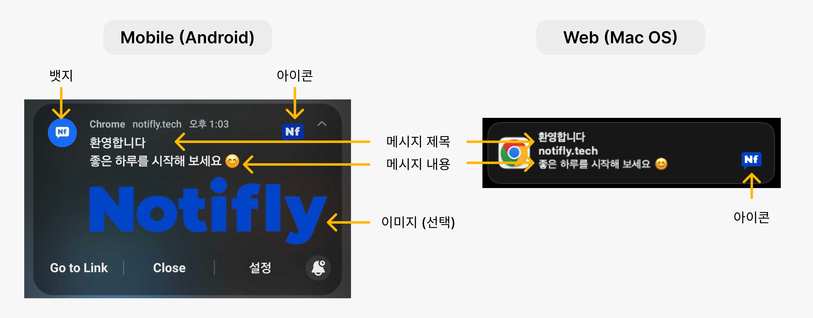
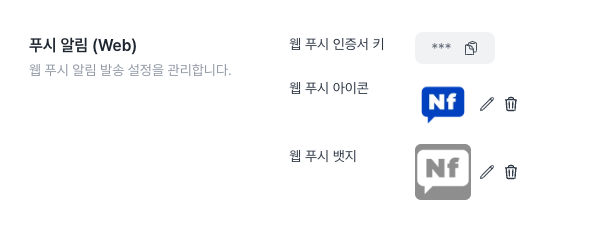

# 웹 푸시 구성 요소 및 설정

모바일, PC 등 브라우저가 설치된 기기에서는 모두 웹 푸시가 지원됩니다. 다만, 브라우저 및 환경에 따라 설정이 다르게 적용됩니다.

## 1. 웹 푸시 알림 구성 요소

### 1-1. 웹 푸시 제목 및 내용

웹 푸시 알림의 제목 및 내용은 캠페인에서 입력할 수 있습니다.

### 1-2. 웹 푸시 이미지 (선택 사항)

웹 푸시 알림의 이미지는 캠페인에서 설정할 수 있습니다.

- 이미지는 .png, .jpeg(.jpg) 파일만 지원합니다. 200KB 이하의 이미지를 권장합니다.
- 360x240 픽셀 이상의 이미지를 권장합니다. 데스크톱과 모바일에서 이미지가 보여지는 크기 및 비율이 다르기 때문에 적절한 비율을 테스트한 뒤 사용해 주세요.

macOS Chrome에서는 이미지가 표시되지 않습니다. (참고: [Google Chrome 웹 푸시 전환 공지](https://developer.chrome.com/blog/native-mac-os-notifications?hl=ko))

### 1-3. 웹 푸시 아이콘

웹 푸시 아이콘은 프로젝트 설정에서 설정할 수 있습니다. 이미지 업로드 및 URL 입력 방식을 지원합니다.

- 이미지는 .png, .jpeg(.jpg) 파일만 지원합니다. 100KB 이하의 이미지를 권장합니다.
- 192x192 픽셀의 정사각형 이미지, 투명 배경을 사용해 주세요.

### 1-4. 웹 푸시 뱃지

웹 푸시 뱃지는 프로젝트 설정에서 설정할 수 있습니다. 이미지 업로드 및 URL 입력 방식을 지원합니다.

- 이미지는 .png, .jpeg(.jpg) 파일만 지원합니다. 100KB 이하의 이미지를 권장합니다.
- 72x72 픽셀의 정사각형 이미지, 투명 배경의 흑백 아이콘을 사용해 주세요.

Android Asset Studio 혹은 이미지 편집 툴 (예시: [Notification icon generator](https://romannurik.github.io/AndroidAssetStudio/icons-notification.html))을 활용하면 더욱 쉽게 뱃지 이미지를 생성할 수 있습니다.

현재 배지는 Android의 Chrome에서만 사용되고, 다른 브라우저 (또는 배지가 없는 Chrome)에는 브라우저 아이콘이 표시됩니다.

### 1-5. 기기 및 브라우저 환경 별 웹 푸시 이미지, 아이콘, 뱃지 지원 여부

| Platform | Browser       | 이미지 | 아이콘 | 뱃지 |
| -------- | ------------- | ------ | ------ | ---- |
| Android  | Chrome        | O      | O      | O    |
| Android  | Firefox       | O      | O      | X    |
| Android  | 기타 브라우저 | O      | O      | X    |
| iOS      | Safari        | X      | O      | X    |
| macOS    | Safari        | X      | O      | X    |
| macOS    | Chrome        | X      | O      | X    |
| macOS    | Firefox       | O      | O      | X    |
| macOS    | 기타 브라우저 | O      | O      | X    |
| Windows  | Chrome        | O      | O      | X    |
| Windows  | Firefox       | O      | O      | X    |
| Windows  | Edge          | O      | O      | X    |
| Windows  | 기타 브라우저 | O      | O      | X    |

## 2. 웹 푸시 알림 뱃지 및 아이콘 설정

1. 노티플라이 콘솔에 로그인한 뒤, 설정 페이지로 이동합니다.
2. '채널' 탭에서 웹 푸시 아이콘과 뱃지를 설정할 수 있습니다.

웹 푸시 테스트 발송을 통해 설정한 뱃지와 아이콘이 정상적으로 표시되는지 확인해 주세요.
